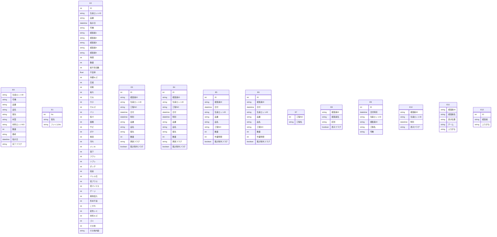

# Access データベース・スキーマ抽出レポート

このファイルは **Access の ODBC メタデータ**から自動生成しました。
LLM に渡す場合は **「スキーマ JSON」セクション**と **「PostgreSQL DDL 草案」**をあわせて指示に含めると、目的の RDB に近い定義を再現しやすくなります。

## LLM / AI 向け: このドキュメントの使い方

以下をプロンプトにコピーして、目的の SQL ダイアレクト（例: PostgreSQL）向け **CREATE TABLE・INDEX・FK** を生成させてください。

```text
あなたはデータベース設計者です。添付 Markdown の次を根拠に、一貫したリレーショナルスキーマを設計してください。
1) YAML フロントマターと「サマリー」の数値
2) 「スキーマ JSON（機械可読・全量）」の tables / relationships / warnings
3) 「PostgreSQL DDL 草案」は参考用。型・NULL・FK・インデックスを JSON・列定義と突き合わせて修正すること。
4) ODBC が SYNONYM としたテーブルはリンク元の実体が別にある場合がある。移行時はデータ取得元を明示すること。
5) relationships が空のときは、列名・サンプルデータから FK を推論してよいが、推論はコメントで区別すること。
出力: (a) 最終 DDL (b) 設計上の想定・未確定事項の箇条書き
```

> ⚠ FK 取得スキップ: t_Excel現品票履歴 — ('IM001', '[IM001] [Microsoft][ODBC Driver Manager] ドライバーはこの関数をサポートしていません。 (0) (SQLForeignKeys)')
> ⚠ FK 取得スキップ: t_チェックシートリスト — ('IM001', '[IM001] [Microsoft][ODBC Driver Manager] ドライバーはこの関数をサポートしていません。 (0) (SQLForeignKeys)')
> ⚠ FK 取得スキップ: t_不具合情報 — ('IM001', '[IM001] [Microsoft][ODBC Driver Manager] ドライバーはこの関数をサポートしていません。 (0) (SQLForeignKeys)')
> ⚠ FK 取得スキップ: t_外観検査記録 — ('IM001', '[IM001] [Microsoft][ODBC Driver Manager] ドライバーはこの関数をサポートしていません。 (0) (SQLForeignKeys)')
> ⚠ FK 取得スキップ: t_外観検査記録保存 — ('IM001', '[IM001] [Microsoft][ODBC Driver Manager] ドライバーはこの関数をサポートしていません。 (0) (SQLForeignKeys)')
> ⚠ FK 取得スキップ: t_外観検査集計 — ('IM001', '[IM001] [Microsoft][ODBC Driver Manager] ドライバーはこの関数をサポートしていません。 (0) (SQLForeignKeys)')
> ⚠ FK 取得スキップ: t_外観検査集計保存 — ('IM001', '[IM001] [Microsoft][ODBC Driver Manager] ドライバーはこの関数をサポートしていません。 (0) (SQLForeignKeys)')
> ⚠ FK 取得スキップ: t_工程マスタ — ('IM001', '[IM001] [Microsoft][ODBC Driver Manager] ドライバーはこの関数をサポートしていません。 (0) (SQLForeignKeys)')
> ⚠ FK 取得スキップ: t_数値検査員マスタ — ('IM001', '[IM001] [Microsoft][ODBC Driver Manager] ドライバーはこの関数をサポートしていません。 (0) (SQLForeignKeys)')
> ⚠ FK 取得スキップ: t_数値検査記録 — ('IM001', '[IM001] [Microsoft][ODBC Driver Manager] ドライバーはこの関数をサポートしていません。 (0) (SQLForeignKeys)')
> ⚠ FK 取得スキップ: t_検査中 — ('IM001', '[IM001] [Microsoft][ODBC Driver Manager] ドライバーはこの関数をサポートしていません。 (0) (SQLForeignKeys)')
> ⚠ FK 取得スキップ: t_検査員マスタ — ('IM001', '[IM001] [Microsoft][ODBC Driver Manager] ドライバーはこの関数をサポートしていません。 (0) (SQLForeignKeys)')
> ⚠ FK 取得スキップ: t_検査者マスタ — ('IM001', '[IM001] [Microsoft][ODBC Driver Manager] ドライバーはこの関数をサポートしていません。 (0) (SQLForeignKeys)')

## サマリー

| 項目 | 値 |
|---|---|
| Access ファイル | `\\192.168.1.200\共有\生産管理課\AccessDB\外観検査記録DB.accdb` |
| ODBC ドライバ | `Microsoft Access Driver (*.mdb, *.accdb)` |
| テーブル数 | 13 |
| 行数合計（取得できたテーブルのみ） | 732,964 |
| リンクテーブル相当（ODBC: SYNONYM） | 0 |
| 外部キー（検出分） | 0 |
| ビュー / クエリ名 | 0 |
| 警告 | 13 |

## ER 図（Mermaid・参考）

Mermaid 内のエンティティは `E0`, `E1`, … です。実テーブル名は次の対応表を参照してください。

| 記号 | テーブル名 | ODBC 型 | 行数 |
|---|---|---:|---:|
| E0 | `t_Excel現品票履歴` | TABLE | 33,987 |
| E1 | `t_チェックシートリスト` | TABLE | 119 |
| E2 | `t_不具合情報` | TABLE | 155,700 |
| E3 | `t_外観検査記録` | TABLE | 68,820 |
| E4 | `t_外観検査記録保存` | TABLE | 225,171 |
| E5 | `t_外観検査集計` | TABLE | 51,450 |
| E6 | `t_外観検査集計保存` | TABLE | 171,580 |
| E7 | `t_工程マスタ` | TABLE | 10 |
| E8 | `t_数値検査員マスタ` | TABLE | 14 |
| E9 | `t_数値検査記録` | TABLE | 25,906 |
| E10 | `t_検査中` | TABLE | 59 |
| E11 | `t_検査員マスタ` | TABLE | 76 |
| E12 | `t_検査者マスタ` | TABLE | 72 |



## PostgreSQL DDL 草案（全文・自動生成）

```sql
-- PostgreSQL DDL 草案（Access メタデータから自動生成）
-- ※ 型・制約は必ず手動で確認・修正してください

CREATE TABLE "t_Excel現品票履歴" (
    "生産ロットID" VARCHAR(7),
    "号機" VARCHAR(5),
    "品番" VARCHAR(30),
    "品名" VARCHAR(30),
    "客先" VARCHAR(30),
    "材質" VARCHAR(50),
    "材料ロットNO" VARCHAR(30),
    "数量" INTEGER,
    "備考" VARCHAR(50),
    "指示日" TIMESTAMP,
    "完了フラグ" VARCHAR(1)
);


CREATE TABLE "t_チェックシートリスト" (
    "No" INTEGER,
    "客先" VARCHAR(25),
    "ファイルNo" VARCHAR(10)
);


CREATE TABLE "t_不具合情報" (
    "ID" BIGSERIAL,
    "生産ロットID" VARCHAR(7),
    "品番" VARCHAR(30),
    "指示日" TIMESTAMP,
    "号機" VARCHAR(5),
    "検査者1" VARCHAR(6),
    "検査者2" VARCHAR(6),
    "検査者3" VARCHAR(6),
    "検査者4" VARCHAR(6),
    "検査者5" VARCHAR(20),
    "時間" INTEGER,
    "数量" INTEGER,
    "総不具合数" INTEGER,
    "不良率" DOUBLE PRECISION,
    "外観キズ" INTEGER,
    "圧痕" INTEGER,
    "切粉" INTEGER,
    "毟れ" INTEGER,
    "穴大" INTEGER,
    "穴小" INTEGER,
    "穴キズ" INTEGER,
    "バリ" INTEGER,
    "短寸" INTEGER,
    "面粗" INTEGER,
    "サビ" INTEGER,
    "ボケ" INTEGER,
    "挽目" INTEGER,
    "汚れ" INTEGER,
    "メッキ" INTEGER,
    "落下" INTEGER,
    "フクレ" INTEGER,
    "ツブレ" INTEGER,
    "ボッチ" INTEGER,
    "段差" INTEGER,
    "バレル石" INTEGER,
    "径プラス" INTEGER,
    "径マイナス" INTEGER,
    "ゲージ" INTEGER,
    "異物混入" INTEGER,
    "形状不良" INTEGER,
    "こすれ" INTEGER,
    "変色シミ" INTEGER,
    "材料キズ" INTEGER,
    "ゴミ" INTEGER,
    "その他" INTEGER,
    "その他内容" VARCHAR(10)
);


CREATE TABLE "t_外観検査記録" (
    "ID" BIGSERIAL,
    "検査員ID" VARCHAR(4),
    "生産ロットID" VARCHAR(7),
    "工程NO" VARCHAR(2),
    "日付" TIMESTAMP,
    "時刻" TIMESTAMP,
    "品番" VARCHAR(30),
    "品名" VARCHAR(30),
    "客先" VARCHAR(25),
    "数量" INTEGER,
    "更新フラグ" VARCHAR(1),
    "集計除外フラグ" BOOLEAN NOT NULL
);


CREATE TABLE "t_外観検査記録保存" (
    "ID" BIGSERIAL,
    "検査員ID" VARCHAR(4),
    "生産ロットID" VARCHAR(7),
    "工程NO" VARCHAR(2),
    "日付" TIMESTAMP,
    "時刻" TIMESTAMP,
    "品番" VARCHAR(30),
    "品名" VARCHAR(30),
    "客先" VARCHAR(25),
    "数量" INTEGER,
    "更新フラグ" VARCHAR(1),
    "集計除外フラグ" BOOLEAN NOT NULL
);


CREATE TABLE "t_外観検査集計" (
    "ID" BIGSERIAL,
    "検査員ID" VARCHAR(4),
    "日付" TIMESTAMP,
    "生産ロットID" VARCHAR(7),
    "品番" VARCHAR(30),
    "品名" VARCHAR(30),
    "工程NO" VARCHAR(2),
    "数量" INTEGER,
    "作業時間" INTEGER,
    "集計除外フラグ" BOOLEAN NOT NULL
);


CREATE TABLE "t_外観検査集計保存" (
    "ID" BIGSERIAL,
    "検査員ID" VARCHAR(4),
    "日付" TIMESTAMP,
    "生産ロットID" VARCHAR(7),
    "品番" VARCHAR(30),
    "品名" VARCHAR(30),
    "工程NO" VARCHAR(2),
    "数量" INTEGER,
    "作業時間" INTEGER,
    "集計除外フラグ" BOOLEAN NOT NULL
);


CREATE TABLE "t_工程マスタ" (
    "工程NO" INTEGER,
    "工程名" VARCHAR(10)
);


CREATE TABLE "t_数値検査員マスタ" (
    "検査員ID" VARCHAR(4),
    "検査員名" VARCHAR(5),
    "区別" VARCHAR(5),
    "表示フラグ" BOOLEAN NOT NULL
);


CREATE TABLE "t_数値検査記録" (
    "ID" BIGSERIAL,
    "日付時刻" TIMESTAMP,
    "生産ロットID" VARCHAR(7),
    "検査員ID" VARCHAR(4),
    "工程名" VARCHAR(30),
    "号機" VARCHAR(5)
);


CREATE TABLE "t_検査中" (
    "検査員ID" VARCHAR(4),
    "生産ロットID" VARCHAR(7),
    "時刻" TIMESTAMP,
    "表示フラグ" VARCHAR(1)
);


CREATE TABLE "t_検査員マスタ" (
    "検査員ID" VARCHAR(4),
    "検査員名" VARCHAR(10),
    "表示位置" VARCHAR(3),
    "チーム" VARCHAR(1),
    "ふりがな" VARCHAR(1)
);


CREATE TABLE "t_検査者マスタ" (
    "ID" BIGSERIAL,
    "検査者" VARCHAR(6),
    "ふりがな" VARCHAR(1)
);
```

## スキーマ JSON（機械可読・全量）

以下をパースすれば、テーブル・列・PK・インデックス・サンプル・統計・FK・ビュー名を一括で渡せます。

```json
{
  "export_spec": "access-inspector/schema-export/v1",
  "generated_at": "2026-06-12T01:06:11.724307+00:00",
  "source": {
    "database_path": "\\\\192.168.1.200\\共有\\生産管理課\\AccessDB\\外観検査記録DB.accdb",
    "driver_used": "Microsoft Access Driver (*.mdb, *.accdb)"
  },
  "summary": {
    "table_count": 13,
    "sum_row_count_where_known": 732964,
    "tables_with_row_count": 13,
    "linked_table_odbc_synonym_count": 0,
    "relationship_count": 0,
    "view_count": 0,
    "warning_count": 13
  },
  "notes_for_consumer": [
    "ODBC の table_type が SYNONYM のテーブルは Access のリンクテーブルであることが多い。",
    "PostgreSQL 型ヒントは参考。最終 DDL は業務要件とデータ実態で確認すること。",
    "relationships が空でも、命名規則やサンプル行から推定された FK があり得る。"
  ],
  "tables": [
    {
      "name": "t_Excel現品票履歴",
      "table_type": "TABLE",
      "row_count": 33987,
      "row_count_error": null,
      "primary_key": [],
      "columns": [
        {
          "name": "生産ロットID",
          "access_type": "VARCHAR",
          "sql_data_type": -9,
          "column_size": 7,
          "decimal_digits": null,
          "nullable": true,
          "postgres_type_hint": "VARCHAR(7)"
        },
        {
          "name": "号機",
          "access_type": "VARCHAR",
          "sql_data_type": -9,
          "column_size": 5,
          "decimal_digits": null,
          "nullable": true,
          "postgres_type_hint": "VARCHAR(5)"
        },
        {
          "name": "品番",
          "access_type": "VARCHAR",
          "sql_data_type": -9,
          "column_size": 30,
          "decimal_digits": null,
          "nullable": true,
          "postgres_type_hint": "VARCHAR(30)"
        },
        {
          "name": "品名",
          "access_type": "VARCHAR",
          "sql_data_type": -9,
          "column_size": 30,
          "decimal_digits": null,
          "nullable": true,
          "postgres_type_hint": "VARCHAR(30)"
        },
        {
          "name": "客先",
          "access_type": "VARCHAR",
          "sql_data_type": -9,
          "column_size": 30,
          "decimal_digits": null,
          "nullable": true,
          "postgres_type_hint": "VARCHAR(30)"
        },
        {
          "name": "材質",
          "access_type": "VARCHAR",
          "sql_data_type": -9,
          "column_size": 50,
          "decimal_digits": null,
          "nullable": true,
          "postgres_type_hint": "VARCHAR(50)"
        },
        {
          "name": "材料ロットNO",
          "access_type": "VARCHAR",
          "sql_data_type": -9,
          "column_size": 30,
          "decimal_digits": null,
          "nullable": true,
          "postgres_type_hint": "VARCHAR(30)"
        },
        {
          "name": "数量",
          "access_type": "INTEGER",
          "sql_data_type": 4,
          "column_size": 10,
          "decimal_digits": 0,
          "nullable": true,
          "postgres_type_hint": "INTEGER"
        },
        {
          "name": "備考",
          "access_type": "VARCHAR",
          "sql_data_type": -9,
          "column_size": 50,
          "decimal_digits": null,
          "nullable": true,
          "postgres_type_hint": "VARCHAR(50)"
        },
        {
          "name": "指示日",
          "access_type": "DATETIME",
          "sql_data_type": 9,
          "column_size": 19,
          "decimal_digits": 0,
          "nullable": true,
          "postgres_type_hint": "TIMESTAMP"
        },
        {
          "name": "完了フラグ",
          "access_type": "VARCHAR",
          "sql_data_type": -9,
          "column_size": 1,
          "decimal_digits": null,
          "nullable": true,
          "postgres_type_hint": "VARCHAR(1)"
        }
      ],
      "indexes": [],
      "sample_headers": [
        "生産ロットID",
        "号機",
        "品番",
        "品名",
        "客先",
        "材質",
        "材料ロットNO",
        "数量",
        "備考",
        "指示日",
        "完了フラグ"
      ],
      "sample_rows": [
        [
          "E000001",
          "AN",
          "00575532-01",
          "カラー 8×8.16",
          "東京鋲兼",
          "SUS303 φ8.0CM",
          null,
          3730,
          null,
          "2017-10-12T00:00:00",
          null
        ],
        [
          "E000002",
          "AN",
          "00575532-01",
          "カラー 8×8.16",
          "東京鋲兼",
          "SUS303 φ8.0CM",
          null,
          1370,
          null,
          "2017-10-14T00:00:00",
          null
        ],
        [
          "E000003",
          "AN",
          "00575532-05",
          "カラー 8×8.14",
          "東京鋲兼",
          "SUS303 φ8.0CM",
          null,
          2700,
          null,
          "2017-10-14T00:00:00",
          null
        ],
        [
          "E000004",
          "AN-1",
          "FA用リベット",
          "FA用リベット",
          "イワタボルト",
          "SUS303Cu φ10.0D",
          null,
          10000,
          null,
          "2017-10-14T00:00:00",
          null
        ],
        [
          "E000005",
          "AN-2",
          "FA用リベット",
          "FA用リベット",
          "イワタボルト",
          "SUS303Cu φ10.0D",
          null,
          10000,
          null,
          "2017-10-14T00:00:00",
          null
        ]
      ],
      "column_stats": [
        {
          "column": "生産ロットID",
          "null_count": 0,
          "null_rate_pct": 0.0,
          "unique_count": null,
          "unique_rate_pct": null
        },
        {
          "column": "号機",
          "null_count": 0,
          "null_rate_pct": 0.0,
          "unique_count": null,
          "unique_rate_pct": null
        },
        {
          "column": "品番",
          "null_count": 0,
          "null_rate_pct": 0.0,
          "unique_count": null,
          "unique_rate_pct": null
        },
        {
          "column": "品名",
          "null_count": 0,
          "null_rate_pct": 0.0,
          "unique_count": null,
          "unique_rate_pct": null
        },
        {
          "column": "客先",
          "null_count": 0,
          "null_rate_pct": 0.0,
          "unique_count": null,
          "unique_rate_pct": null
        },
        {
          "column": "材質",
          "null_count": 22,
          "null_rate_pct": 0.1,
          "unique_count": null,
          "unique_rate_pct": null
        },
        {
          "column": "材料ロットNO",
          "null_count": 4781,
          "null_rate_pct": 14.1,
          "unique_count": null,
          "unique_rate_pct": null
        },
        {
          "column": "数量",
          "null_count": 2,
          "null_rate_pct": 0.0,
          "unique_count": null,
          "unique_rate_pct": null
        },
        {
          "column": "備考",
          "null_count": 27865,
          "null_rate_pct": 82.0,
          "unique_count": null,
          "unique_rate_pct": null
        },
        {
          "column": "指示日",
          "null_count": 0,
          "null_rate_pct": 0.0,
          "unique_count": null,
          "unique_rate_pct": null
        },
        {
          "column": "完了フラグ",
          "null_count": 33987,
          "null_rate_pct": 100.0,
          "unique_count": null,
          "unique_rate_pct": null
        }
      ]
    },
    {
      "name": "t_チェックシートリスト",
      "table_type": "TABLE",
      "row_count": 119,
      "row_count_error": null,
      "primary_key": [],
      "columns": [
        {
          "name": "No",
          "access_type": "INTEGER",
          "sql_data_type": 4,
          "column_size": 10,
          "decimal_digits": 0,
          "nullable": true,
          "postgres_type_hint": "INTEGER"
        },
        {
          "name": "客先",
          "access_type": "VARCHAR",
          "sql_data_type": -9,
          "column_size": 25,
          "decimal_digits": null,
          "nullable": true,
          "postgres_type_hint": "VARCHAR(25)"
        },
        {
          "name": "ファイルNo",
          "access_type": "VARCHAR",
          "sql_data_type": -9,
          "column_size": 10,
          "decimal_digits": null,
          "nullable": true,
          "postgres_type_hint": "VARCHAR(10)"
        }
      ],
      "indexes": [],
      "sample_headers": [
        "No",
        "客先",
        "ファイルNo"
      ],
      "sample_rows": [
        [
          1,
          "ALPS",
          "3"
        ],
        [
          2,
          "DNPイメージングコム",
          "22"
        ],
        [
          3,
          "GMタイセー",
          "12"
        ],
        [
          4,
          "Ｊ・ＧＥＡＲ",
          "27"
        ],
        [
          5,
          "KGS",
          "24"
        ]
      ],
      "column_stats": [
        {
          "column": "No",
          "null_count": 0,
          "null_rate_pct": 0.0,
          "unique_count": null,
          "unique_rate_pct": null
        },
        {
          "column": "客先",
          "null_count": 0,
          "null_rate_pct": 0.0,
          "unique_count": null,
          "unique_rate_pct": null
        },
        {
          "column": "ファイルNo",
          "null_count": 0,
          "null_rate_pct": 0.0,
          "unique_count": null,
          "unique_rate_pct": null
        }
      ]
    },
    {
      "name": "t_不具合情報",
      "table_type": "TABLE",
      "row_count": 155700,
      "row_count_error": null,
      "primary_key": [],
      "columns": [
        {
          "name": "ID",
          "access_type": "COUNTER",
          "sql_data_type": 4,
          "column_size": 10,
          "decimal_digits": 0,
          "nullable": false,
          "postgres_type_hint": "BIGSERIAL"
        },
        {
          "name": "生産ロットID",
          "access_type": "VARCHAR",
          "sql_data_type": -9,
          "column_size": 7,
          "decimal_digits": null,
          "nullable": true,
          "postgres_type_hint": "VARCHAR(7)"
        },
        {
          "name": "品番",
          "access_type": "VARCHAR",
          "sql_data_type": -9,
          "column_size": 30,
          "decimal_digits": null,
          "nullable": true,
          "postgres_type_hint": "VARCHAR(30)"
        },
        {
          "name": "指示日",
          "access_type": "DATETIME",
          "sql_data_type": 9,
          "column_size": 19,
          "decimal_digits": 0,
          "nullable": true,
          "postgres_type_hint": "TIMESTAMP"
        },
        {
          "name": "号機",
          "access_type": "VARCHAR",
          "sql_data_type": -9,
          "column_size": 5,
          "decimal_digits": null,
          "nullable": true,
          "postgres_type_hint": "VARCHAR(5)"
        },
        {
          "name": "検査者1",
          "access_type": "VARCHAR",
          "sql_data_type": -9,
          "column_size": 6,
          "decimal_digits": null,
          "nullable": true,
          "postgres_type_hint": "VARCHAR(6)"
        },
        {
          "name": "検査者2",
          "access_type": "VARCHAR",
          "sql_data_type": -9,
          "column_size": 6,
          "decimal_digits": null,
          "nullable": true,
          "postgres_type_hint": "VARCHAR(6)"
        },
        {
          "name": "検査者3",
          "access_type": "VARCHAR",
          "sql_data_type": -9,
          "column_size": 6,
          "decimal_digits": null,
          "nullable": true,
          "postgres_type_hint": "VARCHAR(6)"
        },
        {
          "name": "検査者4",
          "access_type": "VARCHAR",
          "sql_data_type": -9,
          "column_size": 6,
          "decimal_digits": null,
          "nullable": true,
          "postgres_type_hint": "VARCHAR(6)"
        },
        {
          "name": "検査者5",
          "access_type": "VARCHAR",
          "sql_data_type": -9,
          "column_size": 20,
          "decimal_digits": null,
          "nullable": true,
          "postgres_type_hint": "VARCHAR(20)"
        },
        {
          "name": "時間",
          "access_type": "INTEGER",
          "sql_data_type": 4,
          "column_size": 10,
          "decimal_digits": 0,
          "nullable": true,
          "postgres_type_hint": "INTEGER"
        },
        {
          "name": "数量",
          "access_type": "INTEGER",
          "sql_data_type": 4,
          "column_size": 10,
          "decimal_digits": 0,
          "nullable": true,
          "postgres_type_hint": "INTEGER"
        },
        {
          "name": "総不具合数",
          "access_type": "INTEGER",
          "sql_data_type": 4,
          "column_size": 10,
          "decimal_digits": 0,
          "nullable": true,
          "postgres_type_hint": "INTEGER"
        },
        {
          "name": "不良率",
          "access_type": "DOUBLE",
          "sql_data_type": 8,
          "column_size": 53,
          "decimal_digits": null,
          "nullable": true,
          "postgres_type_hint": "DOUBLE PRECISION"
        },
        {
          "name": "外観キズ",
          "access_type": "INTEGER",
          "sql_data_type": 4,
          "column_size": 10,
          "decimal_digits": 0,
          "nullable": true,
          "postgres_type_hint": "INTEGER"
        },
        {
          "name": "圧痕",
          "access_type": "INTEGER",
          "sql_data_type": 4,
          "column_size": 10,
          "decimal_digits": 0,
          "nullable": true,
          "postgres_type_hint": "INTEGER"
        },
        {
          "name": "切粉",
          "access_type": "INTEGER",
          "sql_data_type": 4,
          "column_size": 10,
          "decimal_digits": 0,
          "nullable": true,
          "postgres_type_hint": "INTEGER"
        },
        {
          "name": "毟れ",
          "access_type": "INTEGER",
          "sql_data_type": 4,
          "column_size": 10,
          "decimal_digits": 0,
          "nullable": true,
          "postgres_type_hint": "INTEGER"
        },
        {
          "name": "穴大",
          "access_type": "INTEGER",
          "sql_data_type": 4,
          "column_size": 10,
          "decimal_digits": 0,
          "nullable": true,
          "postgres_type_hint": "INTEGER"
        },
        {
          "name": "穴小",
          "access_type": "INTEGER",
          "sql_data_type": 4,
          "column_size": 10,
          "decimal_digits": 0,
          "nullable": true,
          "postgres_type_hint": "INTEGER"
        },
        {
          "name": "穴キズ",
          "access_type": "INTEGER",
          "sql_data_type": 4,
          "column_size": 10,
          "decimal_digits": 0,
          "nullable": true,
          "postgres_type_hint": "INTEGER"
        },
        {
          "name": "バリ",
          "access_type": "INTEGER",
          "sql_data_type": 4,
          "column_size": 10,
          "decimal_digits": 0,
          "nullable": true,
          "postgres_type_hint": "INTEGER"
        },
        {
          "name": "短寸",
          "access_type": "INTEGER",
          "sql_data_type": 4,
          "column_size": 10,
          "decimal_digits": 0,
          "nullable": true,
          "postgres_type_hint": "INTEGER"
        },
        {
          "name": "面粗",
          "access_type": "INTEGER",
          "sql_data_type": 4,
          "column_size": 10,
          "decimal_digits": 0,
          "nullable": true,
          "postgres_type_hint": "INTEGER"
        },
        {
          "name": "サビ",
          "access_type": "INTEGER",
          "sql_data_type": 4,
          "column_size": 10,
          "decimal_digits": 0,
          "nullable": true,
          "postgres_type_hint": "INTEGER"
        },
        {
          "name": "ボケ",
          "access_type": "INTEGER",
          "sql_data_type": 4,
          "column_size": 10,
          "decimal_digits": 0,
          "nullable": true,
          "postgres_type_hint": "INTEGER"
        },
        {
          "name": "挽目",
          "access_type": "INTEGER",
          "sql_data_type": 4,
          "column_size": 10,
          "decimal_digits": 0,
          "nullable": true,
          "postgres_type_hint": "INTEGER"
        },
        {
          "name": "汚れ",
          "access_type": "INTEGER",
          "sql_data_type": 4,
          "column_size": 10,
          "decimal_digits": 0,
          "nullable": true,
          "postgres_type_hint": "INTEGER"
        },
        {
          "name": "メッキ",
          "access_type": "INTEGER",
          "sql_data_type": 4,
          "column_size": 10,
          "decimal_digits": 0,
          "nullable": true,
          "postgres_type_hint": "INTEGER"
        },
        {
          "name": "落下",
          "access_type": "INTEGER",
          "sql_data_type": 4,
          "column_size": 10,
          "decimal_digits": 0,
          "nullable": true,
          "postgres_type_hint": "INTEGER"
        },
        {
          "name": "フクレ",
          "access_type": "INTEGER",
          "sql_data_type": 4,
          "column_size": 10,
          "decimal_digits": 0,
          "nullable": true,
          "postgres_type_hint": "INTEGER"
        },
        {
          "name": "ツブレ",
          "access_type": "INTEGER",
          "sql_data_type": 4,
          "column_size": 10,
          "decimal_digits": 0,
          "nullable": true,
          "postgres_type_hint": "INTEGER"
        },
        {
          "name": "ボッチ",
          "access_type": "INTEGER",
          "sql_data_type": 4,
          "column_size": 10,
          "decimal_digits": 0,
          "nullable": true,
          "postgres_type_hint": "INTEGER"
        },
        {
          "name": "段差",
          "access_type": "INTEGER",
          "sql_data_type": 4,
          "column_size": 10,
          "decimal_digits": 0,
          "nullable": true,
          "postgres_type_hint": "INTEGER"
        },
        {
          "name": "バレル石",
          "access_type": "INTEGER",
          "sql_data_type": 4,
          "column_size": 10,
          "decimal_digits": 0,
          "nullable": true,
          "postgres_type_hint": "INTEGER"
        },
        {
          "name": "径プラス",
          "access_type": "INTEGER",
          "sql_data_type": 4,
          "column_size": 10,
          "decimal_digits": 0,
          "nullable": true,
          "postgres_type_hint": "INTEGER"
        },
        {
          "name": "径マイナス",
          "access_type": "INTEGER",
          "sql_data_type": 4,
          "column_size": 10,
          "decimal_digits": 0,
          "nullable": true,
          "postgres_type_hint": "INTEGER"
        },
        {
          "name": "ゲージ",
          "access_type": "INTEGER",
          "sql_data_type": 4,
          "column_size": 10,
          "decimal_digits": 0,
          "nullable": true,
          "postgres_type_hint": "INTEGER"
        },
        {
          "name": "異物混入",
          "access_type": "INTEGER",
          "sql_data_type": 4,
          "column_size": 10,
          "decimal_digits": 0,
          "nullable": true,
          "postgres_type_hint": "INTEGER"
        },
        {
          "name": "形状不良",
          "access_type": "INTEGER",
          "sql_data_type": 4,
          "column_size": 10,
          "decimal_digits": 0,
          "nullable": true,
          "postgres_type_hint": "INTEGER"
        },
        {
          "name": "こすれ",
          "access_type": "INTEGER",
          "sql_data_type": 4,
          "column_size": 10,
          "decimal_digits": 0,
          "nullable": true,
          "postgres_type_hint": "INTEGER"
        },
        {
          "name": "変色シミ",
          "access_type": "INTEGER",
          "sql_data_type": 4,
          "column_size": 10,
          "decimal_digits": 0,
          "nullable": true,
          "postgres_type_hint": "INTEGER"
        },
        {
          "name": "材料キズ",
          "access_type": "INTEGER",
          "sql_data_type": 4,
          "column_size": 10,
          "decimal_digits": 0,
          "nullable": true,
          "postgres_type_hint": "INTEGER"
        },
        {
          "name": "ゴミ",
          "access_type": "INTEGER",
          "sql_data_type": 4,
          "column_size": 10,
          "decimal_digits": 0,
          "nullable": true,
          "postgres_type_hint": "INTEGER"
        },
        {
          "name": "その他",
          "access_type": "INTEGER",
          "sql_data_type": 4,
          "column_size": 10,
          "decimal_digits": 0,
          "nullable": true,
          "postgres_type_hint": "INTEGER"
        },
        {
          "name": "その他内容",
          "access_type": "VARCHAR",
          "sql_data_type": -9,
          "column_size": 10,
          "decimal_digits": null,
          "nullable": true,
          "postgres_type_hint": "VARCHAR(10)"
        }
      ],
      "indexes": [],
      "sample_headers": [
        "ID",
        "生産ロットID",
        "品番",
        "指示日",
        "号機",
        "検査者1",
        "検査者2",
        "検査者3",
        "検査者4",
        "検査者5",
        "時間",
        "数量",
        "総不具合数",
        "不良率",
        "外観キズ",
        "圧痕",
        "切粉",
        "毟れ",
        "穴大",
        "穴小",
        "穴キズ",
        "バリ",
        "短寸",
        "面粗",
        "サビ",
        "ボケ",
        "挽目",
        "汚れ",
        "メッキ",
        "落下",
        "フクレ",
        "ツブレ",
        "ボッチ",
        "段差",
        "バレル石",
        "径プラス",
        "径マイナス",
        "ゲージ",
        "異物混入",
        "形状不良",
        "こすれ",
        "変色シミ",
        "材料キズ",
        "ゴミ",
        "その他",
        "その他内容"
      ],
      "sample_rows": [
        [
          1,
          "P009869",
          "CC02120-0103",
          "2010-11-08T00:00:00",
          "旧機番",
          "関根り",
          "野口",
          null,
          null,
          null,
          255,
          2129,
          496,
          0.23297322686707375,
          null,
          null,
          493,
          null,
          null,
          null,
          null,
          null,
          null,
          null,
          null,
          null,
          null,
          3,
          null,
          null,
          null,
          null,
          null,
          null,
          null,
          null,
          null,
          null,
          null,
          null,
          null,
          null,
          null,
          null,
          null,
          null
        ],
        [
          2,
          "P009868",
          "CC02180-0103",
          "2010-11-09T00:00:00",
          "旧機番",
          "関田",
          null,
          null,
          null,
          null,
          80,
          660,
          104,
          0.15757575757575756,
          1,
          null,
          103,
          null,
          null,
          null,
          null,
          null,
          null,
          null,
          null,
          null,
          null,
          null,
          null,
          null,
          null,
          null,
          null,
          null,
          null,
          null,
          null,
          null,
          null,
          null,
          null,
          null,
          null,
          null,
          null,
          null
        ],
        [
          3,
          "P009867",
          "CC02200-0103",
          "2010-11-10T00:00:00",
          "旧機番",
          "村田",
          "久保",
          null,
          null,
          null,
          75,
          441,
          58,
          0.13151927437641722,
          null,
          3,
          55,
          null,
          null,
          null,
          null,
          null,
          null,
          null,
          null,
          null,
          null,
          null,
          null,
          null,
          null,
          null,
          null,
          null,
          null,
          null,
          null,
          null,
          null,
          null,
          null,
          null,
          null,
          null,
          null,
          null
        ],
        [
          4,
          "P008499",
          "A-61112-01-03",
          "2011-10-08T00:00:00",
          "旧機番",
          "黒澤",
          null,
          null,
          null,
          null,
          30,
          175,
          34,
          0.19428571428571428,
          null,
          null,
          34,
          null,
          null,
          null,
          null,
          null,
          null,
          null,
          null,
          null,
          null,
          null,
          null,
          null,
          null,
          null,
          null,
          null,
          null,
          null,
          null,
          null,
          null,
          null,
          null,
          null,
          null,
          null,
          null,
          null
        ],
        [
          5,
          "P007592",
          "A27906-E22MT0044.SH",
          "2012-02-10T00:00:00",
          "旧機番",
          "中",
          null,
          null,
          null,
          null,
          30,
          220,
          2,
          0.00909090909090909,
          null,
          2,
          null,
          null,
          null,
          null,
          null,
          null,
          null,
          null,
          null,
          null,
          null,
          null,
          null,
          null,
          null,
          null,
          null,
          null,
          null,
          null,
          null,
          null,
          null,
          null,
          null,
          null,
          null,
          null,
          null,
          null
        ]
      ],
      "column_stats": [
        {
          "column": "ID",
          "null_count": 0,
          "null_rate_pct": 0.0,
          "unique_count": null,
          "unique_rate_pct": null
        },
        {
          "column": "生産ロットID",
          "null_count": 3,
          "null_rate_pct": 0.0,
          "unique_count": null,
          "unique_rate_pct": null
        },
        {
          "column": "品番",
          "null_count": 3,
          "null_rate_pct": 0.0,
          "unique_count": null,
          "unique_rate_pct": null
        },
        {
          "column": "指示日",
          "null_count": 3,
          "null_rate_pct": 0.0,
          "unique_count": null,
          "unique_rate_pct": null
        },
        {
          "column": "号機",
          "null_count": 3,
          "null_rate_pct": 0.0,
          "unique_count": null,
          "unique_rate_pct": null
        },
        {
          "column": "検査者1",
          "null_count": 239,
          "null_rate_pct": 0.2,
          "unique_count": null,
          "unique_rate_pct": null
        },
        {
          "column": "検査者2",
          "null_count": 22873,
          "null_rate_pct": 14.7,
          "unique_count": null,
          "unique_rate_pct": null
        },
        {
          "column": "検査者3",
          "null_count": 35471,
          "null_rate_pct": 22.8,
          "unique_count": null,
          "unique_rate_pct": null
        },
        {
          "column": "検査者4",
          "null_count": 38164,
          "null_rate_pct": 24.5,
          "unique_count": null,
          "unique_rate_pct": null
        },
        {
          "column": "検査者5",
          "null_count": 38987,
          "null_rate_pct": 25.0,
          "unique_count": null,
          "unique_rate_pct": null
        },
        {
          "column": "時間",
          "null_count": 3420,
          "null_rate_pct": 2.2,
          "unique_count": null,
          "unique_rate_pct": null
        },
        {
          "column": "数量",
          "null_count": 1,
          "null_rate_pct": 0.0,
          "unique_count": null,
          "unique_rate_pct": null
        },
        {
          "column": "総不具合数",
          "null_count": 0,
          "null_rate_pct": 0.0,
          "unique_count": null,
          "unique_rate_pct": null
        },
        {
          "column": "不良率",
          "null_count": 28,
          "null_rate_pct": 0.0,
          "unique_count": null,
          "unique_rate_pct": null
        },
        {
          "column": "外観キズ",
          "null_count": 28538,
          "null_rate_pct": 18.3,
          "unique_count": null,
          "unique_rate_pct": null
        },
        {
          "column": "圧痕",
          "null_count": 31177,
          "null_rate_pct": 20.0,
          "unique_count": null,
          "unique_rate_pct": null
        },
        {
          "column": "切粉",
          "null_count": 24560,
          "null_rate_pct": 15.8,
          "unique_count": null,
          "unique_rate_pct": null
        },
        {
          "column": "毟れ",
          "null_count": 38239,
          "null_rate_pct": 24.6,
          "unique_count": null,
          "unique_rate_pct": null
        },
        {
          "column": "穴大",
          "null_count": 38774,
          "null_rate_pct": 24.9,
          "unique_count": null,
          "unique_rate_pct": null
        },
        {
          "column": "穴小",
          "null_count": 37227,
          "null_rate_pct": 23.9,
          "unique_count": null,
          "unique_rate_pct": null
        },
        {
          "column": "穴キズ",
          "null_count": 38987,
          "null_rate_pct": 25.0,
          "unique_count": null,
          "unique_rate_pct": null
        },
        {
          "column": "バリ",
          "null_count": 36174,
          "null_rate_pct": 23.2,
          "unique_count": null,
          "unique_rate_pct": null
        },
        {
          "column": "短寸",
          "null_count": 38715,
          "null_rate_pct": 24.9,
          "unique_count": null,
          "unique_rate_pct": null
        },
        {
          "column": "面粗",
          "null_count": 38999,
          "null_rate_pct": 25.0,
          "unique_count": null,
          "unique_rate_pct": null
        },
        {
          "column": "サビ",
          "null_count": 36936,
          "null_rate_pct": 23.7,
          "unique_count": null,
          "unique_rate_pct": null
        },
        {
          "column": "ボケ",
          "null_count": 38461,
          "null_rate_pct": 24.7,
          "unique_count": null,
          "unique_rate_pct": null
        },
        {
          "column": "挽目",
          "null_count": 36274,
          "null_rate_pct": 23.3,
          "unique_count": null,
          "unique_rate_pct": null
        },
        {
          "column": "汚れ",
          "null_count": 38306,
          "null_rate_pct": 24.6,
          "unique_count": null,
          "unique_rate_pct": null
        },
        {
          "column": "メッキ",
          "null_count": 37410,
          "null_rate_pct": 24.0,
          "unique_count": null,
          "unique_rate_pct": null
        },
        {
          "column": "落下",
          "null_count": 38845,
          "null_rate_pct": 24.9,
          "unique_count": null,
          "unique_rate_pct": null
        },
        {
          "column": "フクレ",
          "null_count": 38372,
          "null_rate_pct": 24.6,
          "unique_count": null,
          "unique_rate_pct": null
        },
        {
          "column": "ツブレ",
          "null_count": 38773,
          "null_rate_pct": 24.9,
          "unique_count": null,
          "unique_rate_pct": null
        },
        {
          "column": "ボッチ",
          "null_count": 38778,
          "null_rate_pct": 24.9,
          "unique_count": null,
          "unique_rate_pct": null
        },
        {
          "column": "段差",
          "null_count": 38582,
          "null_rate_pct": 24.8,
          "unique_count": null,
          "unique_rate_pct": null
        },
        {
          "column": "バレル石",
          "null_count": 38914,
          "null_rate_pct": 25.0,
          "unique_count": null,
          "unique_rate_pct": null
        },
        {
          "column": "径プラス",
          "null_count": 38370,
          "null_rate_pct": 24.6,
          "unique_count": null,
          "unique_rate_pct": null
        },
        {
          "column": "径マイナス",
          "null_count": 38919,
          "null_rate_pct": 25.0,
          "unique_count": null,
          "unique_rate_pct": null
        },
        {
          "column": "ゲージ",
          "null_count": 38811,
          "null_rate_pct": 24.9,
          "unique_count": null,
          "unique_rate_pct": null
        },
        {
          "column": "異物混入",
          "null_count": 38760,
          "null_rate_pct": 24.9,
          "unique_count": null,
          "unique_rate_pct": null
        },
        {
          "column": "形状不良",
          "null_count": 38857,
          "null_rate_pct": 25.0,
          "unique_count": null,
          "unique_rate_pct": null
        },
        {
          "column": "こすれ",
          "null_count": 38960,
          "null_rate_pct": 25.0,
          "unique_count": null,
          "unique_rate_pct": null
        },
        {
          "column": "変色シミ",
          "null_count": 38850,
          "null_rate_pct": 25.0,
          "unique_count": null,
          "unique_rate_pct": null
        },
        {
          "column": "材料キズ",
          "null_count": 38811,
          "null_rate_pct": 24.9,
          "unique_count": null,
          "unique_rate_pct": null
        },
        {
          "column": "ゴミ",
          "null_count": 38944,
          "null_rate_pct": 25.0,
          "unique_count": null,
          "unique_rate_pct": null
        },
        {
          "column": "その他",
          "null_count": 37270,
          "null_rate_pct": 23.9,
          "unique_count": null,
          "unique_rate_pct": null
        },
        {
          "column": "その他内容",
          "null_count": 37428,
          "null_rate_pct": 24.0,
          "unique_count": null,
          "unique_rate_pct": null
        }
      ]
    },
    {
      "name": "t_外観検査記録",
      "table_type": "TABLE",
      "row_count": 68820,
      "row_count_error": null,
      "primary_key": [],
      "columns": [
        {
          "name": "ID",
          "access_type": "COUNTER",
          "sql_data_type": 4,
          "column_size": 10,
          "decimal_digits": 0,
          "nullable": false,
          "postgres_type_hint": "BIGSERIAL"
        },
        {
          "name": "検査員ID",
          "access_type": "VARCHAR",
          "sql_data_type": -9,
          "column_size": 4,
          "decimal_digits": null,
          "nullable": true,
          "postgres_type_hint": "VARCHAR(4)"
        },
        {
          "name": "生産ロットID",
          "access_type": "VARCHAR",
          "sql_data_type": -9,
          "column_size": 7,
          "decimal_digits": null,
          "nullable": true,
          "postgres_type_hint": "VARCHAR(7)"
        },
        {
          "name": "工程NO",
          "access_type": "VARCHAR",
          "sql_data_type": -9,
          "column_size": 2,
          "decimal_digits": null,
          "nullable": true,
          "postgres_type_hint": "VARCHAR(2)"
        },
        {
          "name": "日付",
          "access_type": "DATETIME",
          "sql_data_type": 9,
          "column_size": 19,
          "decimal_digits": 0,
          "nullable": true,
          "postgres_type_hint": "TIMESTAMP"
        },
        {
          "name": "時刻",
          "access_type": "DATETIME",
          "sql_data_type": 9,
          "column_size": 19,
          "decimal_digits": 0,
          "nullable": true,
          "postgres_type_hint": "TIMESTAMP"
        },
        {
          "name": "品番",
          "access_type": "VARCHAR",
          "sql_data_type": -9,
          "column_size": 30,
          "decimal_digits": null,
          "nullable": true,
          "postgres_type_hint": "VARCHAR(30)"
        },
        {
          "name": "品名",
          "access_type": "VARCHAR",
          "sql_data_type": -9,
          "column_size": 30,
          "decimal_digits": null,
          "nullable": true,
          "postgres_type_hint": "VARCHAR(30)"
        },
        {
          "name": "客先",
          "access_type": "VARCHAR",
          "sql_data_type": -9,
          "column_size": 25,
          "decimal_digits": null,
          "nullable": true,
          "postgres_type_hint": "VARCHAR(25)"
        },
        {
          "name": "数量",
          "access_type": "INTEGER",
          "sql_data_type": 4,
          "column_size": 10,
          "decimal_digits": 0,
          "nullable": true,
          "postgres_type_hint": "INTEGER"
        },
        {
          "name": "更新フラグ",
          "access_type": "VARCHAR",
          "sql_data_type": -9,
          "column_size": 1,
          "decimal_digits": null,
          "nullable": true,
          "postgres_type_hint": "VARCHAR(1)"
        },
        {
          "name": "集計除外フラグ",
          "access_type": "BIT",
          "sql_data_type": -7,
          "column_size": 1,
          "decimal_digits": 0,
          "nullable": false,
          "postgres_type_hint": "BOOLEAN"
        }
      ],
      "indexes": [],
      "sample_headers": [
        "ID",
        "検査員ID",
        "生産ロットID",
        "工程NO",
        "日付",
        "時刻",
        "品番",
        "品名",
        "客先",
        "数量",
        "更新フラグ",
        "集計除外フラグ"
      ],
      "sample_rows": [
        [
          225708,
          "V020",
          "P129606",
          "4",
          "2025-01-06T00:00:00",
          "1899-12-30T07:55:00",
          "08131-01010",
          "ﾄﾞﾗｲﾊﾞ",
          "不二工機",
          3083,
          null,
          false
        ],
        [
          225709,
          "V053",
          "P129605",
          "4",
          "2025-01-06T00:00:00",
          "1899-12-30T07:59:00",
          "08131-01010",
          "ﾄﾞﾗｲﾊﾞ",
          "不二工機",
          3216,
          null,
          false
        ],
        [
          225710,
          "V065",
          "P129390",
          "4",
          "2025-01-06T00:00:00",
          "1899-12-30T07:59:00",
          "99759-00022",
          "シャフトB",
          "三協",
          4886,
          null,
          false
        ],
        [
          225712,
          "V011",
          "E014893",
          "3",
          "2025-01-06T00:00:00",
          "1899-12-30T08:03:00",
          "3W4PR3289",
          "ｲﾝｻｰﾄﾌﾞｯｼｭ",
          "クラウン精密",
          2502,
          null,
          false
        ],
        [
          225713,
          "V004",
          "E014894",
          "3",
          "2025-01-06T00:00:00",
          "1899-12-30T08:03:00",
          "3W4PR3289",
          "ｲﾝｻｰﾄﾌﾞｯｼｭ",
          "クラウン精密",
          2500,
          null,
          false
        ]
      ],
      "column_stats": [
        {
          "column": "ID",
          "null_count": 0,
          "null_rate_pct": 0.0,
          "unique_count": null,
          "unique_rate_pct": null
        },
        {
          "column": "検査員ID",
          "null_count": 0,
          "null_rate_pct": 0.0,
          "unique_count": null,
          "unique_rate_pct": null
        },
        {
          "column": "生産ロットID",
          "null_count": 14211,
          "null_rate_pct": 20.6,
          "unique_count": null,
          "unique_rate_pct": null
        },
        {
          "column": "工程NO",
          "null_count": 0,
          "null_rate_pct": 0.0,
          "unique_count": null,
          "unique_rate_pct": null
        },
        {
          "column": "日付",
          "null_count": 0,
          "null_rate_pct": 0.0,
          "unique_count": null,
          "unique_rate_pct": null
        },
        {
          "column": "時刻",
          "null_count": 0,
          "null_rate_pct": 0.0,
          "unique_count": null,
          "unique_rate_pct": null
        },
        {
          "column": "品番",
          "null_count": 9470,
          "null_rate_pct": 13.8,
          "unique_count": null,
          "unique_rate_pct": null
        },
        {
          "column": "品名",
          "null_count": 9470,
          "null_rate_pct": 13.8,
          "unique_count": null,
          "unique_rate_pct": null
        },
        {
          "column": "客先",
          "null_count": 9470,
          "null_rate_pct": 13.8,
          "unique_count": null,
          "unique_rate_pct": null
        },
        {
          "column": "数量",
          "null_count": 0,
          "null_rate_pct": 0.0,
          "unique_count": null,
          "unique_rate_pct": null
        },
        {
          "column": "更新フラグ",
          "null_count": 68820,
          "null_rate_pct": 100.0,
          "unique_count": null,
          "unique_rate_pct": null
        },
        {
          "column": "集計除外フラグ",
          "null_count": 0,
          "null_rate_pct": 0.0,
          "unique_count": null,
          "unique_rate_pct": null
        }
      ]
    },
    {
      "name": "t_外観検査記録保存",
      "table_type": "TABLE",
      "row_count": 225171,
      "row_count_error": null,
      "primary_key": [],
      "columns": [
        {
          "name": "ID",
          "access_type": "COUNTER",
          "sql_data_type": 4,
          "column_size": 10,
          "decimal_digits": 0,
          "nullable": false,
          "postgres_type_hint": "BIGSERIAL"
        },
        {
          "name": "検査員ID",
          "access_type": "VARCHAR",
          "sql_data_type": -9,
          "column_size": 4,
          "decimal_digits": null,
          "nullable": true,
          "postgres_type_hint": "VARCHAR(4)"
        },
        {
          "name": "生産ロットID",
          "access_type": "VARCHAR",
          "sql_data_type": -9,
          "column_size": 7,
          "decimal_digits": null,
          "nullable": true,
          "postgres_type_hint": "VARCHAR(7)"
        },
        {
          "name": "工程NO",
          "access_type": "VARCHAR",
          "sql_data_type": -9,
          "column_size": 2,
          "decimal_digits": null,
          "nullable": true,
          "postgres_type_hint": "VARCHAR(2)"
        },
        {
          "name": "日付",
          "access_type": "DATETIME",
          "sql_data_type": 9,
          "column_size": 19,
          "decimal_digits": 0,
          "nullable": true,
          "postgres_type_hint": "TIMESTAMP"
        },
        {
          "name": "時刻",
          "access_type": "DATETIME",
          "sql_data_type": 9,
          "column_size": 19,
          "decimal_digits": 0,
          "nullable": true,
          "postgres_type_hint": "TIMESTAMP"
        },
        {
          "name": "品番",
          "access_type": "VARCHAR",
          "sql_data_type": -9,
          "column_size": 30,
          "decimal_digits": null,
          "nullable": true,
          "postgres_type_hint": "VARCHAR(30)"
        },
        {
          "name": "品名",
          "access_type": "VARCHAR",
          "sql_data_type": -9,
          "column_size": 30,
          "decimal_digits": null,
          "nullable": true,
          "postgres_type_hint": "VARCHAR(30)"
        },
        {
          "name": "客先",
          "access_type": "VARCHAR",
          "sql_data_type": -9,
          "column_size": 25,
          "decimal_digits": null,
          "nullable": true,
          "postgres_type_hint": "VARCHAR(25)"
        },
        {
          "name": "数量",
          "access_type": "INTEGER",
          "sql_data_type": 4,
          "column_size": 10,
          "decimal_digits": 0,
          "nullable": true,
          "postgres_type_hint": "INTEGER"
        },
        {
          "name": "更新フラグ",
          "access_type": "VARCHAR",
          "sql_data_type": -9,
          "column_size": 1,
          "decimal_digits": null,
          "nullable": true,
          "postgres_type_hint": "VARCHAR(1)"
        },
        {
          "name": "集計除外フラグ",
          "access_type": "BIT",
          "sql_data_type": -7,
          "column_size": 1,
          "decimal_digits": 0,
          "nullable": false,
          "postgres_type_hint": "BOOLEAN"
        }
      ],
      "indexes": [],
      "sample_headers": [
        "ID",
        "検査員ID",
        "生産ロットID",
        "工程NO",
        "日付",
        "時刻",
        "品番",
        "品名",
        "客先",
        "数量",
        "更新フラグ",
        "集計除外フラグ"
      ],
      "sample_rows": [
        [
          257,
          "V017",
          null,
          "0",
          "2020-03-04T00:00:00",
          "1899-12-30T16:30:00",
          "",
          "",
          "",
          0,
          null,
          false
        ],
        [
          258,
          "V007",
          null,
          "0",
          "2020-03-04T00:00:00",
          "1899-12-30T16:31:00",
          "",
          "",
          "",
          0,
          null,
          false
        ],
        [
          259,
          "V025",
          "P038892",
          "4",
          "2020-03-04T00:00:00",
          "1899-12-30T16:32:00",
          "1J102R-1",
          "6K13533-B",
          "福井鋲螺",
          3369,
          null,
          false
        ],
        [
          260,
          "V005",
          "P038892",
          "4",
          "2020-03-04T00:00:00",
          "1899-12-30T16:33:00",
          "1J102R-1",
          "6K13533-B",
          "福井鋲螺",
          3369,
          null,
          false
        ],
        [
          261,
          "V017",
          "P040941",
          "3",
          "2020-03-04T00:00:00",
          "1899-12-30T16:34:00",
          "504344-1475-0-00",
          "ホルダー",
          "東泉産業",
          1086,
          null,
          false
        ]
      ],
      "column_stats": [
        {
          "column": "ID",
          "null_count": 0,
          "null_rate_pct": 0.0,
          "unique_count": null,
          "unique_rate_pct": null
        },
        {
          "column": "検査員ID",
          "null_count": 0,
          "null_rate_pct": 0.0,
          "unique_count": null,
          "unique_rate_pct": null
        },
        {
          "column": "生産ロットID",
          "null_count": 44507,
          "null_rate_pct": 19.8,
          "unique_count": null,
          "unique_rate_pct": null
        },
        {
          "column": "工程NO",
          "null_count": 0,
          "null_rate_pct": 0.0,
          "unique_count": null,
          "unique_rate_pct": null
        },
        {
          "column": "日付",
          "null_count": 0,
          "null_rate_pct": 0.0,
          "unique_count": null,
          "unique_rate_pct": null
        },
        {
          "column": "時刻",
          "null_count": 0,
          "null_rate_pct": 0.0,
          "unique_count": null,
          "unique_rate_pct": null
        },
        {
          "column": "品番",
          "null_count": 14546,
          "null_rate_pct": 6.5,
          "unique_count": null,
          "unique_rate_pct": null
        },
        {
          "column": "品名",
          "null_count": 14546,
          "null_rate_pct": 6.5,
          "unique_count": null,
          "unique_rate_pct": null
        },
        {
          "column": "客先",
          "null_count": 14546,
          "null_rate_pct": 6.5,
          "unique_count": null,
          "unique_rate_pct": null
        },
        {
          "column": "数量",
          "null_count": 0,
          "null_rate_pct": 0.0,
          "unique_count": null,
          "unique_rate_pct": null
        },
        {
          "column": "更新フラグ",
          "null_count": 225171,
          "null_rate_pct": 100.0,
          "unique_count": null,
          "unique_rate_pct": null
        },
        {
          "column": "集計除外フラグ",
          "null_count": 0,
          "null_rate_pct": 0.0,
          "unique_count": null,
          "unique_rate_pct": null
        }
      ]
    },
    {
      "name": "t_外観検査集計",
      "table_type": "TABLE",
      "row_count": 51450,
      "row_count_error": null,
      "primary_key": [],
      "columns": [
        {
          "name": "ID",
          "access_type": "COUNTER",
          "sql_data_type": 4,
          "column_size": 10,
          "decimal_digits": 0,
          "nullable": false,
          "postgres_type_hint": "BIGSERIAL"
        },
        {
          "name": "検査員ID",
          "access_type": "VARCHAR",
          "sql_data_type": -9,
          "column_size": 4,
          "decimal_digits": null,
          "nullable": true,
          "postgres_type_hint": "VARCHAR(4)"
        },
        {
          "name": "日付",
          "access_type": "DATETIME",
          "sql_data_type": 9,
          "column_size": 19,
          "decimal_digits": 0,
          "nullable": true,
          "postgres_type_hint": "TIMESTAMP"
        },
        {
          "name": "生産ロットID",
          "access_type": "VARCHAR",
          "sql_data_type": -9,
          "column_size": 7,
          "decimal_digits": null,
          "nullable": true,
          "postgres_type_hint": "VARCHAR(7)"
        },
        {
          "name": "品番",
          "access_type": "VARCHAR",
          "sql_data_type": -9,
          "column_size": 30,
          "decimal_digits": null,
          "nullable": true,
          "postgres_type_hint": "VARCHAR(30)"
        },
        {
          "name": "品名",
          "access_type": "VARCHAR",
          "sql_data_type": -9,
          "column_size": 30,
          "decimal_digits": null,
          "nullable": true,
          "postgres_type_hint": "VARCHAR(30)"
        },
        {
          "name": "工程NO",
          "access_type": "VARCHAR",
          "sql_data_type": -9,
          "column_size": 2,
          "decimal_digits": null,
          "nullable": true,
          "postgres_type_hint": "VARCHAR(2)"
        },
        {
          "name": "数量",
          "access_type": "INTEGER",
          "sql_data_type": 4,
          "column_size": 10,
          "decimal_digits": 0,
          "nullable": true,
          "postgres_type_hint": "INTEGER"
        },
        {
          "name": "作業時間",
          "access_type": "INTEGER",
          "sql_data_type": 4,
          "column_size": 10,
          "decimal_digits": 0,
          "nullable": true,
          "postgres_type_hint": "INTEGER"
        },
        {
          "name": "集計除外フラグ",
          "access_type": "BIT",
          "sql_data_type": -7,
          "column_size": 1,
          "decimal_digits": 0,
          "nullable": false,
          "postgres_type_hint": "BOOLEAN"
        }
      ],
      "indexes": [],
      "sample_headers": [
        "ID",
        "検査員ID",
        "日付",
        "生産ロットID",
        "品番",
        "品名",
        "工程NO",
        "数量",
        "作業時間",
        "集計除外フラグ"
      ],
      "sample_rows": [
        [
          177965,
          "V053",
          "2025-01-06T00:00:00",
          "P129605",
          "08131-01010",
          "ﾄﾞﾗｲﾊﾞ",
          "4",
          3216,
          6,
          false
        ],
        [
          177966,
          "V039",
          "2025-01-06T00:00:00",
          "P129719",
          "08131-01010",
          "ﾄﾞﾗｲﾊﾞ",
          "4",
          3208,
          66,
          false
        ],
        [
          177967,
          "V053",
          "2025-01-06T00:00:00",
          "P129621",
          "08131-01010",
          "ﾄﾞﾗｲﾊﾞ",
          "4",
          3468,
          87,
          false
        ],
        [
          177968,
          "V020",
          "2025-01-06T00:00:00",
          "P129606",
          "08131-01010",
          "ﾄﾞﾗｲﾊﾞ",
          "4",
          3083,
          105,
          false
        ],
        [
          177969,
          "V063",
          "2025-01-06T00:00:00",
          "P129504",
          "99759-00022",
          "シャフトB",
          "4",
          3783,
          80,
          false
        ]
      ],
      "column_stats": [
        {
          "column": "ID",
          "null_count": 0,
          "null_rate_pct": 0.0,
          "unique_count": null,
          "unique_rate_pct": null
        },
        {
          "column": "検査員ID",
          "null_count": 0,
          "null_rate_pct": 0.0,
          "unique_count": null,
          "unique_rate_pct": null
        },
        {
          "column": "日付",
          "null_count": 0,
          "null_rate_pct": 0.0,
          "unique_count": null,
          "unique_rate_pct": null
        },
        {
          "column": "生産ロットID",
          "null_count": 136,
          "null_rate_pct": 0.3,
          "unique_count": null,
          "unique_rate_pct": null
        },
        {
          "column": "品番",
          "null_count": 0,
          "null_rate_pct": 0.0,
          "unique_count": null,
          "unique_rate_pct": null
        },
        {
          "column": "品名",
          "null_count": 0,
          "null_rate_pct": 0.0,
          "unique_count": null,
          "unique_rate_pct": null
        },
        {
          "column": "工程NO",
          "null_count": 0,
          "null_rate_pct": 0.0,
          "unique_count": null,
          "unique_rate_pct": null
        },
        {
          "column": "数量",
          "null_count": 0,
          "null_rate_pct": 0.0,
          "unique_count": null,
          "unique_rate_pct": null
        },
        {
          "column": "作業時間",
          "null_count": 0,
          "null_rate_pct": 0.0,
          "unique_count": null,
          "unique_rate_pct": null
        },
        {
          "column": "集計除外フラグ",
          "null_count": 0,
          "null_rate_pct": 0.0,
          "unique_count": null,
          "unique_rate_pct": null
        }
      ]
    },
    {
      "name": "t_外観検査集計保存",
      "table_type": "TABLE",
      "row_count": 171580,
      "row_count_error": null,
      "primary_key": [],
      "columns": [
        {
          "name": "ID",
          "access_type": "COUNTER",
          "sql_data_type": 4,
          "column_size": 10,
          "decimal_digits": 0,
          "nullable": false,
          "postgres_type_hint": "BIGSERIAL"
        },
        {
          "name": "検査員ID",
          "access_type": "VARCHAR",
          "sql_data_type": -9,
          "column_size": 4,
          "decimal_digits": null,
          "nullable": true,
          "postgres_type_hint": "VARCHAR(4)"
        },
        {
          "name": "日付",
          "access_type": "DATETIME",
          "sql_data_type": 9,
          "column_size": 19,
          "decimal_digits": 0,
          "nullable": true,
          "postgres_type_hint": "TIMESTAMP"
        },
        {
          "name": "生産ロットID",
          "access_type": "VARCHAR",
          "sql_data_type": -9,
          "column_size": 7,
          "decimal_digits": null,
          "nullable": true,
          "postgres_type_hint": "VARCHAR(7)"
        },
        {
          "name": "品番",
          "access_type": "VARCHAR",
          "sql_data_type": -9,
          "column_size": 30,
          "decimal_digits": null,
          "nullable": true,
          "postgres_type_hint": "VARCHAR(30)"
        },
        {
          "name": "品名",
          "access_type": "VARCHAR",
          "sql_data_type": -9,
          "column_size": 30,
          "decimal_digits": null,
          "nullable": true,
          "postgres_type_hint": "VARCHAR(30)"
        },
        {
          "name": "工程NO",
          "access_type": "VARCHAR",
          "sql_data_type": -9,
          "column_size": 2,
          "decimal_digits": null,
          "nullable": true,
          "postgres_type_hint": "VARCHAR(2)"
        },
        {
          "name": "数量",
          "access_type": "INTEGER",
          "sql_data_type": 4,
          "column_size": 10,
          "decimal_digits": 0,
          "nullable": true,
          "postgres_type_hint": "INTEGER"
        },
        {
          "name": "作業時間",
          "access_type": "INTEGER",
          "sql_data_type": 4,
          "column_size": 10,
          "decimal_digits": 0,
          "nullable": true,
          "postgres_type_hint": "INTEGER"
        },
        {
          "name": "集計除外フラグ",
          "access_type": "BIT",
          "sql_data_type": -7,
          "column_size": 1,
          "decimal_digits": 0,
          "nullable": false,
          "postgres_type_hint": "BOOLEAN"
        }
      ],
      "indexes": [],
      "sample_headers": [
        "ID",
        "検査員ID",
        "日付",
        "生産ロットID",
        "品番",
        "品名",
        "工程NO",
        "数量",
        "作業時間",
        "集計除外フラグ"
      ],
      "sample_rows": [
        [
          1,
          "V034",
          "2020-03-03T00:00:00",
          "P038026",
          "590-536 FINER2-G",
          "ﾊﾟｯｷﾝｶﾞｲﾄﾞ",
          "7",
          2501,
          19,
          false
        ],
        [
          2,
          "V001",
          "2020-03-03T00:00:00",
          "P041761",
          "99759-00022",
          "シャフトB",
          "4",
          2505,
          91,
          false
        ],
        [
          3,
          "V040",
          "2020-03-03T00:00:00",
          "P041927",
          "N210045625AA",
          "PIN",
          "3",
          599,
          59,
          false
        ],
        [
          4,
          "V039",
          "2020-03-03T00:00:00",
          "P041878",
          "FC00-1301",
          "流量調整ﾕﾆｯﾄ本体",
          "3",
          327,
          87,
          false
        ],
        [
          5,
          "V002",
          "2020-03-03T00:00:00",
          "P041494",
          "0240M-09A",
          "FN-5L  締付金具",
          "3",
          1685,
          85,
          false
        ]
      ],
      "column_stats": [
        {
          "column": "ID",
          "null_count": 0,
          "null_rate_pct": 0.0,
          "unique_count": null,
          "unique_rate_pct": null
        },
        {
          "column": "検査員ID",
          "null_count": 0,
          "null_rate_pct": 0.0,
          "unique_count": null,
          "unique_rate_pct": null
        },
        {
          "column": "日付",
          "null_count": 0,
          "null_rate_pct": 0.0,
          "unique_count": null,
          "unique_rate_pct": null
        },
        {
          "column": "生産ロットID",
          "null_count": 763,
          "null_rate_pct": 0.4,
          "unique_count": null,
          "unique_rate_pct": null
        },
        {
          "column": "品番",
          "null_count": 0,
          "null_rate_pct": 0.0,
          "unique_count": null,
          "unique_rate_pct": null
        },
        {
          "column": "品名",
          "null_count": 0,
          "null_rate_pct": 0.0,
          "unique_count": null,
          "unique_rate_pct": null
        },
        {
          "column": "工程NO",
          "null_count": 0,
          "null_rate_pct": 0.0,
          "unique_count": null,
          "unique_rate_pct": null
        },
        {
          "column": "数量",
          "null_count": 0,
          "null_rate_pct": 0.0,
          "unique_count": null,
          "unique_rate_pct": null
        },
        {
          "column": "作業時間",
          "null_count": 0,
          "null_rate_pct": 0.0,
          "unique_count": null,
          "unique_rate_pct": null
        },
        {
          "column": "集計除外フラグ",
          "null_count": 0,
          "null_rate_pct": 0.0,
          "unique_count": null,
          "unique_rate_pct": null
        }
      ]
    },
    {
      "name": "t_工程マスタ",
      "table_type": "TABLE",
      "row_count": 10,
      "row_count_error": null,
      "primary_key": [],
      "columns": [
        {
          "name": "工程NO",
          "access_type": "INTEGER",
          "sql_data_type": 4,
          "column_size": 10,
          "decimal_digits": 0,
          "nullable": true,
          "postgres_type_hint": "INTEGER"
        },
        {
          "name": "工程名",
          "access_type": "VARCHAR",
          "sql_data_type": -9,
          "column_size": 10,
          "decimal_digits": null,
          "nullable": true,
          "postgres_type_hint": "VARCHAR(10)"
        }
      ],
      "indexes": [],
      "sample_headers": [
        "工程NO",
        "工程名"
      ],
      "sample_rows": [
        [
          15,
          "バリ取り"
        ],
        [
          16,
          "ゲージ検査"
        ],
        [
          17,
          "エアー吹き"
        ],
        [
          18,
          "切粉除去"
        ],
        [
          19,
          "返品再検査"
        ]
      ],
      "column_stats": [
        {
          "column": "工程NO",
          "null_count": 0,
          "null_rate_pct": 0.0,
          "unique_count": null,
          "unique_rate_pct": null
        },
        {
          "column": "工程名",
          "null_count": 0,
          "null_rate_pct": 0.0,
          "unique_count": null,
          "unique_rate_pct": null
        }
      ]
    },
    {
      "name": "t_数値検査員マスタ",
      "table_type": "TABLE",
      "row_count": 14,
      "row_count_error": null,
      "primary_key": [],
      "columns": [
        {
          "name": "検査員ID",
          "access_type": "VARCHAR",
          "sql_data_type": -9,
          "column_size": 4,
          "decimal_digits": null,
          "nullable": true,
          "postgres_type_hint": "VARCHAR(4)"
        },
        {
          "name": "検査員名",
          "access_type": "VARCHAR",
          "sql_data_type": -9,
          "column_size": 5,
          "decimal_digits": null,
          "nullable": true,
          "postgres_type_hint": "VARCHAR(5)"
        },
        {
          "name": "区別",
          "access_type": "VARCHAR",
          "sql_data_type": -9,
          "column_size": 5,
          "decimal_digits": null,
          "nullable": true,
          "postgres_type_hint": "VARCHAR(5)"
        },
        {
          "name": "表示フラグ",
          "access_type": "BIT",
          "sql_data_type": -7,
          "column_size": 1,
          "decimal_digits": 0,
          "nullable": false,
          "postgres_type_hint": "BOOLEAN"
        }
      ],
      "indexes": [],
      "sample_headers": [
        "検査員ID",
        "検査員名",
        "区別",
        "表示フラグ"
      ],
      "sample_rows": [
        [
          "0",
          "旧０",
          null,
          false
        ],
        [
          "1",
          "旧１",
          null,
          false
        ],
        [
          "11",
          "千葉かおる",
          "担当",
          true
        ],
        [
          "12",
          "山中かおり",
          "担当",
          true
        ],
        [
          "13",
          "新井春香",
          "担当",
          true
        ]
      ],
      "column_stats": [
        {
          "column": "検査員ID",
          "null_count": 0,
          "null_rate_pct": 0.0,
          "unique_count": null,
          "unique_rate_pct": null
        },
        {
          "column": "検査員名",
          "null_count": 0,
          "null_rate_pct": 0.0,
          "unique_count": null,
          "unique_rate_pct": null
        },
        {
          "column": "区別",
          "null_count": 3,
          "null_rate_pct": 21.4,
          "unique_count": null,
          "unique_rate_pct": null
        },
        {
          "column": "表示フラグ",
          "null_count": 0,
          "null_rate_pct": 0.0,
          "unique_count": null,
          "unique_rate_pct": null
        }
      ]
    },
    {
      "name": "t_数値検査記録",
      "table_type": "TABLE",
      "row_count": 25906,
      "row_count_error": null,
      "primary_key": [],
      "columns": [
        {
          "name": "ID",
          "access_type": "COUNTER",
          "sql_data_type": 4,
          "column_size": 10,
          "decimal_digits": 0,
          "nullable": false,
          "postgres_type_hint": "BIGSERIAL"
        },
        {
          "name": "日付時刻",
          "access_type": "DATETIME",
          "sql_data_type": 9,
          "column_size": 19,
          "decimal_digits": 0,
          "nullable": true,
          "postgres_type_hint": "TIMESTAMP"
        },
        {
          "name": "生産ロットID",
          "access_type": "VARCHAR",
          "sql_data_type": -9,
          "column_size": 7,
          "decimal_digits": null,
          "nullable": true,
          "postgres_type_hint": "VARCHAR(7)"
        },
        {
          "name": "検査員ID",
          "access_type": "VARCHAR",
          "sql_data_type": -9,
          "column_size": 4,
          "decimal_digits": null,
          "nullable": true,
          "postgres_type_hint": "VARCHAR(4)"
        },
        {
          "name": "工程名",
          "access_type": "VARCHAR",
          "sql_data_type": -9,
          "column_size": 30,
          "decimal_digits": null,
          "nullable": true,
          "postgres_type_hint": "VARCHAR(30)"
        },
        {
          "name": "号機",
          "access_type": "VARCHAR",
          "sql_data_type": -9,
          "column_size": 5,
          "decimal_digits": null,
          "nullable": true,
          "postgres_type_hint": "VARCHAR(5)"
        }
      ],
      "indexes": [],
      "sample_headers": [
        "ID",
        "日付時刻",
        "生産ロットID",
        "検査員ID",
        "工程名",
        "号機"
      ],
      "sample_rows": [
        [
          117,
          "2024-10-10T10:47:28",
          "P126569",
          "16",
          "数値検査",
          "F-6"
        ],
        [
          118,
          "2024-10-10T10:47:44",
          "P126610",
          "16",
          "数値検査",
          "F-6"
        ],
        [
          119,
          "2024-10-10T10:48:01",
          "P126654",
          "16",
          "数値検査",
          "F-6"
        ],
        [
          120,
          "2024-10-10T10:48:16",
          "P126697",
          "16",
          "数値検査",
          "F-6"
        ],
        [
          121,
          "2024-10-10T10:48:34",
          "P126444",
          "16",
          "数値検査",
          "F-6"
        ]
      ],
      "column_stats": [
        {
          "column": "ID",
          "null_count": 0,
          "null_rate_pct": 0.0,
          "unique_count": null,
          "unique_rate_pct": null
        },
        {
          "column": "日付時刻",
          "null_count": 0,
          "null_rate_pct": 0.0,
          "unique_count": null,
          "unique_rate_pct": null
        },
        {
          "column": "生産ロットID",
          "null_count": 0,
          "null_rate_pct": 0.0,
          "unique_count": null,
          "unique_rate_pct": null
        },
        {
          "column": "検査員ID",
          "null_count": 0,
          "null_rate_pct": 0.0,
          "unique_count": null,
          "unique_rate_pct": null
        },
        {
          "column": "工程名",
          "null_count": 0,
          "null_rate_pct": 0.0,
          "unique_count": null,
          "unique_rate_pct": null
        },
        {
          "column": "号機",
          "null_count": 10,
          "null_rate_pct": 0.0,
          "unique_count": null,
          "unique_rate_pct": null
        }
      ]
    },
    {
      "name": "t_検査中",
      "table_type": "TABLE",
      "row_count": 59,
      "row_count_error": null,
      "primary_key": [],
      "columns": [
        {
          "name": "検査員ID",
          "access_type": "VARCHAR",
          "sql_data_type": -9,
          "column_size": 4,
          "decimal_digits": null,
          "nullable": true,
          "postgres_type_hint": "VARCHAR(4)"
        },
        {
          "name": "生産ロットID",
          "access_type": "VARCHAR",
          "sql_data_type": -9,
          "column_size": 7,
          "decimal_digits": null,
          "nullable": true,
          "postgres_type_hint": "VARCHAR(7)"
        },
        {
          "name": "時刻",
          "access_type": "DATETIME",
          "sql_data_type": 9,
          "column_size": 19,
          "decimal_digits": 0,
          "nullable": true,
          "postgres_type_hint": "TIMESTAMP"
        },
        {
          "name": "表示フラグ",
          "access_type": "VARCHAR",
          "sql_data_type": -9,
          "column_size": 1,
          "decimal_digits": null,
          "nullable": true,
          "postgres_type_hint": "VARCHAR(1)"
        }
      ],
      "indexes": [],
      "sample_headers": [
        "検査員ID",
        "生産ロットID",
        "時刻",
        "表示フラグ"
      ],
      "sample_rows": [
        [
          "V001",
          null,
          null,
          null
        ],
        [
          "V002",
          "P147115",
          "1899-12-30T08:52:00",
          null
        ],
        [
          "V004",
          "P154178",
          "1899-12-30T08:56:00",
          null
        ],
        [
          "V005",
          null,
          null,
          null
        ],
        [
          "V007",
          null,
          null,
          null
        ]
      ],
      "column_stats": [
        {
          "column": "検査員ID",
          "null_count": 0,
          "null_rate_pct": 0.0,
          "unique_count": null,
          "unique_rate_pct": null
        },
        {
          "column": "生産ロットID",
          "null_count": 39,
          "null_rate_pct": 66.1,
          "unique_count": null,
          "unique_rate_pct": null
        },
        {
          "column": "時刻",
          "null_count": 39,
          "null_rate_pct": 66.1,
          "unique_count": null,
          "unique_rate_pct": null
        },
        {
          "column": "表示フラグ",
          "null_count": 59,
          "null_rate_pct": 100.0,
          "unique_count": null,
          "unique_rate_pct": null
        }
      ]
    },
    {
      "name": "t_検査員マスタ",
      "table_type": "TABLE",
      "row_count": 76,
      "row_count_error": null,
      "primary_key": [],
      "columns": [
        {
          "name": "検査員ID",
          "access_type": "VARCHAR",
          "sql_data_type": -9,
          "column_size": 4,
          "decimal_digits": null,
          "nullable": true,
          "postgres_type_hint": "VARCHAR(4)"
        },
        {
          "name": "検査員名",
          "access_type": "VARCHAR",
          "sql_data_type": -9,
          "column_size": 10,
          "decimal_digits": null,
          "nullable": true,
          "postgres_type_hint": "VARCHAR(10)"
        },
        {
          "name": "表示位置",
          "access_type": "VARCHAR",
          "sql_data_type": -9,
          "column_size": 3,
          "decimal_digits": null,
          "nullable": true,
          "postgres_type_hint": "VARCHAR(3)"
        },
        {
          "name": "チーム",
          "access_type": "VARCHAR",
          "sql_data_type": -9,
          "column_size": 1,
          "decimal_digits": null,
          "nullable": true,
          "postgres_type_hint": "VARCHAR(1)"
        },
        {
          "name": "ふりがな",
          "access_type": "VARCHAR",
          "sql_data_type": -9,
          "column_size": 1,
          "decimal_digits": null,
          "nullable": true,
          "postgres_type_hint": "VARCHAR(1)"
        }
      ],
      "indexes": [],
      "sample_headers": [
        "検査員ID",
        "検査員名",
        "表示位置",
        "チーム",
        "ふりがな"
      ],
      "sample_rows": [
        [
          "V001",
          "中",
          null,
          null,
          "な"
        ],
        [
          "V002",
          "鈴木",
          "210",
          "A",
          "す"
        ],
        [
          "V003",
          "吉岡",
          null,
          null,
          "よ"
        ],
        [
          "V004",
          "新井(登)",
          "28",
          "A",
          "あ"
        ],
        [
          "V005",
          "前森",
          "211",
          "A",
          "ま"
        ]
      ],
      "column_stats": [
        {
          "column": "検査員ID",
          "null_count": 0,
          "null_rate_pct": 0.0,
          "unique_count": null,
          "unique_rate_pct": null
        },
        {
          "column": "検査員名",
          "null_count": 0,
          "null_rate_pct": 0.0,
          "unique_count": null,
          "unique_rate_pct": null
        },
        {
          "column": "表示位置",
          "null_count": 42,
          "null_rate_pct": 55.3,
          "unique_count": null,
          "unique_rate_pct": null
        },
        {
          "column": "チーム",
          "null_count": 38,
          "null_rate_pct": 50.0,
          "unique_count": null,
          "unique_rate_pct": null
        },
        {
          "column": "ふりがな",
          "null_count": 4,
          "null_rate_pct": 5.3,
          "unique_count": null,
          "unique_rate_pct": null
        }
      ]
    },
    {
      "name": "t_検査者マスタ",
      "table_type": "TABLE",
      "row_count": 72,
      "row_count_error": null,
      "primary_key": [],
      "columns": [
        {
          "name": "ID",
          "access_type": "COUNTER",
          "sql_data_type": 4,
          "column_size": 10,
          "decimal_digits": 0,
          "nullable": false,
          "postgres_type_hint": "BIGSERIAL"
        },
        {
          "name": "検査者",
          "access_type": "VARCHAR",
          "sql_data_type": -9,
          "column_size": 6,
          "decimal_digits": null,
          "nullable": true,
          "postgres_type_hint": "VARCHAR(6)"
        },
        {
          "name": "ふりがな",
          "access_type": "VARCHAR",
          "sql_data_type": -9,
          "column_size": 1,
          "decimal_digits": null,
          "nullable": true,
          "postgres_type_hint": "VARCHAR(1)"
        }
      ],
      "indexes": [],
      "sample_headers": [
        "ID",
        "検査者",
        "ふりがな"
      ],
      "sample_rows": [
        [
          1,
          "(外)浅川",
          "ん"
        ],
        [
          2,
          "(外)今井",
          "あ"
        ],
        [
          3,
          "(外)武井",
          "ん"
        ],
        [
          4,
          "(外)島田",
          "ん"
        ],
        [
          5,
          "(外)櫻井",
          "ん"
        ]
      ],
      "column_stats": [
        {
          "column": "ID",
          "null_count": 0,
          "null_rate_pct": 0.0,
          "unique_count": null,
          "unique_rate_pct": null
        },
        {
          "column": "検査者",
          "null_count": 0,
          "null_rate_pct": 0.0,
          "unique_count": null,
          "unique_rate_pct": null
        },
        {
          "column": "ふりがな",
          "null_count": 0,
          "null_rate_pct": 0.0,
          "unique_count": null,
          "unique_rate_pct": null
        }
      ]
    }
  ],
  "relationships": [],
  "views_and_queries": [],
  "vba_modules": [
    {
      "name": "Form_f_Main",
      "type": "レポートモジュール",
      "line_count": 50
    }
  ],
  "warnings": [
    "FK 取得スキップ: t_Excel現品票履歴 — ('IM001', '[IM001] [Microsoft][ODBC Driver Manager] ドライバーはこの関数をサポートしていません。 (0) (SQLForeignKeys)')",
    "FK 取得スキップ: t_チェックシートリスト — ('IM001', '[IM001] [Microsoft][ODBC Driver Manager] ドライバーはこの関数をサポートしていません。 (0) (SQLForeignKeys)')",
    "FK 取得スキップ: t_不具合情報 — ('IM001', '[IM001] [Microsoft][ODBC Driver Manager] ドライバーはこの関数をサポートしていません。 (0) (SQLForeignKeys)')",
    "FK 取得スキップ: t_外観検査記録 — ('IM001', '[IM001] [Microsoft][ODBC Driver Manager] ドライバーはこの関数をサポートしていません。 (0) (SQLForeignKeys)')",
    "FK 取得スキップ: t_外観検査記録保存 — ('IM001', '[IM001] [Microsoft][ODBC Driver Manager] ドライバーはこの関数をサポートしていません。 (0) (SQLForeignKeys)')",
    "FK 取得スキップ: t_外観検査集計 — ('IM001', '[IM001] [Microsoft][ODBC Driver Manager] ドライバーはこの関数をサポートしていません。 (0) (SQLForeignKeys)')",
    "FK 取得スキップ: t_外観検査集計保存 — ('IM001', '[IM001] [Microsoft][ODBC Driver Manager] ドライバーはこの関数をサポートしていません。 (0) (SQLForeignKeys)')",
    "FK 取得スキップ: t_工程マスタ — ('IM001', '[IM001] [Microsoft][ODBC Driver Manager] ドライバーはこの関数をサポートしていません。 (0) (SQLForeignKeys)')",
    "FK 取得スキップ: t_数値検査員マスタ — ('IM001', '[IM001] [Microsoft][ODBC Driver Manager] ドライバーはこの関数をサポートしていません。 (0) (SQLForeignKeys)')",
    "FK 取得スキップ: t_数値検査記録 — ('IM001', '[IM001] [Microsoft][ODBC Driver Manager] ドライバーはこの関数をサポートしていません。 (0) (SQLForeignKeys)')",
    "FK 取得スキップ: t_検査中 — ('IM001', '[IM001] [Microsoft][ODBC Driver Manager] ドライバーはこの関数をサポートしていません。 (0) (SQLForeignKeys)')",
    "FK 取得スキップ: t_検査員マスタ — ('IM001', '[IM001] [Microsoft][ODBC Driver Manager] ドライバーはこの関数をサポートしていません。 (0) (SQLForeignKeys)')",
    "FK 取得スキップ: t_検査者マスタ — ('IM001', '[IM001] [Microsoft][ODBC Driver Manager] ドライバーはこの関数をサポートしていません。 (0) (SQLForeignKeys)')"
  ]
}
```

## テーブル一覧

| テーブル | ODBC 型 | 行数 | PK | インデックス数 |
|---|---|---:|---|---:|
| `t_Excel現品票履歴` | TABLE | 33,987 | — | 0 |
| `t_チェックシートリスト` | TABLE | 119 | — | 0 |
| `t_不具合情報` | TABLE | 155,700 | — | 0 |
| `t_外観検査記録` | TABLE | 68,820 | — | 0 |
| `t_外観検査記録保存` | TABLE | 225,171 | — | 0 |
| `t_外観検査集計` | TABLE | 51,450 | — | 0 |
| `t_外観検査集計保存` | TABLE | 171,580 | — | 0 |
| `t_工程マスタ` | TABLE | 10 | — | 0 |
| `t_数値検査員マスタ` | TABLE | 14 | — | 0 |
| `t_数値検査記録` | TABLE | 25,906 | — | 0 |
| `t_検査中` | TABLE | 59 | — | 0 |
| `t_検査員マスタ` | TABLE | 76 | — | 0 |
| `t_検査者マスタ` | TABLE | 72 | — | 0 |

## カラム詳細

### `t_Excel現品票履歴`

- **ODBC テーブル種別**: TABLE
- **行数**: 33,987

| 列 | Access 型 | PG 型ヒント | sql_data_type | サイズ | 小数 | NULL | PK |
|---|---|---|---:|---:|---:|:---:|:---:|
| 生産ロットID | VARCHAR | VARCHAR(7) | -9 | 7 |  | ○ |  |
| 号機 | VARCHAR | VARCHAR(5) | -9 | 5 |  | ○ |  |
| 品番 | VARCHAR | VARCHAR(30) | -9 | 30 |  | ○ |  |
| 品名 | VARCHAR | VARCHAR(30) | -9 | 30 |  | ○ |  |
| 客先 | VARCHAR | VARCHAR(30) | -9 | 30 |  | ○ |  |
| 材質 | VARCHAR | VARCHAR(50) | -9 | 50 |  | ○ |  |
| 材料ロットNO | VARCHAR | VARCHAR(30) | -9 | 30 |  | ○ |  |
| 数量 | INTEGER | INTEGER | 4 | 10 | 0 | ○ |  |
| 備考 | VARCHAR | VARCHAR(50) | -9 | 50 |  | ○ |  |
| 指示日 | DATETIME | TIMESTAMP | 9 | 19 | 0 | ○ |  |
| 完了フラグ | VARCHAR | VARCHAR(1) | -9 | 1 |  | ○ |  |

**カラム統計**

| 列 | NULL件数 | NULL率% | ユニーク件数 | ユニーク率% |
|---|---:|---:|---:|---:|
| 生産ロットID | 0 | 0.0 | None | None |
| 号機 | 0 | 0.0 | None | None |
| 品番 | 0 | 0.0 | None | None |
| 品名 | 0 | 0.0 | None | None |
| 客先 | 0 | 0.0 | None | None |
| 材質 | 22 | 0.1 | None | None |
| 材料ロットNO | 4781 | 14.1 | None | None |
| 数量 | 2 | 0.0 | None | None |
| 備考 | 27865 | 82.0 | None | None |
| 指示日 | 0 | 0.0 | None | None |
| 完了フラグ | 33987 | 100.0 | None | None |

**サンプルデータ（先頭数行）**

| 生産ロットID | 号機 | 品番 | 品名 | 客先 | 材質 | 材料ロットNO | 数量 | 備考 | 指示日 | 完了フラグ |
|---|---|---|---|---|---|---|---|---|---|---|
| E000001 | AN | 00575532-01 | カラー 8×8.16 | 東京鋲兼 | SUS303 φ8.0CM | NULL | 3730 | NULL | 2017-10-12T00:00:00 | NULL |
| E000002 | AN | 00575532-01 | カラー 8×8.16 | 東京鋲兼 | SUS303 φ8.0CM | NULL | 1370 | NULL | 2017-10-14T00:00:00 | NULL |
| E000003 | AN | 00575532-05 | カラー 8×8.14 | 東京鋲兼 | SUS303 φ8.0CM | NULL | 2700 | NULL | 2017-10-14T00:00:00 | NULL |
| E000004 | AN-1 | FA用リベット | FA用リベット | イワタボルト | SUS303Cu φ10.0D | NULL | 10000 | NULL | 2017-10-14T00:00:00 | NULL |
| E000005 | AN-2 | FA用リベット | FA用リベット | イワタボルト | SUS303Cu φ10.0D | NULL | 10000 | NULL | 2017-10-14T00:00:00 | NULL |

### `t_チェックシートリスト`

- **ODBC テーブル種別**: TABLE
- **行数**: 119

| 列 | Access 型 | PG 型ヒント | sql_data_type | サイズ | 小数 | NULL | PK |
|---|---|---|---:|---:|---:|:---:|:---:|
| No | INTEGER | INTEGER | 4 | 10 | 0 | ○ |  |
| 客先 | VARCHAR | VARCHAR(25) | -9 | 25 |  | ○ |  |
| ファイルNo | VARCHAR | VARCHAR(10) | -9 | 10 |  | ○ |  |

**カラム統計**

| 列 | NULL件数 | NULL率% | ユニーク件数 | ユニーク率% |
|---|---:|---:|---:|---:|
| No | 0 | 0.0 | None | None |
| 客先 | 0 | 0.0 | None | None |
| ファイルNo | 0 | 0.0 | None | None |

**サンプルデータ（先頭数行）**

| No | 客先 | ファイルNo |
|---|---|---|
| 1 | ALPS | 3 |
| 2 | DNPイメージングコム | 22 |
| 3 | GMタイセー | 12 |
| 4 | Ｊ・ＧＥＡＲ | 27 |
| 5 | KGS | 24 |

### `t_不具合情報`

- **ODBC テーブル種別**: TABLE
- **行数**: 155,700

| 列 | Access 型 | PG 型ヒント | sql_data_type | サイズ | 小数 | NULL | PK |
|---|---|---|---:|---:|---:|:---:|:---:|
| ID | COUNTER | BIGSERIAL | 4 | 10 | 0 | × |  |
| 生産ロットID | VARCHAR | VARCHAR(7) | -9 | 7 |  | ○ |  |
| 品番 | VARCHAR | VARCHAR(30) | -9 | 30 |  | ○ |  |
| 指示日 | DATETIME | TIMESTAMP | 9 | 19 | 0 | ○ |  |
| 号機 | VARCHAR | VARCHAR(5) | -9 | 5 |  | ○ |  |
| 検査者1 | VARCHAR | VARCHAR(6) | -9 | 6 |  | ○ |  |
| 検査者2 | VARCHAR | VARCHAR(6) | -9 | 6 |  | ○ |  |
| 検査者3 | VARCHAR | VARCHAR(6) | -9 | 6 |  | ○ |  |
| 検査者4 | VARCHAR | VARCHAR(6) | -9 | 6 |  | ○ |  |
| 検査者5 | VARCHAR | VARCHAR(20) | -9 | 20 |  | ○ |  |
| 時間 | INTEGER | INTEGER | 4 | 10 | 0 | ○ |  |
| 数量 | INTEGER | INTEGER | 4 | 10 | 0 | ○ |  |
| 総不具合数 | INTEGER | INTEGER | 4 | 10 | 0 | ○ |  |
| 不良率 | DOUBLE | DOUBLE PRECISION | 8 | 53 |  | ○ |  |
| 外観キズ | INTEGER | INTEGER | 4 | 10 | 0 | ○ |  |
| 圧痕 | INTEGER | INTEGER | 4 | 10 | 0 | ○ |  |
| 切粉 | INTEGER | INTEGER | 4 | 10 | 0 | ○ |  |
| 毟れ | INTEGER | INTEGER | 4 | 10 | 0 | ○ |  |
| 穴大 | INTEGER | INTEGER | 4 | 10 | 0 | ○ |  |
| 穴小 | INTEGER | INTEGER | 4 | 10 | 0 | ○ |  |
| 穴キズ | INTEGER | INTEGER | 4 | 10 | 0 | ○ |  |
| バリ | INTEGER | INTEGER | 4 | 10 | 0 | ○ |  |
| 短寸 | INTEGER | INTEGER | 4 | 10 | 0 | ○ |  |
| 面粗 | INTEGER | INTEGER | 4 | 10 | 0 | ○ |  |
| サビ | INTEGER | INTEGER | 4 | 10 | 0 | ○ |  |
| ボケ | INTEGER | INTEGER | 4 | 10 | 0 | ○ |  |
| 挽目 | INTEGER | INTEGER | 4 | 10 | 0 | ○ |  |
| 汚れ | INTEGER | INTEGER | 4 | 10 | 0 | ○ |  |
| メッキ | INTEGER | INTEGER | 4 | 10 | 0 | ○ |  |
| 落下 | INTEGER | INTEGER | 4 | 10 | 0 | ○ |  |
| フクレ | INTEGER | INTEGER | 4 | 10 | 0 | ○ |  |
| ツブレ | INTEGER | INTEGER | 4 | 10 | 0 | ○ |  |
| ボッチ | INTEGER | INTEGER | 4 | 10 | 0 | ○ |  |
| 段差 | INTEGER | INTEGER | 4 | 10 | 0 | ○ |  |
| バレル石 | INTEGER | INTEGER | 4 | 10 | 0 | ○ |  |
| 径プラス | INTEGER | INTEGER | 4 | 10 | 0 | ○ |  |
| 径マイナス | INTEGER | INTEGER | 4 | 10 | 0 | ○ |  |
| ゲージ | INTEGER | INTEGER | 4 | 10 | 0 | ○ |  |
| 異物混入 | INTEGER | INTEGER | 4 | 10 | 0 | ○ |  |
| 形状不良 | INTEGER | INTEGER | 4 | 10 | 0 | ○ |  |
| こすれ | INTEGER | INTEGER | 4 | 10 | 0 | ○ |  |
| 変色シミ | INTEGER | INTEGER | 4 | 10 | 0 | ○ |  |
| 材料キズ | INTEGER | INTEGER | 4 | 10 | 0 | ○ |  |
| ゴミ | INTEGER | INTEGER | 4 | 10 | 0 | ○ |  |
| その他 | INTEGER | INTEGER | 4 | 10 | 0 | ○ |  |
| その他内容 | VARCHAR | VARCHAR(10) | -9 | 10 |  | ○ |  |

**カラム統計**

| 列 | NULL件数 | NULL率% | ユニーク件数 | ユニーク率% |
|---|---:|---:|---:|---:|
| ID | 0 | 0.0 | None | None |
| 生産ロットID | 3 | 0.0 | None | None |
| 品番 | 3 | 0.0 | None | None |
| 指示日 | 3 | 0.0 | None | None |
| 号機 | 3 | 0.0 | None | None |
| 検査者1 | 239 | 0.2 | None | None |
| 検査者2 | 22873 | 14.7 | None | None |
| 検査者3 | 35471 | 22.8 | None | None |
| 検査者4 | 38164 | 24.5 | None | None |
| 検査者5 | 38987 | 25.0 | None | None |
| 時間 | 3420 | 2.2 | None | None |
| 数量 | 1 | 0.0 | None | None |
| 総不具合数 | 0 | 0.0 | None | None |
| 不良率 | 28 | 0.0 | None | None |
| 外観キズ | 28538 | 18.3 | None | None |
| 圧痕 | 31177 | 20.0 | None | None |
| 切粉 | 24560 | 15.8 | None | None |
| 毟れ | 38239 | 24.6 | None | None |
| 穴大 | 38774 | 24.9 | None | None |
| 穴小 | 37227 | 23.9 | None | None |
| 穴キズ | 38987 | 25.0 | None | None |
| バリ | 36174 | 23.2 | None | None |
| 短寸 | 38715 | 24.9 | None | None |
| 面粗 | 38999 | 25.0 | None | None |
| サビ | 36936 | 23.7 | None | None |
| ボケ | 38461 | 24.7 | None | None |
| 挽目 | 36274 | 23.3 | None | None |
| 汚れ | 38306 | 24.6 | None | None |
| メッキ | 37410 | 24.0 | None | None |
| 落下 | 38845 | 24.9 | None | None |
| フクレ | 38372 | 24.6 | None | None |
| ツブレ | 38773 | 24.9 | None | None |
| ボッチ | 38778 | 24.9 | None | None |
| 段差 | 38582 | 24.8 | None | None |
| バレル石 | 38914 | 25.0 | None | None |
| 径プラス | 38370 | 24.6 | None | None |
| 径マイナス | 38919 | 25.0 | None | None |
| ゲージ | 38811 | 24.9 | None | None |
| 異物混入 | 38760 | 24.9 | None | None |
| 形状不良 | 38857 | 25.0 | None | None |
| こすれ | 38960 | 25.0 | None | None |
| 変色シミ | 38850 | 25.0 | None | None |
| 材料キズ | 38811 | 24.9 | None | None |
| ゴミ | 38944 | 25.0 | None | None |
| その他 | 37270 | 23.9 | None | None |
| その他内容 | 37428 | 24.0 | None | None |

**サンプルデータ（先頭数行）**

| ID | 生産ロットID | 品番 | 指示日 | 号機 | 検査者1 | 検査者2 | 検査者3 | 検査者4 | 検査者5 | 時間 | 数量 | 総不具合数 | 不良率 | 外観キズ | 圧痕 | 切粉 | 毟れ | 穴大 | 穴小 | 穴キズ | バリ | 短寸 | 面粗 | サビ | ボケ | 挽目 | 汚れ | メッキ | 落下 | フクレ | ツブレ | ボッチ | 段差 | バレル石 | 径プラス | 径マイナス | ゲージ | 異物混入 | 形状不良 | こすれ | 変色シミ | 材料キズ | ゴミ | その他 | その他内容 |
|---|---|---|---|---|---|---|---|---|---|---|---|---|---|---|---|---|---|---|---|---|---|---|---|---|---|---|---|---|---|---|---|---|---|---|---|---|---|---|---|---|---|---|---|---|---|
| 1 | P009869 | CC02120-0103 | 2010-11-08T00:00:00 | 旧機番 | 関根り | 野口 | NULL | NULL | NULL | 255 | 2129 | 496 | 0.23297322686707375 | NULL | NULL | 493 | NULL | NULL | NULL | NULL | NULL | NULL | NULL | NULL | NULL | NULL | 3 | NULL | NULL | NULL | NULL | NULL | NULL | NULL | NULL | NULL | NULL | NULL | NULL | NULL | NULL | NULL | NULL | NULL | NULL |
| 2 | P009868 | CC02180-0103 | 2010-11-09T00:00:00 | 旧機番 | 関田 | NULL | NULL | NULL | NULL | 80 | 660 | 104 | 0.15757575757575756 | 1 | NULL | 103 | NULL | NULL | NULL | NULL | NULL | NULL | NULL | NULL | NULL | NULL | NULL | NULL | NULL | NULL | NULL | NULL | NULL | NULL | NULL | NULL | NULL | NULL | NULL | NULL | NULL | NULL | NULL | NULL | NULL |
| 3 | P009867 | CC02200-0103 | 2010-11-10T00:00:00 | 旧機番 | 村田 | 久保 | NULL | NULL | NULL | 75 | 441 | 58 | 0.13151927437641722 | NULL | 3 | 55 | NULL | NULL | NULL | NULL | NULL | NULL | NULL | NULL | NULL | NULL | NULL | NULL | NULL | NULL | NULL | NULL | NULL | NULL | NULL | NULL | NULL | NULL | NULL | NULL | NULL | NULL | NULL | NULL | NULL |
| 4 | P008499 | A-61112-01-03 | 2011-10-08T00:00:00 | 旧機番 | 黒澤 | NULL | NULL | NULL | NULL | 30 | 175 | 34 | 0.19428571428571428 | NULL | NULL | 34 | NULL | NULL | NULL | NULL | NULL | NULL | NULL | NULL | NULL | NULL | NULL | NULL | NULL | NULL | NULL | NULL | NULL | NULL | NULL | NULL | NULL | NULL | NULL | NULL | NULL | NULL | NULL | NULL | NULL |
| 5 | P007592 | A27906-E22MT0044.SH | 2012-02-10T00:00:00 | 旧機番 | 中 | NULL | NULL | NULL | NULL | 30 | 220 | 2 | 0.00909090909090909 | NULL | 2 | NULL | NULL | NULL | NULL | NULL | NULL | NULL | NULL | NULL | NULL | NULL | NULL | NULL | NULL | NULL | NULL | NULL | NULL | NULL | NULL | NULL | NULL | NULL | NULL | NULL | NULL | NULL | NULL | NULL | NULL |

### `t_外観検査記録`

- **ODBC テーブル種別**: TABLE
- **行数**: 68,820

| 列 | Access 型 | PG 型ヒント | sql_data_type | サイズ | 小数 | NULL | PK |
|---|---|---|---:|---:|---:|:---:|:---:|
| ID | COUNTER | BIGSERIAL | 4 | 10 | 0 | × |  |
| 検査員ID | VARCHAR | VARCHAR(4) | -9 | 4 |  | ○ |  |
| 生産ロットID | VARCHAR | VARCHAR(7) | -9 | 7 |  | ○ |  |
| 工程NO | VARCHAR | VARCHAR(2) | -9 | 2 |  | ○ |  |
| 日付 | DATETIME | TIMESTAMP | 9 | 19 | 0 | ○ |  |
| 時刻 | DATETIME | TIMESTAMP | 9 | 19 | 0 | ○ |  |
| 品番 | VARCHAR | VARCHAR(30) | -9 | 30 |  | ○ |  |
| 品名 | VARCHAR | VARCHAR(30) | -9 | 30 |  | ○ |  |
| 客先 | VARCHAR | VARCHAR(25) | -9 | 25 |  | ○ |  |
| 数量 | INTEGER | INTEGER | 4 | 10 | 0 | ○ |  |
| 更新フラグ | VARCHAR | VARCHAR(1) | -9 | 1 |  | ○ |  |
| 集計除外フラグ | BIT | BOOLEAN | -7 | 1 | 0 | × |  |

**カラム統計**

| 列 | NULL件数 | NULL率% | ユニーク件数 | ユニーク率% |
|---|---:|---:|---:|---:|
| ID | 0 | 0.0 | None | None |
| 検査員ID | 0 | 0.0 | None | None |
| 生産ロットID | 14211 | 20.6 | None | None |
| 工程NO | 0 | 0.0 | None | None |
| 日付 | 0 | 0.0 | None | None |
| 時刻 | 0 | 0.0 | None | None |
| 品番 | 9470 | 13.8 | None | None |
| 品名 | 9470 | 13.8 | None | None |
| 客先 | 9470 | 13.8 | None | None |
| 数量 | 0 | 0.0 | None | None |
| 更新フラグ | 68820 | 100.0 | None | None |
| 集計除外フラグ | 0 | 0.0 | None | None |

**サンプルデータ（先頭数行）**

| ID | 検査員ID | 生産ロットID | 工程NO | 日付 | 時刻 | 品番 | 品名 | 客先 | 数量 | 更新フラグ | 集計除外フラグ |
|---|---|---|---|---|---|---|---|---|---|---|---|
| 225708 | V020 | P129606 | 4 | 2025-01-06T00:00:00 | 1899-12-30T07:55:00 | 08131-01010 | ﾄﾞﾗｲﾊﾞ | 不二工機 | 3083 | NULL | False |
| 225709 | V053 | P129605 | 4 | 2025-01-06T00:00:00 | 1899-12-30T07:59:00 | 08131-01010 | ﾄﾞﾗｲﾊﾞ | 不二工機 | 3216 | NULL | False |
| 225710 | V065 | P129390 | 4 | 2025-01-06T00:00:00 | 1899-12-30T07:59:00 | 99759-00022 | シャフトB | 三協 | 4886 | NULL | False |
| 225712 | V011 | E014893 | 3 | 2025-01-06T00:00:00 | 1899-12-30T08:03:00 | 3W4PR3289 | ｲﾝｻｰﾄﾌﾞｯｼｭ | クラウン精密 | 2502 | NULL | False |
| 225713 | V004 | E014894 | 3 | 2025-01-06T00:00:00 | 1899-12-30T08:03:00 | 3W4PR3289 | ｲﾝｻｰﾄﾌﾞｯｼｭ | クラウン精密 | 2500 | NULL | False |

### `t_外観検査記録保存`

- **ODBC テーブル種別**: TABLE
- **行数**: 225,171

| 列 | Access 型 | PG 型ヒント | sql_data_type | サイズ | 小数 | NULL | PK |
|---|---|---|---:|---:|---:|:---:|:---:|
| ID | COUNTER | BIGSERIAL | 4 | 10 | 0 | × |  |
| 検査員ID | VARCHAR | VARCHAR(4) | -9 | 4 |  | ○ |  |
| 生産ロットID | VARCHAR | VARCHAR(7) | -9 | 7 |  | ○ |  |
| 工程NO | VARCHAR | VARCHAR(2) | -9 | 2 |  | ○ |  |
| 日付 | DATETIME | TIMESTAMP | 9 | 19 | 0 | ○ |  |
| 時刻 | DATETIME | TIMESTAMP | 9 | 19 | 0 | ○ |  |
| 品番 | VARCHAR | VARCHAR(30) | -9 | 30 |  | ○ |  |
| 品名 | VARCHAR | VARCHAR(30) | -9 | 30 |  | ○ |  |
| 客先 | VARCHAR | VARCHAR(25) | -9 | 25 |  | ○ |  |
| 数量 | INTEGER | INTEGER | 4 | 10 | 0 | ○ |  |
| 更新フラグ | VARCHAR | VARCHAR(1) | -9 | 1 |  | ○ |  |
| 集計除外フラグ | BIT | BOOLEAN | -7 | 1 | 0 | × |  |

**カラム統計**

| 列 | NULL件数 | NULL率% | ユニーク件数 | ユニーク率% |
|---|---:|---:|---:|---:|
| ID | 0 | 0.0 | None | None |
| 検査員ID | 0 | 0.0 | None | None |
| 生産ロットID | 44507 | 19.8 | None | None |
| 工程NO | 0 | 0.0 | None | None |
| 日付 | 0 | 0.0 | None | None |
| 時刻 | 0 | 0.0 | None | None |
| 品番 | 14546 | 6.5 | None | None |
| 品名 | 14546 | 6.5 | None | None |
| 客先 | 14546 | 6.5 | None | None |
| 数量 | 0 | 0.0 | None | None |
| 更新フラグ | 225171 | 100.0 | None | None |
| 集計除外フラグ | 0 | 0.0 | None | None |

**サンプルデータ（先頭数行）**

| ID | 検査員ID | 生産ロットID | 工程NO | 日付 | 時刻 | 品番 | 品名 | 客先 | 数量 | 更新フラグ | 集計除外フラグ |
|---|---|---|---|---|---|---|---|---|---|---|---|
| 257 | V017 | NULL | 0 | 2020-03-04T00:00:00 | 1899-12-30T16:30:00 |  |  |  | 0 | NULL | False |
| 258 | V007 | NULL | 0 | 2020-03-04T00:00:00 | 1899-12-30T16:31:00 |  |  |  | 0 | NULL | False |
| 259 | V025 | P038892 | 4 | 2020-03-04T00:00:00 | 1899-12-30T16:32:00 | 1J102R-1 | 6K13533-B | 福井鋲螺 | 3369 | NULL | False |
| 260 | V005 | P038892 | 4 | 2020-03-04T00:00:00 | 1899-12-30T16:33:00 | 1J102R-1 | 6K13533-B | 福井鋲螺 | 3369 | NULL | False |
| 261 | V017 | P040941 | 3 | 2020-03-04T00:00:00 | 1899-12-30T16:34:00 | 504344-1475-0-00 | ホルダー | 東泉産業 | 1086 | NULL | False |

### `t_外観検査集計`

- **ODBC テーブル種別**: TABLE
- **行数**: 51,450

| 列 | Access 型 | PG 型ヒント | sql_data_type | サイズ | 小数 | NULL | PK |
|---|---|---|---:|---:|---:|:---:|:---:|
| ID | COUNTER | BIGSERIAL | 4 | 10 | 0 | × |  |
| 検査員ID | VARCHAR | VARCHAR(4) | -9 | 4 |  | ○ |  |
| 日付 | DATETIME | TIMESTAMP | 9 | 19 | 0 | ○ |  |
| 生産ロットID | VARCHAR | VARCHAR(7) | -9 | 7 |  | ○ |  |
| 品番 | VARCHAR | VARCHAR(30) | -9 | 30 |  | ○ |  |
| 品名 | VARCHAR | VARCHAR(30) | -9 | 30 |  | ○ |  |
| 工程NO | VARCHAR | VARCHAR(2) | -9 | 2 |  | ○ |  |
| 数量 | INTEGER | INTEGER | 4 | 10 | 0 | ○ |  |
| 作業時間 | INTEGER | INTEGER | 4 | 10 | 0 | ○ |  |
| 集計除外フラグ | BIT | BOOLEAN | -7 | 1 | 0 | × |  |

**カラム統計**

| 列 | NULL件数 | NULL率% | ユニーク件数 | ユニーク率% |
|---|---:|---:|---:|---:|
| ID | 0 | 0.0 | None | None |
| 検査員ID | 0 | 0.0 | None | None |
| 日付 | 0 | 0.0 | None | None |
| 生産ロットID | 136 | 0.3 | None | None |
| 品番 | 0 | 0.0 | None | None |
| 品名 | 0 | 0.0 | None | None |
| 工程NO | 0 | 0.0 | None | None |
| 数量 | 0 | 0.0 | None | None |
| 作業時間 | 0 | 0.0 | None | None |
| 集計除外フラグ | 0 | 0.0 | None | None |

**サンプルデータ（先頭数行）**

| ID | 検査員ID | 日付 | 生産ロットID | 品番 | 品名 | 工程NO | 数量 | 作業時間 | 集計除外フラグ |
|---|---|---|---|---|---|---|---|---|---|
| 177965 | V053 | 2025-01-06T00:00:00 | P129605 | 08131-01010 | ﾄﾞﾗｲﾊﾞ | 4 | 3216 | 6 | False |
| 177966 | V039 | 2025-01-06T00:00:00 | P129719 | 08131-01010 | ﾄﾞﾗｲﾊﾞ | 4 | 3208 | 66 | False |
| 177967 | V053 | 2025-01-06T00:00:00 | P129621 | 08131-01010 | ﾄﾞﾗｲﾊﾞ | 4 | 3468 | 87 | False |
| 177968 | V020 | 2025-01-06T00:00:00 | P129606 | 08131-01010 | ﾄﾞﾗｲﾊﾞ | 4 | 3083 | 105 | False |
| 177969 | V063 | 2025-01-06T00:00:00 | P129504 | 99759-00022 | シャフトB | 4 | 3783 | 80 | False |

### `t_外観検査集計保存`

- **ODBC テーブル種別**: TABLE
- **行数**: 171,580

| 列 | Access 型 | PG 型ヒント | sql_data_type | サイズ | 小数 | NULL | PK |
|---|---|---|---:|---:|---:|:---:|:---:|
| ID | COUNTER | BIGSERIAL | 4 | 10 | 0 | × |  |
| 検査員ID | VARCHAR | VARCHAR(4) | -9 | 4 |  | ○ |  |
| 日付 | DATETIME | TIMESTAMP | 9 | 19 | 0 | ○ |  |
| 生産ロットID | VARCHAR | VARCHAR(7) | -9 | 7 |  | ○ |  |
| 品番 | VARCHAR | VARCHAR(30) | -9 | 30 |  | ○ |  |
| 品名 | VARCHAR | VARCHAR(30) | -9 | 30 |  | ○ |  |
| 工程NO | VARCHAR | VARCHAR(2) | -9 | 2 |  | ○ |  |
| 数量 | INTEGER | INTEGER | 4 | 10 | 0 | ○ |  |
| 作業時間 | INTEGER | INTEGER | 4 | 10 | 0 | ○ |  |
| 集計除外フラグ | BIT | BOOLEAN | -7 | 1 | 0 | × |  |

**カラム統計**

| 列 | NULL件数 | NULL率% | ユニーク件数 | ユニーク率% |
|---|---:|---:|---:|---:|
| ID | 0 | 0.0 | None | None |
| 検査員ID | 0 | 0.0 | None | None |
| 日付 | 0 | 0.0 | None | None |
| 生産ロットID | 763 | 0.4 | None | None |
| 品番 | 0 | 0.0 | None | None |
| 品名 | 0 | 0.0 | None | None |
| 工程NO | 0 | 0.0 | None | None |
| 数量 | 0 | 0.0 | None | None |
| 作業時間 | 0 | 0.0 | None | None |
| 集計除外フラグ | 0 | 0.0 | None | None |

**サンプルデータ（先頭数行）**

| ID | 検査員ID | 日付 | 生産ロットID | 品番 | 品名 | 工程NO | 数量 | 作業時間 | 集計除外フラグ |
|---|---|---|---|---|---|---|---|---|---|
| 1 | V034 | 2020-03-03T00:00:00 | P038026 | 590-536 FINER2-G | ﾊﾟｯｷﾝｶﾞｲﾄﾞ | 7 | 2501 | 19 | False |
| 2 | V001 | 2020-03-03T00:00:00 | P041761 | 99759-00022 | シャフトB | 4 | 2505 | 91 | False |
| 3 | V040 | 2020-03-03T00:00:00 | P041927 | N210045625AA | PIN | 3 | 599 | 59 | False |
| 4 | V039 | 2020-03-03T00:00:00 | P041878 | FC00-1301 | 流量調整ﾕﾆｯﾄ本体 | 3 | 327 | 87 | False |
| 5 | V002 | 2020-03-03T00:00:00 | P041494 | 0240M-09A | FN-5L  締付金具 | 3 | 1685 | 85 | False |

### `t_工程マスタ`

- **ODBC テーブル種別**: TABLE
- **行数**: 10

| 列 | Access 型 | PG 型ヒント | sql_data_type | サイズ | 小数 | NULL | PK |
|---|---|---|---:|---:|---:|:---:|:---:|
| 工程NO | INTEGER | INTEGER | 4 | 10 | 0 | ○ |  |
| 工程名 | VARCHAR | VARCHAR(10) | -9 | 10 |  | ○ |  |

**カラム統計**

| 列 | NULL件数 | NULL率% | ユニーク件数 | ユニーク率% |
|---|---:|---:|---:|---:|
| 工程NO | 0 | 0.0 | None | None |
| 工程名 | 0 | 0.0 | None | None |

**サンプルデータ（先頭数行）**

| 工程NO | 工程名 |
|---|---|
| 15 | バリ取り |
| 16 | ゲージ検査 |
| 17 | エアー吹き |
| 18 | 切粉除去 |
| 19 | 返品再検査 |

### `t_数値検査員マスタ`

- **ODBC テーブル種別**: TABLE
- **行数**: 14

| 列 | Access 型 | PG 型ヒント | sql_data_type | サイズ | 小数 | NULL | PK |
|---|---|---|---:|---:|---:|:---:|:---:|
| 検査員ID | VARCHAR | VARCHAR(4) | -9 | 4 |  | ○ |  |
| 検査員名 | VARCHAR | VARCHAR(5) | -9 | 5 |  | ○ |  |
| 区別 | VARCHAR | VARCHAR(5) | -9 | 5 |  | ○ |  |
| 表示フラグ | BIT | BOOLEAN | -7 | 1 | 0 | × |  |

**カラム統計**

| 列 | NULL件数 | NULL率% | ユニーク件数 | ユニーク率% |
|---|---:|---:|---:|---:|
| 検査員ID | 0 | 0.0 | None | None |
| 検査員名 | 0 | 0.0 | None | None |
| 区別 | 3 | 21.4 | None | None |
| 表示フラグ | 0 | 0.0 | None | None |

**サンプルデータ（先頭数行）**

| 検査員ID | 検査員名 | 区別 | 表示フラグ |
|---|---|---|---|
| 0 | 旧０ | NULL | False |
| 1 | 旧１ | NULL | False |
| 11 | 千葉かおる | 担当 | True |
| 12 | 山中かおり | 担当 | True |
| 13 | 新井春香 | 担当 | True |

### `t_数値検査記録`

- **ODBC テーブル種別**: TABLE
- **行数**: 25,906

| 列 | Access 型 | PG 型ヒント | sql_data_type | サイズ | 小数 | NULL | PK |
|---|---|---|---:|---:|---:|:---:|:---:|
| ID | COUNTER | BIGSERIAL | 4 | 10 | 0 | × |  |
| 日付時刻 | DATETIME | TIMESTAMP | 9 | 19 | 0 | ○ |  |
| 生産ロットID | VARCHAR | VARCHAR(7) | -9 | 7 |  | ○ |  |
| 検査員ID | VARCHAR | VARCHAR(4) | -9 | 4 |  | ○ |  |
| 工程名 | VARCHAR | VARCHAR(30) | -9 | 30 |  | ○ |  |
| 号機 | VARCHAR | VARCHAR(5) | -9 | 5 |  | ○ |  |

**カラム統計**

| 列 | NULL件数 | NULL率% | ユニーク件数 | ユニーク率% |
|---|---:|---:|---:|---:|
| ID | 0 | 0.0 | None | None |
| 日付時刻 | 0 | 0.0 | None | None |
| 生産ロットID | 0 | 0.0 | None | None |
| 検査員ID | 0 | 0.0 | None | None |
| 工程名 | 0 | 0.0 | None | None |
| 号機 | 10 | 0.0 | None | None |

**サンプルデータ（先頭数行）**

| ID | 日付時刻 | 生産ロットID | 検査員ID | 工程名 | 号機 |
|---|---|---|---|---|---|
| 117 | 2024-10-10T10:47:28 | P126569 | 16 | 数値検査 | F-6 |
| 118 | 2024-10-10T10:47:44 | P126610 | 16 | 数値検査 | F-6 |
| 119 | 2024-10-10T10:48:01 | P126654 | 16 | 数値検査 | F-6 |
| 120 | 2024-10-10T10:48:16 | P126697 | 16 | 数値検査 | F-6 |
| 121 | 2024-10-10T10:48:34 | P126444 | 16 | 数値検査 | F-6 |

### `t_検査中`

- **ODBC テーブル種別**: TABLE
- **行数**: 59

| 列 | Access 型 | PG 型ヒント | sql_data_type | サイズ | 小数 | NULL | PK |
|---|---|---|---:|---:|---:|:---:|:---:|
| 検査員ID | VARCHAR | VARCHAR(4) | -9 | 4 |  | ○ |  |
| 生産ロットID | VARCHAR | VARCHAR(7) | -9 | 7 |  | ○ |  |
| 時刻 | DATETIME | TIMESTAMP | 9 | 19 | 0 | ○ |  |
| 表示フラグ | VARCHAR | VARCHAR(1) | -9 | 1 |  | ○ |  |

**カラム統計**

| 列 | NULL件数 | NULL率% | ユニーク件数 | ユニーク率% |
|---|---:|---:|---:|---:|
| 検査員ID | 0 | 0.0 | None | None |
| 生産ロットID | 39 | 66.1 | None | None |
| 時刻 | 39 | 66.1 | None | None |
| 表示フラグ | 59 | 100.0 | None | None |

**サンプルデータ（先頭数行）**

| 検査員ID | 生産ロットID | 時刻 | 表示フラグ |
|---|---|---|---|
| V001 | NULL | NULL | NULL |
| V002 | P147115 | 1899-12-30T08:52:00 | NULL |
| V004 | P154178 | 1899-12-30T08:56:00 | NULL |
| V005 | NULL | NULL | NULL |
| V007 | NULL | NULL | NULL |

### `t_検査員マスタ`

- **ODBC テーブル種別**: TABLE
- **行数**: 76

| 列 | Access 型 | PG 型ヒント | sql_data_type | サイズ | 小数 | NULL | PK |
|---|---|---|---:|---:|---:|:---:|:---:|
| 検査員ID | VARCHAR | VARCHAR(4) | -9 | 4 |  | ○ |  |
| 検査員名 | VARCHAR | VARCHAR(10) | -9 | 10 |  | ○ |  |
| 表示位置 | VARCHAR | VARCHAR(3) | -9 | 3 |  | ○ |  |
| チーム | VARCHAR | VARCHAR(1) | -9 | 1 |  | ○ |  |
| ふりがな | VARCHAR | VARCHAR(1) | -9 | 1 |  | ○ |  |

**カラム統計**

| 列 | NULL件数 | NULL率% | ユニーク件数 | ユニーク率% |
|---|---:|---:|---:|---:|
| 検査員ID | 0 | 0.0 | None | None |
| 検査員名 | 0 | 0.0 | None | None |
| 表示位置 | 42 | 55.3 | None | None |
| チーム | 38 | 50.0 | None | None |
| ふりがな | 4 | 5.3 | None | None |

**サンプルデータ（先頭数行）**

| 検査員ID | 検査員名 | 表示位置 | チーム | ふりがな |
|---|---|---|---|---|
| V001 | 中 | NULL | NULL | な |
| V002 | 鈴木 | 210 | A | す |
| V003 | 吉岡 | NULL | NULL | よ |
| V004 | 新井(登) | 28 | A | あ |
| V005 | 前森 | 211 | A | ま |

### `t_検査者マスタ`

- **ODBC テーブル種別**: TABLE
- **行数**: 72

| 列 | Access 型 | PG 型ヒント | sql_data_type | サイズ | 小数 | NULL | PK |
|---|---|---|---:|---:|---:|:---:|:---:|
| ID | COUNTER | BIGSERIAL | 4 | 10 | 0 | × |  |
| 検査者 | VARCHAR | VARCHAR(6) | -9 | 6 |  | ○ |  |
| ふりがな | VARCHAR | VARCHAR(1) | -9 | 1 |  | ○ |  |

**カラム統計**

| 列 | NULL件数 | NULL率% | ユニーク件数 | ユニーク率% |
|---|---:|---:|---:|---:|
| ID | 0 | 0.0 | None | None |
| 検査者 | 0 | 0.0 | None | None |
| ふりがな | 0 | 0.0 | None | None |

**サンプルデータ（先頭数行）**

| ID | 検査者 | ふりがな |
|---|---|---|
| 1 | (外)浅川 | ん |
| 2 | (外)今井 | あ |
| 3 | (外)武井 | ん |
| 4 | (外)島田 | ん |
| 5 | (外)櫻井 | ん |

## リレーション（外部キー）

（検出なし、またはドライバが FK メタデータを返しませんでした）

## ビュー / クエリ

（なし）

## VBA モジュール

### `Form_f_Main` （レポートモジュール / 50 行）

```vba
Option Compare Database

'検査記録ボタン
Private Sub btnKensakiroku_Click()
    Dim strSQL As String
    
    If IsNull(Me.txtDate) Then
        MsgBox "日付の指定がありません", vbCritical + vbOKOnly, "確認"
        Me.txtDate.SetFocus
        Exit Sub
    End If
    
    If MsgBox("外観検査記録データの移動を行いますか？", vbQuestion + vbYesNo, "確認") <> vbYes Then Exit Sub
    
    Me.ProgressBar1.max = 4
    Me.ProgressBar1.min = 0
    Me.ProgressBar1 = 0
    Me.ProgressBar1.Visible = True
    DoEvents
    
    strSQL = "INSERT INTO t_外観検査記録保存 (検査員ID, 生産ロットID, 工程NO, 日付, 時刻, 品番, 品名, 客先, 数量, 更新フラグ) "
    strSQL = strSQL & "SELECT 検査員ID, 生産ロットID, 工程NO, 日付, 時刻, 品番, 品名, 客先, 数量, 更新フラグ "
    strSQL = strSQL & "FROM t_外観検査記録 "
    strSQL = strSQL & "WHERE 日付 <= #" & Me.txtDate & "#;"
    DoCmd.RunSQL strSQL
    Me.ProgressBar1 = 1
    DoEvents
    
    strSQL = "DELETE FROM t_外観検査記録 WHERE 日付 <= #" & Me.txtDate & "#;"
    DoCmd.RunSQL strSQL
    Me.ProgressBar1 = 2
    DoEvents
    
    strSQL = "INSERT INTO t_外観検査集計保存 (検査員ID, 日付, 生産ロットID, 品番, 品名, 工程NO, 数量, 作業時間) "
    strSQL = strSQL & "SELECT 検査員ID, 日付, 生産ロットID, 品番, 品名, 工程NO, 数量, 作業時間 "
    strSQL = strSQL & "FROM t_外観検査集計 "
    strSQL = strSQL & "WHERE 日付 <= #" & Me.txtDate & "#;"
    DoCmd.RunSQL strSQL
    Me.ProgressBar1 = 3
    DoEvents
    
    strSQL = "DELETE FROM t_外観検査集計 WHERE 日付 <= #" & Me.txtDate & "#;"
    DoCmd.RunSQL strSQL
    Me.ProgressBar1 = 4
    DoEvents
    
    MsgBox "終了しました", vbInformation + vbOKOnly, "確認"
    Me.ProgressBar1.Visible = False
    
End Sub
```

