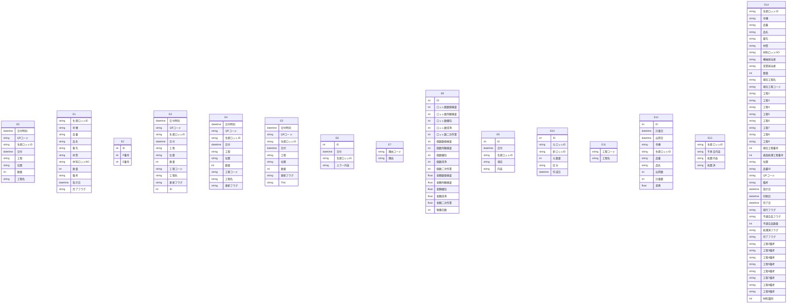

# Access データベース・スキーマ抽出レポート

このファイルは **Access の ODBC メタデータ**から自動生成しました。
LLM に渡す場合は **「スキーマ JSON」セクション**と **「PostgreSQL DDL 草案」**をあわせて指示に含めると、目的の RDB に近い定義を再現しやすくなります。

## LLM / AI 向け: このドキュメントの使い方

以下をプロンプトにコピーして、目的の SQL ダイアレクト（例: PostgreSQL）向け **CREATE TABLE・INDEX・FK** を生成させてください。

```text
あなたはデータベース設計者です。添付 Markdown の次を根拠に、一貫したリレーショナルスキーマを設計してください。
1) YAML フロントマターと「サマリー」の数値
2) 「スキーマ JSON（機械可読・全量）」の tables / relationships / warnings
3) 「PostgreSQL DDL 草案」は参考用。型・NULL・FK・インデックスを JSON・列定義と突き合わせて修正すること。
4) ODBC が SYNONYM としたテーブルはリンク元の実体が別にある場合がある。移行時はデータ取得元を明示すること。
5) relationships が空のときは、列名・サンプルデータから FK を推論してよいが、推論はコメントで区別すること。
出力: (a) 最終 DDL (b) 設計上の想定・未確定事項の箇条書き
```

> ⚠ FK 取得スキップ: t_ExcelQR履歴 — ('IM001', '[IM001] [Microsoft][ODBC Driver Manager] ドライバーはこの関数をサポートしていません。 (0) (SQLForeignKeys)')
> ⚠ FK 取得スキップ: t_Excel現品票履歴 — ('IM001', '[IM001] [Microsoft][ODBC Driver Manager] ドライバーはこの関数をサポートしていません。 (0) (SQLForeignKeys)')
> ⚠ FK 取得スキップ: t_ID番号 — ('IM001', '[IM001] [Microsoft][ODBC Driver Manager] ドライバーはこの関数をサポートしていません。 (0) (SQLForeignKeys)')
> ⚠ FK 取得スキップ: t_QR履歴 — ('IM001', '[IM001] [Microsoft][ODBC Driver Manager] ドライバーはこの関数をサポートしていません。 (0) (SQLForeignKeys)')
> ⚠ FK 取得スキップ: t_QR履歴(backup_260521) — ('IM001', '[IM001] [Microsoft][ODBC Driver Manager] ドライバーはこの関数をサポートしていません。 (0) (SQLForeignKeys)')
> ⚠ FK 取得スキップ: t_QR履歴Tmp — ('IM001', '[IM001] [Microsoft][ODBC Driver Manager] ドライバーはこの関数をサポートしていません。 (0) (SQLForeignKeys)')
> ⚠ FK 取得スキップ: t_エラーログ — ('IM001', '[IM001] [Microsoft][ODBC Driver Manager] ドライバーはこの関数をサポートしていません。 (0) (SQLForeignKeys)')
> ⚠ FK 取得スキップ: t_ロット完了理由 — ('IM001', '[IM001] [Microsoft][ODBC Driver Manager] ドライバーはこの関数をサポートしていません。 (0) (SQLForeignKeys)')
> ⚠ FK 取得スキップ: t_作業履歴 — ('IM001', '[IM001] [Microsoft][ODBC Driver Manager] ドライバーはこの関数をサポートしていません。 (0) (SQLForeignKeys)')
> ⚠ FK 取得スキップ: t_修正ログ — ('IM001', '[IM001] [Microsoft][ODBC Driver Manager] ドライバーはこの関数をサポートしていません。 (0) (SQLForeignKeys)')
> ⚠ FK 取得スキップ: t_分割ロット — ('IM001', '[IM001] [Microsoft][ODBC Driver Manager] ドライバーはこの関数をサポートしていません。 (0) (SQLForeignKeys)')
> ⚠ FK 取得スキップ: t_工程マスタ — ('IM001', '[IM001] [Microsoft][ODBC Driver Manager] ドライバーはこの関数をサポートしていません。 (0) (SQLForeignKeys)')
> ⚠ FK 取得スキップ: t_数量差異 — ('IM001', '[IM001] [Microsoft][ODBC Driver Manager] ドライバーはこの関数をサポートしていません。 (0) (SQLForeignKeys)')
> ⚠ FK 取得スキップ: t_現品票不具合内容 — ('IM001', '[IM001] [Microsoft][ODBC Driver Manager] ドライバーはこの関数をサポートしていません。 (0) (SQLForeignKeys)')
> ⚠ FK 取得スキップ: t_現品票履歴 — ('IM001', '[IM001] [Microsoft][ODBC Driver Manager] ドライバーはこの関数をサポートしていません。 (0) (SQLForeignKeys)')

## サマリー

| 項目 | 値 |
|---|---|
| Access ファイル | `\\192.168.1.200\共有\QRシステム\Access\現品票DB.accdb` |
| ODBC ドライバ | `Microsoft Access Driver (*.mdb, *.accdb)` |
| テーブル数 | 15 |
| 行数合計（取得できたテーブルのみ） | 548,615 |
| リンクテーブル相当（ODBC: SYNONYM） | 0 |
| 外部キー（検出分） | 0 |
| ビュー / クエリ名 | 0 |
| 警告 | 15 |

## ER 図（Mermaid・参考）

Mermaid 内のエンティティは `E0`, `E1`, … です。実テーブル名は次の対応表を参照してください。

| 記号 | テーブル名 | ODBC 型 | 行数 |
|---|---|---:|---:|
| E0 | `t_ExcelQR履歴` | TABLE | 0 |
| E1 | `t_Excel現品票履歴` | TABLE | 35,817 |
| E2 | `t_ID番号` | TABLE | 1 |
| E3 | `t_QR履歴` | TABLE | 112,500 |
| E4 | `t_QR履歴(backup_260521)` | TABLE | 106,967 |
| E5 | `t_QR履歴Tmp` | TABLE | 44,867 |
| E6 | `t_エラーログ` | TABLE | 16,564 |
| E7 | `t_ロット完了理由` | TABLE | 6 |
| E8 | `t_作業履歴` | TABLE | 1 |
| E9 | `t_修正ログ` | TABLE | 9,927 |
| E10 | `t_分割ロット` | TABLE | 7,595 |
| E11 | `t_工程マスタ` | TABLE | 5 |
| E12 | `t_数量差異` | TABLE | 78,357 |
| E13 | `t_現品票不具合内容` | TABLE | 165 |
| E14 | `t_現品票履歴` | TABLE | 135,843 |



## PostgreSQL DDL 草案（全文・自動生成）

```sql
-- PostgreSQL DDL 草案（Access メタデータから自動生成）
-- ※ 型・制約は必ず手動で確認・修正してください

CREATE TABLE "t_ExcelQR履歴" (
    "日付時刻" TIMESTAMP,
    "QRコード" VARCHAR(22),
    "生産ロットID" VARCHAR(7),
    "日付" TIMESTAMP,
    "工程" VARCHAR(2),
    "位置" VARCHAR(2),
    "数量" INTEGER,
    "工程名" VARCHAR(30)
);


CREATE TABLE "t_Excel現品票履歴" (
    "生産ロットID" VARCHAR(7),
    "号機" VARCHAR(5),
    "品番" VARCHAR(30),
    "品名" VARCHAR(30),
    "客先" VARCHAR(30),
    "材質" VARCHAR(50),
    "材料ロットNO" VARCHAR(30),
    "数量" INTEGER,
    "備考" VARCHAR(50),
    "指示日" TIMESTAMP,
    "完了フラグ" VARCHAR(1)
);


CREATE TABLE "t_ID番号" (
    "ID" BIGSERIAL,
    "P番号" INTEGER,
    "E番号" INTEGER
);


CREATE TABLE "t_QR履歴" (
    "日付時刻" TIMESTAMP,
    "QRコード" VARCHAR(22),
    "生産ロットID" VARCHAR(7),
    "日付" TIMESTAMP,
    "工程" VARCHAR(2),
    "位置" VARCHAR(2),
    "数量" INTEGER,
    "工程コード" VARCHAR(2),
    "工程名" VARCHAR(30),
    "更新フラグ" VARCHAR(1),
    "ID" BIGSERIAL
);


CREATE TABLE "t_QR履歴(backup_260521)" (
    "日付時刻" TIMESTAMP,
    "QRコード" VARCHAR(22),
    "生産ロットID" VARCHAR(7),
    "日付" TIMESTAMP,
    "工程" VARCHAR(2),
    "位置" VARCHAR(2),
    "数量" INTEGER,
    "工程コード" VARCHAR(2),
    "工程名" VARCHAR(30),
    "更新フラグ" VARCHAR(1)
);


CREATE TABLE "t_QR履歴Tmp" (
    "日付時刻" TIMESTAMP,
    "QRコード" VARCHAR(22),
    "生産ロットID" VARCHAR(7),
    "日付" TIMESTAMP,
    "工程" VARCHAR(2),
    "位置" VARCHAR(2),
    "数量" INTEGER,
    "更新フラグ" VARCHAR(1),
    "TNo" VARCHAR(1)
);


CREATE TABLE "t_エラーログ" (
    "ID" BIGSERIAL,
    "日付" TIMESTAMP,
    "生産ロットID" VARCHAR(7),
    "エラー内容" VARCHAR(20)
);


CREATE TABLE "t_ロット完了理由" (
    "理由コード" VARCHAR(1),
    "理由" VARCHAR(5)
);


CREATE TABLE "t_作業履歴" (
    "ID" BIGSERIAL,
    "ロット数数値検査" INTEGER,
    "ロット数外観検査" INTEGER,
    "ロット数梱包" INTEGER,
    "ロット数洗浄" INTEGER,
    "ロット数二次作業" INTEGER,
    "個数数値検査" INTEGER,
    "個数外観検査" INTEGER,
    "個数梱包" INTEGER,
    "個数洗浄" INTEGER,
    "個数二次作業" INTEGER,
    "金額数値検査" DOUBLE PRECISION,
    "金額外観検査" DOUBLE PRECISION,
    "金額梱包" DOUBLE PRECISION,
    "金額洗浄" DOUBLE PRECISION,
    "金額二次作業" DOUBLE PRECISION,
    "稼働日数" INTEGER
);


CREATE TABLE "t_修正ログ" (
    "ID" BIGSERIAL,
    "日付" TIMESTAMP,
    "生産ロットID" VARCHAR(7),
    "項目" VARCHAR(5),
    "内容" VARCHAR(15)
);


CREATE TABLE "t_分割ロット" (
    "ID" BIGSERIAL,
    "元ロットID" VARCHAR(7),
    "新ロットID" VARCHAR(7),
    "元数量" INTEGER,
    "区分" VARCHAR(1),
    "作成日" TIMESTAMP
);


CREATE TABLE "t_工程マスタ" (
    "工程コード" VARCHAR(2),
    "工程名" VARCHAR(5)
);


CREATE TABLE "t_数量差異" (
    "ID" BIGSERIAL,
    "計量日" TIMESTAMP,
    "出荷日" TIMESTAMP,
    "号機" VARCHAR(4),
    "生産ロットID" VARCHAR(7),
    "品番" VARCHAR(30),
    "品名" VARCHAR(30),
    "出荷数" INTEGER,
    "計量数" INTEGER,
    "差異" DOUBLE PRECISION
);


CREATE TABLE "t_現品票不具合内容" (
    "生産ロットID" VARCHAR(7),
    "不具合内容" VARCHAR(15),
    "処置内容" VARCHAR(15),
    "処置済" VARCHAR(1)
);


CREATE TABLE "t_現品票履歴" (
    "生産ロットID" VARCHAR(7),
    "号機" VARCHAR(5),
    "品番" VARCHAR(30),
    "品名" VARCHAR(30),
    "客先" VARCHAR(30),
    "材質" VARCHAR(50),
    "材料ロットNO" VARCHAR(30),
    "機械担当者" VARCHAR(10),
    "営業担当者" VARCHAR(5),
    "数量" INTEGER,
    "現在工程名" VARCHAR(30),
    "現在工程コード" VARCHAR(2),
    "工程2" VARCHAR(30),
    "工程3" VARCHAR(30),
    "工程4" VARCHAR(30),
    "工程5" VARCHAR(30),
    "工程6" VARCHAR(30),
    "工程7" VARCHAR(30),
    "工程8" VARCHAR(30),
    "工程9" VARCHAR(30),
    "現在工程番号" INTEGER,
    "表面処理工程番号" INTEGER,
    "位置" VARCHAR(2),
    "品番ID" VARCHAR(6),
    "QRコード" VARCHAR(30),
    "備考" VARCHAR(30),
    "指示日" TIMESTAMP,
    "印刷日" TIMESTAMP,
    "完了日" TIMESTAMP,
    "発行フラグ" VARCHAR(1),
    "不適合品フラグ" VARCHAR(1),
    "不適合品数量" INTEGER,
    "処理済フラグ" VARCHAR(1),
    "完了フラグ" VARCHAR(1),
    "工程2備考" VARCHAR(20),
    "工程3備考" VARCHAR(20),
    "工程4備考" VARCHAR(20),
    "工程5備考" VARCHAR(20),
    "工程6備考" VARCHAR(20),
    "工程7備考" VARCHAR(20),
    "工程8備考" VARCHAR(20),
    "工程9備考" VARCHAR(20),
    "材料識別" INTEGER
);
```

## スキーマ JSON（機械可読・全量）

以下をパースすれば、テーブル・列・PK・インデックス・サンプル・統計・FK・ビュー名を一括で渡せます。

```json
{
  "export_spec": "access-inspector/schema-export/v1",
  "generated_at": "2026-06-12T05:14:04.107859+00:00",
  "source": {
    "database_path": "\\\\192.168.1.200\\共有\\QRシステム\\Access\\現品票DB.accdb",
    "driver_used": "Microsoft Access Driver (*.mdb, *.accdb)"
  },
  "summary": {
    "table_count": 15,
    "sum_row_count_where_known": 548615,
    "tables_with_row_count": 15,
    "linked_table_odbc_synonym_count": 0,
    "relationship_count": 0,
    "view_count": 0,
    "warning_count": 15
  },
  "notes_for_consumer": [
    "ODBC の table_type が SYNONYM のテーブルは Access のリンクテーブルであることが多い。",
    "PostgreSQL 型ヒントは参考。最終 DDL は業務要件とデータ実態で確認すること。",
    "relationships が空でも、命名規則やサンプル行から推定された FK があり得る。"
  ],
  "tables": [
    {
      "name": "t_ExcelQR履歴",
      "table_type": "TABLE",
      "row_count": 0,
      "row_count_error": null,
      "primary_key": [],
      "columns": [
        {
          "name": "日付時刻",
          "access_type": "DATETIME",
          "sql_data_type": 9,
          "column_size": 19,
          "decimal_digits": 0,
          "nullable": true,
          "postgres_type_hint": "TIMESTAMP"
        },
        {
          "name": "QRコード",
          "access_type": "VARCHAR",
          "sql_data_type": -9,
          "column_size": 22,
          "decimal_digits": null,
          "nullable": true,
          "postgres_type_hint": "VARCHAR(22)"
        },
        {
          "name": "生産ロットID",
          "access_type": "VARCHAR",
          "sql_data_type": -9,
          "column_size": 7,
          "decimal_digits": null,
          "nullable": true,
          "postgres_type_hint": "VARCHAR(7)"
        },
        {
          "name": "日付",
          "access_type": "DATETIME",
          "sql_data_type": 9,
          "column_size": 19,
          "decimal_digits": 0,
          "nullable": true,
          "postgres_type_hint": "TIMESTAMP"
        },
        {
          "name": "工程",
          "access_type": "VARCHAR",
          "sql_data_type": -9,
          "column_size": 2,
          "decimal_digits": null,
          "nullable": true,
          "postgres_type_hint": "VARCHAR(2)"
        },
        {
          "name": "位置",
          "access_type": "VARCHAR",
          "sql_data_type": -9,
          "column_size": 2,
          "decimal_digits": null,
          "nullable": true,
          "postgres_type_hint": "VARCHAR(2)"
        },
        {
          "name": "数量",
          "access_type": "INTEGER",
          "sql_data_type": 4,
          "column_size": 10,
          "decimal_digits": 0,
          "nullable": true,
          "postgres_type_hint": "INTEGER"
        },
        {
          "name": "工程名",
          "access_type": "VARCHAR",
          "sql_data_type": -9,
          "column_size": 30,
          "decimal_digits": null,
          "nullable": true,
          "postgres_type_hint": "VARCHAR(30)"
        }
      ],
      "indexes": [],
      "sample_headers": [
        "日付時刻",
        "QRコード",
        "生産ロットID",
        "日付",
        "工程",
        "位置",
        "数量",
        "工程名"
      ],
      "sample_rows": [],
      "column_stats": []
    },
    {
      "name": "t_Excel現品票履歴",
      "table_type": "TABLE",
      "row_count": 35817,
      "row_count_error": null,
      "primary_key": [],
      "columns": [
        {
          "name": "生産ロットID",
          "access_type": "VARCHAR",
          "sql_data_type": -9,
          "column_size": 7,
          "decimal_digits": null,
          "nullable": true,
          "postgres_type_hint": "VARCHAR(7)"
        },
        {
          "name": "号機",
          "access_type": "VARCHAR",
          "sql_data_type": -9,
          "column_size": 5,
          "decimal_digits": null,
          "nullable": true,
          "postgres_type_hint": "VARCHAR(5)"
        },
        {
          "name": "品番",
          "access_type": "VARCHAR",
          "sql_data_type": -9,
          "column_size": 30,
          "decimal_digits": null,
          "nullable": true,
          "postgres_type_hint": "VARCHAR(30)"
        },
        {
          "name": "品名",
          "access_type": "VARCHAR",
          "sql_data_type": -9,
          "column_size": 30,
          "decimal_digits": null,
          "nullable": true,
          "postgres_type_hint": "VARCHAR(30)"
        },
        {
          "name": "客先",
          "access_type": "VARCHAR",
          "sql_data_type": -9,
          "column_size": 30,
          "decimal_digits": null,
          "nullable": true,
          "postgres_type_hint": "VARCHAR(30)"
        },
        {
          "name": "材質",
          "access_type": "VARCHAR",
          "sql_data_type": -9,
          "column_size": 50,
          "decimal_digits": null,
          "nullable": true,
          "postgres_type_hint": "VARCHAR(50)"
        },
        {
          "name": "材料ロットNO",
          "access_type": "VARCHAR",
          "sql_data_type": -9,
          "column_size": 30,
          "decimal_digits": null,
          "nullable": true,
          "postgres_type_hint": "VARCHAR(30)"
        },
        {
          "name": "数量",
          "access_type": "INTEGER",
          "sql_data_type": 4,
          "column_size": 10,
          "decimal_digits": 0,
          "nullable": true,
          "postgres_type_hint": "INTEGER"
        },
        {
          "name": "備考",
          "access_type": "VARCHAR",
          "sql_data_type": -9,
          "column_size": 50,
          "decimal_digits": null,
          "nullable": true,
          "postgres_type_hint": "VARCHAR(50)"
        },
        {
          "name": "指示日",
          "access_type": "DATETIME",
          "sql_data_type": 9,
          "column_size": 19,
          "decimal_digits": 0,
          "nullable": true,
          "postgres_type_hint": "TIMESTAMP"
        },
        {
          "name": "完了フラグ",
          "access_type": "VARCHAR",
          "sql_data_type": -9,
          "column_size": 1,
          "decimal_digits": null,
          "nullable": true,
          "postgres_type_hint": "VARCHAR(1)"
        }
      ],
      "indexes": [],
      "sample_headers": [
        "生産ロットID",
        "号機",
        "品番",
        "品名",
        "客先",
        "材質",
        "材料ロットNO",
        "数量",
        "備考",
        "指示日",
        "完了フラグ"
      ],
      "sample_rows": [
        [
          "E000001",
          "AN",
          "00575532-01",
          "カラー 8×8.16",
          "東京鋲兼",
          "SUS303 φ8.0CM",
          null,
          3730,
          null,
          "2017-10-12T00:00:00",
          null
        ],
        [
          "E000002",
          "AN",
          "00575532-01",
          "カラー 8×8.16",
          "東京鋲兼",
          "SUS303 φ8.0CM",
          null,
          1370,
          null,
          "2017-10-14T00:00:00",
          null
        ],
        [
          "E000003",
          "AN",
          "00575532-05",
          "カラー 8×8.14",
          "東京鋲兼",
          "SUS303 φ8.0CM",
          null,
          2700,
          null,
          "2017-10-14T00:00:00",
          null
        ],
        [
          "E000004",
          "AN-1",
          "FA用リベット",
          "FA用リベット",
          "イワタボルト",
          "SUS303Cu φ10.0D",
          null,
          10000,
          null,
          "2017-10-14T00:00:00",
          null
        ],
        [
          "E000005",
          "AN-2",
          "FA用リベット",
          "FA用リベット",
          "イワタボルト",
          "SUS303Cu φ10.0D",
          null,
          10000,
          null,
          "2017-10-14T00:00:00",
          null
        ]
      ],
      "column_stats": [
        {
          "column": "生産ロットID",
          "null_count": 0,
          "null_rate_pct": 0.0,
          "unique_count": null,
          "unique_rate_pct": null
        },
        {
          "column": "号機",
          "null_count": 0,
          "null_rate_pct": 0.0,
          "unique_count": null,
          "unique_rate_pct": null
        },
        {
          "column": "品番",
          "null_count": 0,
          "null_rate_pct": 0.0,
          "unique_count": null,
          "unique_rate_pct": null
        },
        {
          "column": "品名",
          "null_count": 0,
          "null_rate_pct": 0.0,
          "unique_count": null,
          "unique_rate_pct": null
        },
        {
          "column": "客先",
          "null_count": 0,
          "null_rate_pct": 0.0,
          "unique_count": null,
          "unique_rate_pct": null
        },
        {
          "column": "材質",
          "null_count": 30,
          "null_rate_pct": 0.1,
          "unique_count": null,
          "unique_rate_pct": null
        },
        {
          "column": "材料ロットNO",
          "null_count": 5028,
          "null_rate_pct": 14.0,
          "unique_count": null,
          "unique_rate_pct": null
        },
        {
          "column": "数量",
          "null_count": 2,
          "null_rate_pct": 0.0,
          "unique_count": null,
          "unique_rate_pct": null
        },
        {
          "column": "備考",
          "null_count": 29613,
          "null_rate_pct": 82.7,
          "unique_count": null,
          "unique_rate_pct": null
        },
        {
          "column": "指示日",
          "null_count": 0,
          "null_rate_pct": 0.0,
          "unique_count": null,
          "unique_rate_pct": null
        },
        {
          "column": "完了フラグ",
          "null_count": 35817,
          "null_rate_pct": 100.0,
          "unique_count": null,
          "unique_rate_pct": null
        }
      ]
    },
    {
      "name": "t_ID番号",
      "table_type": "TABLE",
      "row_count": 1,
      "row_count_error": null,
      "primary_key": [],
      "columns": [
        {
          "name": "ID",
          "access_type": "COUNTER",
          "sql_data_type": 4,
          "column_size": 10,
          "decimal_digits": 0,
          "nullable": false,
          "postgres_type_hint": "BIGSERIAL"
        },
        {
          "name": "P番号",
          "access_type": "INTEGER",
          "sql_data_type": 4,
          "column_size": 10,
          "decimal_digits": 0,
          "nullable": true,
          "postgres_type_hint": "INTEGER"
        },
        {
          "name": "E番号",
          "access_type": "INTEGER",
          "sql_data_type": 4,
          "column_size": 10,
          "decimal_digits": 0,
          "nullable": true,
          "postgres_type_hint": "INTEGER"
        }
      ],
      "indexes": [],
      "sample_headers": [
        "ID",
        "P番号",
        "E番号"
      ],
      "sample_rows": [
        [
          1,
          154797,
          16664
        ]
      ],
      "column_stats": [
        {
          "column": "ID",
          "null_count": 0,
          "null_rate_pct": 0.0,
          "unique_count": null,
          "unique_rate_pct": null
        },
        {
          "column": "P番号",
          "null_count": 0,
          "null_rate_pct": 0.0,
          "unique_count": null,
          "unique_rate_pct": null
        },
        {
          "column": "E番号",
          "null_count": 0,
          "null_rate_pct": 0.0,
          "unique_count": null,
          "unique_rate_pct": null
        }
      ]
    },
    {
      "name": "t_QR履歴",
      "table_type": "TABLE",
      "row_count": 112500,
      "row_count_error": null,
      "primary_key": [],
      "columns": [
        {
          "name": "日付時刻",
          "access_type": "DATETIME",
          "sql_data_type": 9,
          "column_size": 19,
          "decimal_digits": 0,
          "nullable": true,
          "postgres_type_hint": "TIMESTAMP"
        },
        {
          "name": "QRコード",
          "access_type": "VARCHAR",
          "sql_data_type": -9,
          "column_size": 22,
          "decimal_digits": null,
          "nullable": true,
          "postgres_type_hint": "VARCHAR(22)"
        },
        {
          "name": "生産ロットID",
          "access_type": "VARCHAR",
          "sql_data_type": -9,
          "column_size": 7,
          "decimal_digits": null,
          "nullable": true,
          "postgres_type_hint": "VARCHAR(7)"
        },
        {
          "name": "日付",
          "access_type": "DATETIME",
          "sql_data_type": 9,
          "column_size": 19,
          "decimal_digits": 0,
          "nullable": true,
          "postgres_type_hint": "TIMESTAMP"
        },
        {
          "name": "工程",
          "access_type": "VARCHAR",
          "sql_data_type": -9,
          "column_size": 2,
          "decimal_digits": null,
          "nullable": true,
          "postgres_type_hint": "VARCHAR(2)"
        },
        {
          "name": "位置",
          "access_type": "VARCHAR",
          "sql_data_type": -9,
          "column_size": 2,
          "decimal_digits": null,
          "nullable": true,
          "postgres_type_hint": "VARCHAR(2)"
        },
        {
          "name": "数量",
          "access_type": "INTEGER",
          "sql_data_type": 4,
          "column_size": 10,
          "decimal_digits": 0,
          "nullable": true,
          "postgres_type_hint": "INTEGER"
        },
        {
          "name": "工程コード",
          "access_type": "VARCHAR",
          "sql_data_type": -9,
          "column_size": 2,
          "decimal_digits": null,
          "nullable": true,
          "postgres_type_hint": "VARCHAR(2)"
        },
        {
          "name": "工程名",
          "access_type": "VARCHAR",
          "sql_data_type": -9,
          "column_size": 30,
          "decimal_digits": null,
          "nullable": true,
          "postgres_type_hint": "VARCHAR(30)"
        },
        {
          "name": "更新フラグ",
          "access_type": "VARCHAR",
          "sql_data_type": -9,
          "column_size": 1,
          "decimal_digits": null,
          "nullable": true,
          "postgres_type_hint": "VARCHAR(1)"
        },
        {
          "name": "ID",
          "access_type": "COUNTER",
          "sql_data_type": 4,
          "column_size": 10,
          "decimal_digits": 0,
          "nullable": false,
          "postgres_type_hint": "BIGSERIAL"
        }
      ],
      "indexes": [],
      "sample_headers": [
        "日付時刻",
        "QRコード",
        "生産ロットID",
        "日付",
        "工程",
        "位置",
        "数量",
        "工程コード",
        "工程名",
        "更新フラグ",
        "ID"
      ],
      "sample_rows": [
        [
          "2026-05-22T08:40:22",
          "P153419260519076A06003",
          "P153419",
          "2026-05-22T00:00:00",
          "1",
          "1",
          1534,
          "01",
          "洗浄",
          "1",
          107074
        ],
        [
          "2026-05-22T08:41:23",
          "P153479260520035A06003",
          "P153479",
          "2026-05-22T00:00:00",
          "1",
          "1",
          1857,
          "01",
          "洗浄",
          "1",
          107075
        ],
        [
          "2026-05-22T08:49:51",
          "P152694260428041A00414",
          "P152694",
          "2026-05-22T00:00:00",
          "3",
          "0",
          1715,
          "03",
          "外観検査",
          "1",
          107076
        ],
        [
          "2026-05-22T09:04:02",
          "P153281260516058A04549",
          "P153281",
          "2026-05-22T00:00:00",
          "1",
          "1",
          1882,
          "01",
          "洗浄",
          "1",
          107077
        ],
        [
          "2026-05-22T09:05:00",
          "P153336260516058A04549",
          "P153336",
          "2026-05-22T00:00:00",
          "1",
          "1",
          1487,
          "01",
          "洗浄",
          "1",
          107078
        ]
      ],
      "column_stats": [
        {
          "column": "日付時刻",
          "null_count": 0,
          "null_rate_pct": 0.0,
          "unique_count": null,
          "unique_rate_pct": null
        },
        {
          "column": "QRコード",
          "null_count": 0,
          "null_rate_pct": 0.0,
          "unique_count": null,
          "unique_rate_pct": null
        },
        {
          "column": "生産ロットID",
          "null_count": 0,
          "null_rate_pct": 0.0,
          "unique_count": null,
          "unique_rate_pct": null
        },
        {
          "column": "日付",
          "null_count": 0,
          "null_rate_pct": 0.0,
          "unique_count": null,
          "unique_rate_pct": null
        },
        {
          "column": "工程",
          "null_count": 0,
          "null_rate_pct": 0.0,
          "unique_count": null,
          "unique_rate_pct": null
        },
        {
          "column": "位置",
          "null_count": 0,
          "null_rate_pct": 0.0,
          "unique_count": null,
          "unique_rate_pct": null
        },
        {
          "column": "数量",
          "null_count": 0,
          "null_rate_pct": 0.0,
          "unique_count": null,
          "unique_rate_pct": null
        },
        {
          "column": "工程コード",
          "null_count": 12,
          "null_rate_pct": 0.0,
          "unique_count": null,
          "unique_rate_pct": null
        },
        {
          "column": "工程名",
          "null_count": 12,
          "null_rate_pct": 0.0,
          "unique_count": null,
          "unique_rate_pct": null
        },
        {
          "column": "更新フラグ",
          "null_count": 0,
          "null_rate_pct": 0.0,
          "unique_count": null,
          "unique_rate_pct": null
        },
        {
          "column": "ID",
          "null_count": 0,
          "null_rate_pct": 0.0,
          "unique_count": null,
          "unique_rate_pct": null
        }
      ]
    },
    {
      "name": "t_QR履歴(backup_260521)",
      "table_type": "TABLE",
      "row_count": 106967,
      "row_count_error": null,
      "primary_key": [],
      "columns": [
        {
          "name": "日付時刻",
          "access_type": "DATETIME",
          "sql_data_type": 9,
          "column_size": 19,
          "decimal_digits": 0,
          "nullable": true,
          "postgres_type_hint": "TIMESTAMP"
        },
        {
          "name": "QRコード",
          "access_type": "VARCHAR",
          "sql_data_type": -9,
          "column_size": 22,
          "decimal_digits": null,
          "nullable": true,
          "postgres_type_hint": "VARCHAR(22)"
        },
        {
          "name": "生産ロットID",
          "access_type": "VARCHAR",
          "sql_data_type": -9,
          "column_size": 7,
          "decimal_digits": null,
          "nullable": true,
          "postgres_type_hint": "VARCHAR(7)"
        },
        {
          "name": "日付",
          "access_type": "DATETIME",
          "sql_data_type": 9,
          "column_size": 19,
          "decimal_digits": 0,
          "nullable": true,
          "postgres_type_hint": "TIMESTAMP"
        },
        {
          "name": "工程",
          "access_type": "VARCHAR",
          "sql_data_type": -9,
          "column_size": 2,
          "decimal_digits": null,
          "nullable": true,
          "postgres_type_hint": "VARCHAR(2)"
        },
        {
          "name": "位置",
          "access_type": "VARCHAR",
          "sql_data_type": -9,
          "column_size": 2,
          "decimal_digits": null,
          "nullable": true,
          "postgres_type_hint": "VARCHAR(2)"
        },
        {
          "name": "数量",
          "access_type": "INTEGER",
          "sql_data_type": 4,
          "column_size": 10,
          "decimal_digits": 0,
          "nullable": true,
          "postgres_type_hint": "INTEGER"
        },
        {
          "name": "工程コード",
          "access_type": "VARCHAR",
          "sql_data_type": -9,
          "column_size": 2,
          "decimal_digits": null,
          "nullable": true,
          "postgres_type_hint": "VARCHAR(2)"
        },
        {
          "name": "工程名",
          "access_type": "VARCHAR",
          "sql_data_type": -9,
          "column_size": 30,
          "decimal_digits": null,
          "nullable": true,
          "postgres_type_hint": "VARCHAR(30)"
        },
        {
          "name": "更新フラグ",
          "access_type": "VARCHAR",
          "sql_data_type": -9,
          "column_size": 1,
          "decimal_digits": null,
          "nullable": true,
          "postgres_type_hint": "VARCHAR(1)"
        }
      ],
      "indexes": [],
      "sample_headers": [
        "日付時刻",
        "QRコード",
        "生産ロットID",
        "日付",
        "工程",
        "位置",
        "数量",
        "工程コード",
        "工程名",
        "更新フラグ"
      ],
      "sample_rows": [
        [
          "2025-02-06T08:45:47",
          "P131807250203048A01780",
          "P131807",
          "2025-02-06T00:00:00",
          "3",
          "0",
          0,
          "--",
          "外観検査  1",
          "1"
        ],
        [
          "2025-02-06T08:50:02",
          "P131754250202044A04740",
          "P131754",
          "2025-02-06T00:00:00",
          "2",
          "1",
          0,
          "04",
          "磁気ﾊﾞﾚﾙ 4槽1  ASK8",
          "1"
        ],
        [
          "2025-02-06T08:50:52",
          "P131753250202043A04740",
          "P131753",
          "2025-02-06T00:00:00",
          "2",
          "1",
          0,
          "04",
          "磁気ﾊﾞﾚﾙ 4槽1  ASK8",
          "1"
        ],
        [
          "2025-02-06T08:51:36",
          "P131766250202061A04740",
          "P131766",
          "2025-02-06T00:00:00",
          "2",
          "1",
          0,
          "04",
          "磁気ﾊﾞﾚﾙ 4槽1  ASK8",
          "1"
        ],
        [
          "2025-02-06T08:53:46",
          "P130915250117064A04549",
          "P130915",
          "2025-02-06T00:00:00",
          "1",
          "1",
          1399,
          "01",
          "洗浄",
          "1"
        ]
      ],
      "column_stats": [
        {
          "column": "日付時刻",
          "null_count": 0,
          "null_rate_pct": 0.0,
          "unique_count": null,
          "unique_rate_pct": null
        },
        {
          "column": "QRコード",
          "null_count": 0,
          "null_rate_pct": 0.0,
          "unique_count": null,
          "unique_rate_pct": null
        },
        {
          "column": "生産ロットID",
          "null_count": 0,
          "null_rate_pct": 0.0,
          "unique_count": null,
          "unique_rate_pct": null
        },
        {
          "column": "日付",
          "null_count": 0,
          "null_rate_pct": 0.0,
          "unique_count": null,
          "unique_rate_pct": null
        },
        {
          "column": "工程",
          "null_count": 0,
          "null_rate_pct": 0.0,
          "unique_count": null,
          "unique_rate_pct": null
        },
        {
          "column": "位置",
          "null_count": 0,
          "null_rate_pct": 0.0,
          "unique_count": null,
          "unique_rate_pct": null
        },
        {
          "column": "数量",
          "null_count": 0,
          "null_rate_pct": 0.0,
          "unique_count": null,
          "unique_rate_pct": null
        },
        {
          "column": "工程コード",
          "null_count": 10,
          "null_rate_pct": 0.0,
          "unique_count": null,
          "unique_rate_pct": null
        },
        {
          "column": "工程名",
          "null_count": 10,
          "null_rate_pct": 0.0,
          "unique_count": null,
          "unique_rate_pct": null
        },
        {
          "column": "更新フラグ",
          "null_count": 0,
          "null_rate_pct": 0.0,
          "unique_count": null,
          "unique_rate_pct": null
        }
      ]
    },
    {
      "name": "t_QR履歴Tmp",
      "table_type": "TABLE",
      "row_count": 44867,
      "row_count_error": null,
      "primary_key": [],
      "columns": [
        {
          "name": "日付時刻",
          "access_type": "DATETIME",
          "sql_data_type": 9,
          "column_size": 19,
          "decimal_digits": 0,
          "nullable": true,
          "postgres_type_hint": "TIMESTAMP"
        },
        {
          "name": "QRコード",
          "access_type": "VARCHAR",
          "sql_data_type": -9,
          "column_size": 22,
          "decimal_digits": null,
          "nullable": true,
          "postgres_type_hint": "VARCHAR(22)"
        },
        {
          "name": "生産ロットID",
          "access_type": "VARCHAR",
          "sql_data_type": -9,
          "column_size": 7,
          "decimal_digits": null,
          "nullable": true,
          "postgres_type_hint": "VARCHAR(7)"
        },
        {
          "name": "日付",
          "access_type": "DATETIME",
          "sql_data_type": 9,
          "column_size": 19,
          "decimal_digits": 0,
          "nullable": true,
          "postgres_type_hint": "TIMESTAMP"
        },
        {
          "name": "工程",
          "access_type": "VARCHAR",
          "sql_data_type": -9,
          "column_size": 2,
          "decimal_digits": null,
          "nullable": true,
          "postgres_type_hint": "VARCHAR(2)"
        },
        {
          "name": "位置",
          "access_type": "VARCHAR",
          "sql_data_type": -9,
          "column_size": 2,
          "decimal_digits": null,
          "nullable": true,
          "postgres_type_hint": "VARCHAR(2)"
        },
        {
          "name": "数量",
          "access_type": "INTEGER",
          "sql_data_type": 4,
          "column_size": 10,
          "decimal_digits": 0,
          "nullable": true,
          "postgres_type_hint": "INTEGER"
        },
        {
          "name": "更新フラグ",
          "access_type": "VARCHAR",
          "sql_data_type": -9,
          "column_size": 1,
          "decimal_digits": null,
          "nullable": true,
          "postgres_type_hint": "VARCHAR(1)"
        },
        {
          "name": "TNo",
          "access_type": "VARCHAR",
          "sql_data_type": -9,
          "column_size": 1,
          "decimal_digits": null,
          "nullable": true,
          "postgres_type_hint": "VARCHAR(1)"
        }
      ],
      "indexes": [],
      "sample_headers": [
        "日付時刻",
        "QRコード",
        "生産ロットID",
        "日付",
        "工程",
        "位置",
        "数量",
        "更新フラグ",
        "TNo"
      ],
      "sample_rows": [
        [
          "2025-01-06T08:48:34",
          "P129215241130065A01780",
          "P129215",
          "2025-01-06T00:00:00",
          "9",
          "0",
          0,
          "A",
          "4"
        ],
        [
          "2025-01-06T08:48:43",
          "P129159241129065A01780",
          "P129159",
          "2025-01-06T00:00:00",
          "9",
          "0",
          0,
          "A",
          "4"
        ],
        [
          "2025-01-06T08:48:51",
          "P129105241128065A01780",
          "P129105",
          "2025-01-06T00:00:00",
          "9",
          "0",
          0,
          "A",
          "4"
        ],
        [
          "2025-01-06T08:49:00",
          "P129049241127065A01780",
          "P129049",
          "2025-01-06T00:00:00",
          "9",
          "0",
          0,
          "A",
          "4"
        ],
        [
          "2025-01-06T08:49:09",
          "P128996241126065A01780",
          "P128996",
          "2025-01-06T00:00:00",
          "9",
          "0",
          0,
          "A",
          "4"
        ]
      ],
      "column_stats": [
        {
          "column": "日付時刻",
          "null_count": 0,
          "null_rate_pct": 0.0,
          "unique_count": null,
          "unique_rate_pct": null
        },
        {
          "column": "QRコード",
          "null_count": 0,
          "null_rate_pct": 0.0,
          "unique_count": null,
          "unique_rate_pct": null
        },
        {
          "column": "生産ロットID",
          "null_count": 0,
          "null_rate_pct": 0.0,
          "unique_count": null,
          "unique_rate_pct": null
        },
        {
          "column": "日付",
          "null_count": 0,
          "null_rate_pct": 0.0,
          "unique_count": null,
          "unique_rate_pct": null
        },
        {
          "column": "工程",
          "null_count": 0,
          "null_rate_pct": 0.0,
          "unique_count": null,
          "unique_rate_pct": null
        },
        {
          "column": "位置",
          "null_count": 0,
          "null_rate_pct": 0.0,
          "unique_count": null,
          "unique_rate_pct": null
        },
        {
          "column": "数量",
          "null_count": 0,
          "null_rate_pct": 0.0,
          "unique_count": null,
          "unique_rate_pct": null
        },
        {
          "column": "更新フラグ",
          "null_count": 1,
          "null_rate_pct": 0.0,
          "unique_count": null,
          "unique_rate_pct": null
        },
        {
          "column": "TNo",
          "null_count": 0,
          "null_rate_pct": 0.0,
          "unique_count": null,
          "unique_rate_pct": null
        }
      ]
    },
    {
      "name": "t_エラーログ",
      "table_type": "TABLE",
      "row_count": 16564,
      "row_count_error": null,
      "primary_key": [],
      "columns": [
        {
          "name": "ID",
          "access_type": "COUNTER",
          "sql_data_type": 4,
          "column_size": 10,
          "decimal_digits": 0,
          "nullable": false,
          "postgres_type_hint": "BIGSERIAL"
        },
        {
          "name": "日付",
          "access_type": "DATETIME",
          "sql_data_type": 9,
          "column_size": 19,
          "decimal_digits": 0,
          "nullable": true,
          "postgres_type_hint": "TIMESTAMP"
        },
        {
          "name": "生産ロットID",
          "access_type": "VARCHAR",
          "sql_data_type": -9,
          "column_size": 7,
          "decimal_digits": null,
          "nullable": true,
          "postgres_type_hint": "VARCHAR(7)"
        },
        {
          "name": "エラー内容",
          "access_type": "VARCHAR",
          "sql_data_type": -9,
          "column_size": 20,
          "decimal_digits": null,
          "nullable": true,
          "postgres_type_hint": "VARCHAR(20)"
        }
      ],
      "indexes": [],
      "sample_headers": [
        "ID",
        "日付",
        "生産ロットID",
        "エラー内容"
      ],
      "sample_rows": [
        [
          1757,
          "2019-07-10T00:00:00",
          "P032278",
          "工程番号逆転 現在：6→ 今回：3"
        ],
        [
          1758,
          "2019-07-10T00:00:00",
          "P031854",
          "工程番号逆転 現在：4→ 今回：3"
        ],
        [
          1759,
          "2019-07-11T00:00:00",
          "P032045",
          "工程番号逆転 現在：5→ 今回：2"
        ],
        [
          1760,
          "2019-07-11T00:00:00",
          "P032260",
          "工程番号逆転 現在：4→ 今回：2"
        ],
        [
          1761,
          "2019-07-11T00:00:00",
          "P032253",
          "工程番号逆転 現在：4→ 今回：2"
        ]
      ],
      "column_stats": [
        {
          "column": "ID",
          "null_count": 0,
          "null_rate_pct": 0.0,
          "unique_count": null,
          "unique_rate_pct": null
        },
        {
          "column": "日付",
          "null_count": 0,
          "null_rate_pct": 0.0,
          "unique_count": null,
          "unique_rate_pct": null
        },
        {
          "column": "生産ロットID",
          "null_count": 0,
          "null_rate_pct": 0.0,
          "unique_count": null,
          "unique_rate_pct": null
        },
        {
          "column": "エラー内容",
          "null_count": 0,
          "null_rate_pct": 0.0,
          "unique_count": null,
          "unique_rate_pct": null
        }
      ]
    },
    {
      "name": "t_ロット完了理由",
      "table_type": "TABLE",
      "row_count": 6,
      "row_count_error": null,
      "primary_key": [],
      "columns": [
        {
          "name": "理由コード",
          "access_type": "VARCHAR",
          "sql_data_type": -9,
          "column_size": 1,
          "decimal_digits": null,
          "nullable": true,
          "postgres_type_hint": "VARCHAR(1)"
        },
        {
          "name": "理由",
          "access_type": "VARCHAR",
          "sql_data_type": -9,
          "column_size": 5,
          "decimal_digits": null,
          "nullable": true,
          "postgres_type_hint": "VARCHAR(5)"
        }
      ],
      "indexes": [],
      "sample_headers": [
        "理由コード",
        "理由"
      ],
      "sample_rows": [
        [
          "0",
          "通常"
        ],
        [
          "1",
          "統合"
        ],
        [
          "2",
          "不適合"
        ],
        [
          "3",
          "未使用"
        ],
        [
          "4",
          "廃棄"
        ]
      ],
      "column_stats": [
        {
          "column": "理由コード",
          "null_count": 0,
          "null_rate_pct": 0.0,
          "unique_count": null,
          "unique_rate_pct": null
        },
        {
          "column": "理由",
          "null_count": 0,
          "null_rate_pct": 0.0,
          "unique_count": null,
          "unique_rate_pct": null
        }
      ]
    },
    {
      "name": "t_作業履歴",
      "table_type": "TABLE",
      "row_count": 1,
      "row_count_error": null,
      "primary_key": [],
      "columns": [
        {
          "name": "ID",
          "access_type": "COUNTER",
          "sql_data_type": 4,
          "column_size": 10,
          "decimal_digits": 0,
          "nullable": false,
          "postgres_type_hint": "BIGSERIAL"
        },
        {
          "name": "ロット数数値検査",
          "access_type": "INTEGER",
          "sql_data_type": 4,
          "column_size": 10,
          "decimal_digits": 0,
          "nullable": true,
          "postgres_type_hint": "INTEGER"
        },
        {
          "name": "ロット数外観検査",
          "access_type": "INTEGER",
          "sql_data_type": 4,
          "column_size": 10,
          "decimal_digits": 0,
          "nullable": true,
          "postgres_type_hint": "INTEGER"
        },
        {
          "name": "ロット数梱包",
          "access_type": "INTEGER",
          "sql_data_type": 4,
          "column_size": 10,
          "decimal_digits": 0,
          "nullable": true,
          "postgres_type_hint": "INTEGER"
        },
        {
          "name": "ロット数洗浄",
          "access_type": "INTEGER",
          "sql_data_type": 4,
          "column_size": 10,
          "decimal_digits": 0,
          "nullable": true,
          "postgres_type_hint": "INTEGER"
        },
        {
          "name": "ロット数二次作業",
          "access_type": "INTEGER",
          "sql_data_type": 4,
          "column_size": 10,
          "decimal_digits": 0,
          "nullable": true,
          "postgres_type_hint": "INTEGER"
        },
        {
          "name": "個数数値検査",
          "access_type": "INTEGER",
          "sql_data_type": 4,
          "column_size": 10,
          "decimal_digits": 0,
          "nullable": true,
          "postgres_type_hint": "INTEGER"
        },
        {
          "name": "個数外観検査",
          "access_type": "INTEGER",
          "sql_data_type": 4,
          "column_size": 10,
          "decimal_digits": 0,
          "nullable": true,
          "postgres_type_hint": "INTEGER"
        },
        {
          "name": "個数梱包",
          "access_type": "INTEGER",
          "sql_data_type": 4,
          "column_size": 10,
          "decimal_digits": 0,
          "nullable": true,
          "postgres_type_hint": "INTEGER"
        },
        {
          "name": "個数洗浄",
          "access_type": "INTEGER",
          "sql_data_type": 4,
          "column_size": 10,
          "decimal_digits": 0,
          "nullable": true,
          "postgres_type_hint": "INTEGER"
        },
        {
          "name": "個数二次作業",
          "access_type": "INTEGER",
          "sql_data_type": 4,
          "column_size": 10,
          "decimal_digits": 0,
          "nullable": true,
          "postgres_type_hint": "INTEGER"
        },
        {
          "name": "金額数値検査",
          "access_type": "DOUBLE",
          "sql_data_type": 8,
          "column_size": 53,
          "decimal_digits": null,
          "nullable": true,
          "postgres_type_hint": "DOUBLE PRECISION"
        },
        {
          "name": "金額外観検査",
          "access_type": "DOUBLE",
          "sql_data_type": 8,
          "column_size": 53,
          "decimal_digits": null,
          "nullable": true,
          "postgres_type_hint": "DOUBLE PRECISION"
        },
        {
          "name": "金額梱包",
          "access_type": "DOUBLE",
          "sql_data_type": 8,
          "column_size": 53,
          "decimal_digits": null,
          "nullable": true,
          "postgres_type_hint": "DOUBLE PRECISION"
        },
        {
          "name": "金額洗浄",
          "access_type": "DOUBLE",
          "sql_data_type": 8,
          "column_size": 53,
          "decimal_digits": null,
          "nullable": true,
          "postgres_type_hint": "DOUBLE PRECISION"
        },
        {
          "name": "金額二次作業",
          "access_type": "DOUBLE",
          "sql_data_type": 8,
          "column_size": 53,
          "decimal_digits": null,
          "nullable": true,
          "postgres_type_hint": "DOUBLE PRECISION"
        },
        {
          "name": "稼働日数",
          "access_type": "INTEGER",
          "sql_data_type": 4,
          "column_size": 10,
          "decimal_digits": 0,
          "nullable": true,
          "postgres_type_hint": "INTEGER"
        }
      ],
      "indexes": [],
      "sample_headers": [
        "ID",
        "ロット数数値検査",
        "ロット数外観検査",
        "ロット数梱包",
        "ロット数洗浄",
        "ロット数二次作業",
        "個数数値検査",
        "個数外観検査",
        "個数梱包",
        "個数洗浄",
        "個数二次作業",
        "金額数値検査",
        "金額外観検査",
        "金額梱包",
        "金額洗浄",
        "金額二次作業",
        "稼働日数"
      ],
      "sample_rows": [
        [
          1,
          1489,
          1397,
          1375,
          1553,
          221,
          2700000,
          2658688,
          2731421,
          2723137,
          439158,
          92607775.0,
          89861464.0,
          89184398.0,
          93153324.0,
          11924222.0,
          20
        ]
      ],
      "column_stats": [
        {
          "column": "ID",
          "null_count": 0,
          "null_rate_pct": 0.0,
          "unique_count": null,
          "unique_rate_pct": null
        },
        {
          "column": "ロット数数値検査",
          "null_count": 0,
          "null_rate_pct": 0.0,
          "unique_count": null,
          "unique_rate_pct": null
        },
        {
          "column": "ロット数外観検査",
          "null_count": 0,
          "null_rate_pct": 0.0,
          "unique_count": null,
          "unique_rate_pct": null
        },
        {
          "column": "ロット数梱包",
          "null_count": 0,
          "null_rate_pct": 0.0,
          "unique_count": null,
          "unique_rate_pct": null
        },
        {
          "column": "ロット数洗浄",
          "null_count": 0,
          "null_rate_pct": 0.0,
          "unique_count": null,
          "unique_rate_pct": null
        },
        {
          "column": "ロット数二次作業",
          "null_count": 0,
          "null_rate_pct": 0.0,
          "unique_count": null,
          "unique_rate_pct": null
        },
        {
          "column": "個数数値検査",
          "null_count": 0,
          "null_rate_pct": 0.0,
          "unique_count": null,
          "unique_rate_pct": null
        },
        {
          "column": "個数外観検査",
          "null_count": 0,
          "null_rate_pct": 0.0,
          "unique_count": null,
          "unique_rate_pct": null
        },
        {
          "column": "個数梱包",
          "null_count": 0,
          "null_rate_pct": 0.0,
          "unique_count": null,
          "unique_rate_pct": null
        },
        {
          "column": "個数洗浄",
          "null_count": 0,
          "null_rate_pct": 0.0,
          "unique_count": null,
          "unique_rate_pct": null
        },
        {
          "column": "個数二次作業",
          "null_count": 0,
          "null_rate_pct": 0.0,
          "unique_count": null,
          "unique_rate_pct": null
        },
        {
          "column": "金額数値検査",
          "null_count": 0,
          "null_rate_pct": 0.0,
          "unique_count": null,
          "unique_rate_pct": null
        },
        {
          "column": "金額外観検査",
          "null_count": 0,
          "null_rate_pct": 0.0,
          "unique_count": null,
          "unique_rate_pct": null
        },
        {
          "column": "金額梱包",
          "null_count": 0,
          "null_rate_pct": 0.0,
          "unique_count": null,
          "unique_rate_pct": null
        },
        {
          "column": "金額洗浄",
          "null_count": 0,
          "null_rate_pct": 0.0,
          "unique_count": null,
          "unique_rate_pct": null
        },
        {
          "column": "金額二次作業",
          "null_count": 0,
          "null_rate_pct": 0.0,
          "unique_count": null,
          "unique_rate_pct": null
        },
        {
          "column": "稼働日数",
          "null_count": 0,
          "null_rate_pct": 0.0,
          "unique_count": null,
          "unique_rate_pct": null
        }
      ]
    },
    {
      "name": "t_修正ログ",
      "table_type": "TABLE",
      "row_count": 9927,
      "row_count_error": null,
      "primary_key": [],
      "columns": [
        {
          "name": "ID",
          "access_type": "COUNTER",
          "sql_data_type": 4,
          "column_size": 10,
          "decimal_digits": 0,
          "nullable": false,
          "postgres_type_hint": "BIGSERIAL"
        },
        {
          "name": "日付",
          "access_type": "DATETIME",
          "sql_data_type": 9,
          "column_size": 19,
          "decimal_digits": 0,
          "nullable": true,
          "postgres_type_hint": "TIMESTAMP"
        },
        {
          "name": "生産ロットID",
          "access_type": "VARCHAR",
          "sql_data_type": -9,
          "column_size": 7,
          "decimal_digits": null,
          "nullable": true,
          "postgres_type_hint": "VARCHAR(7)"
        },
        {
          "name": "項目",
          "access_type": "VARCHAR",
          "sql_data_type": -9,
          "column_size": 5,
          "decimal_digits": null,
          "nullable": true,
          "postgres_type_hint": "VARCHAR(5)"
        },
        {
          "name": "内容",
          "access_type": "VARCHAR",
          "sql_data_type": -9,
          "column_size": 15,
          "decimal_digits": null,
          "nullable": true,
          "postgres_type_hint": "VARCHAR(15)"
        }
      ],
      "indexes": [],
      "sample_headers": [
        "ID",
        "日付",
        "生産ロットID",
        "項目",
        "内容"
      ],
      "sample_rows": [
        [
          32,
          "2019-07-10T00:00:00",
          "P032242",
          "品質11",
          "不適合品→良品"
        ],
        [
          33,
          "2019-07-10T00:00:00",
          "P032276",
          "品質11",
          "不適合品→良品"
        ],
        [
          34,
          "2019-07-10T00:00:00",
          "P031821",
          "完了",
          "仕掛梱包 → 完了"
        ],
        [
          35,
          "2019-07-10T00:00:00",
          "P031838",
          "完了",
          "無電解Niﾒ → 完了"
        ],
        [
          36,
          "2019-07-10T00:00:00",
          "P031838",
          "数量修正",
          "1600 → 0"
        ]
      ],
      "column_stats": [
        {
          "column": "ID",
          "null_count": 0,
          "null_rate_pct": 0.0,
          "unique_count": null,
          "unique_rate_pct": null
        },
        {
          "column": "日付",
          "null_count": 0,
          "null_rate_pct": 0.0,
          "unique_count": null,
          "unique_rate_pct": null
        },
        {
          "column": "生産ロットID",
          "null_count": 0,
          "null_rate_pct": 0.0,
          "unique_count": null,
          "unique_rate_pct": null
        },
        {
          "column": "項目",
          "null_count": 0,
          "null_rate_pct": 0.0,
          "unique_count": null,
          "unique_rate_pct": null
        },
        {
          "column": "内容",
          "null_count": 0,
          "null_rate_pct": 0.0,
          "unique_count": null,
          "unique_rate_pct": null
        }
      ]
    },
    {
      "name": "t_分割ロット",
      "table_type": "TABLE",
      "row_count": 7595,
      "row_count_error": null,
      "primary_key": [],
      "columns": [
        {
          "name": "ID",
          "access_type": "COUNTER",
          "sql_data_type": 4,
          "column_size": 10,
          "decimal_digits": 0,
          "nullable": false,
          "postgres_type_hint": "BIGSERIAL"
        },
        {
          "name": "元ロットID",
          "access_type": "VARCHAR",
          "sql_data_type": -9,
          "column_size": 7,
          "decimal_digits": null,
          "nullable": true,
          "postgres_type_hint": "VARCHAR(7)"
        },
        {
          "name": "新ロットID",
          "access_type": "VARCHAR",
          "sql_data_type": -9,
          "column_size": 7,
          "decimal_digits": null,
          "nullable": true,
          "postgres_type_hint": "VARCHAR(7)"
        },
        {
          "name": "元数量",
          "access_type": "INTEGER",
          "sql_data_type": 4,
          "column_size": 10,
          "decimal_digits": 0,
          "nullable": true,
          "postgres_type_hint": "INTEGER"
        },
        {
          "name": "区分",
          "access_type": "VARCHAR",
          "sql_data_type": -9,
          "column_size": 1,
          "decimal_digits": null,
          "nullable": true,
          "postgres_type_hint": "VARCHAR(1)"
        },
        {
          "name": "作成日",
          "access_type": "DATETIME",
          "sql_data_type": 9,
          "column_size": 19,
          "decimal_digits": 0,
          "nullable": true,
          "postgres_type_hint": "TIMESTAMP"
        }
      ],
      "indexes": [],
      "sample_headers": [
        "ID",
        "元ロットID",
        "新ロットID",
        "元数量",
        "区分",
        "作成日"
      ],
      "sample_rows": [
        [
          2,
          "P032299",
          "P032388",
          581,
          "1",
          "2019-07-15T00:00:00"
        ],
        [
          3,
          "P032371",
          "P032465",
          790,
          "1",
          "2019-07-17T00:00:00"
        ],
        [
          4,
          "P032337",
          "P032465",
          809,
          "1",
          "2019-07-17T00:00:00"
        ],
        [
          5,
          "P031294",
          "P033082",
          4000,
          "0",
          "2019-07-18T00:00:00"
        ],
        [
          6,
          "P031218",
          "P033217",
          820,
          "0",
          "2019-07-22T00:00:00"
        ]
      ],
      "column_stats": [
        {
          "column": "ID",
          "null_count": 0,
          "null_rate_pct": 0.0,
          "unique_count": null,
          "unique_rate_pct": null
        },
        {
          "column": "元ロットID",
          "null_count": 0,
          "null_rate_pct": 0.0,
          "unique_count": null,
          "unique_rate_pct": null
        },
        {
          "column": "新ロットID",
          "null_count": 0,
          "null_rate_pct": 0.0,
          "unique_count": null,
          "unique_rate_pct": null
        },
        {
          "column": "元数量",
          "null_count": 0,
          "null_rate_pct": 0.0,
          "unique_count": null,
          "unique_rate_pct": null
        },
        {
          "column": "区分",
          "null_count": 0,
          "null_rate_pct": 0.0,
          "unique_count": null,
          "unique_rate_pct": null
        },
        {
          "column": "作成日",
          "null_count": 0,
          "null_rate_pct": 0.0,
          "unique_count": null,
          "unique_rate_pct": null
        }
      ]
    },
    {
      "name": "t_工程マスタ",
      "table_type": "TABLE",
      "row_count": 5,
      "row_count_error": null,
      "primary_key": [],
      "columns": [
        {
          "name": "工程コード",
          "access_type": "VARCHAR",
          "sql_data_type": -9,
          "column_size": 2,
          "decimal_digits": null,
          "nullable": true,
          "postgres_type_hint": "VARCHAR(2)"
        },
        {
          "name": "工程名",
          "access_type": "VARCHAR",
          "sql_data_type": -9,
          "column_size": 5,
          "decimal_digits": null,
          "nullable": true,
          "postgres_type_hint": "VARCHAR(5)"
        }
      ],
      "indexes": [],
      "sample_headers": [
        "工程コード",
        "工程名"
      ],
      "sample_rows": [
        [
          "--",
          "その他"
        ],
        [
          "01",
          "洗浄"
        ],
        [
          "02",
          "数値検査"
        ],
        [
          "03",
          "外観検査"
        ],
        [
          "99",
          "梱包"
        ]
      ],
      "column_stats": [
        {
          "column": "工程コード",
          "null_count": 0,
          "null_rate_pct": 0.0,
          "unique_count": null,
          "unique_rate_pct": null
        },
        {
          "column": "工程名",
          "null_count": 0,
          "null_rate_pct": 0.0,
          "unique_count": null,
          "unique_rate_pct": null
        }
      ]
    },
    {
      "name": "t_数量差異",
      "table_type": "TABLE",
      "row_count": 78357,
      "row_count_error": null,
      "primary_key": [],
      "columns": [
        {
          "name": "ID",
          "access_type": "COUNTER",
          "sql_data_type": 4,
          "column_size": 10,
          "decimal_digits": 0,
          "nullable": false,
          "postgres_type_hint": "BIGSERIAL"
        },
        {
          "name": "計量日",
          "access_type": "DATETIME",
          "sql_data_type": 9,
          "column_size": 19,
          "decimal_digits": 0,
          "nullable": true,
          "postgres_type_hint": "TIMESTAMP"
        },
        {
          "name": "出荷日",
          "access_type": "DATETIME",
          "sql_data_type": 9,
          "column_size": 19,
          "decimal_digits": 0,
          "nullable": true,
          "postgres_type_hint": "TIMESTAMP"
        },
        {
          "name": "号機",
          "access_type": "VARCHAR",
          "sql_data_type": -9,
          "column_size": 4,
          "decimal_digits": null,
          "nullable": true,
          "postgres_type_hint": "VARCHAR(4)"
        },
        {
          "name": "生産ロットID",
          "access_type": "VARCHAR",
          "sql_data_type": -9,
          "column_size": 7,
          "decimal_digits": null,
          "nullable": true,
          "postgres_type_hint": "VARCHAR(7)"
        },
        {
          "name": "品番",
          "access_type": "VARCHAR",
          "sql_data_type": -9,
          "column_size": 30,
          "decimal_digits": null,
          "nullable": true,
          "postgres_type_hint": "VARCHAR(30)"
        },
        {
          "name": "品名",
          "access_type": "VARCHAR",
          "sql_data_type": -9,
          "column_size": 30,
          "decimal_digits": null,
          "nullable": true,
          "postgres_type_hint": "VARCHAR(30)"
        },
        {
          "name": "出荷数",
          "access_type": "INTEGER",
          "sql_data_type": 4,
          "column_size": 10,
          "decimal_digits": 0,
          "nullable": true,
          "postgres_type_hint": "INTEGER"
        },
        {
          "name": "計量数",
          "access_type": "INTEGER",
          "sql_data_type": 4,
          "column_size": 10,
          "decimal_digits": 0,
          "nullable": true,
          "postgres_type_hint": "INTEGER"
        },
        {
          "name": "差異",
          "access_type": "DOUBLE",
          "sql_data_type": 8,
          "column_size": 53,
          "decimal_digits": null,
          "nullable": true,
          "postgres_type_hint": "DOUBLE PRECISION"
        }
      ],
      "indexes": [],
      "sample_headers": [
        "ID",
        "計量日",
        "出荷日",
        "号機",
        "生産ロットID",
        "品番",
        "品名",
        "出荷数",
        "計量数",
        "差異"
      ],
      "sample_rows": [
        [
          2678,
          "2019-09-02T00:00:00",
          "2019-09-01T00:00:00",
          "B-3",
          "P034533",
          "08131-01010",
          "ﾄﾞﾗｲﾊﾞ",
          1050,
          1041,
          -0.008571428571428572
        ],
        [
          2679,
          "2019-09-06T00:00:00",
          "2019-09-01T00:00:00",
          "B-6",
          "P034535",
          "P4-0011",
          "出力軸",
          1140,
          1153,
          0.011403508771929825
        ],
        [
          2680,
          "2019-09-02T00:00:00",
          "2019-09-01T00:00:00",
          "C-1",
          "P034536",
          "16R-002",
          "ﾒﾀﾙﾊｳｽ(1)",
          760,
          761,
          0.0013157894736842105
        ],
        [
          2681,
          "2019-09-16T00:00:00",
          "2019-09-01T00:00:00",
          "C-5",
          "P034537",
          "JA000420",
          "PIN",
          2280,
          2290,
          0.0043859649122807015
        ],
        [
          2682,
          "2019-09-02T00:00:00",
          "2019-09-01T00:00:00",
          "C-7",
          "P034538",
          "14050AB190-FZ",
          "ﾊﾟｲﾌﾟ4",
          670,
          690,
          0.029850746268656716
        ]
      ],
      "column_stats": [
        {
          "column": "ID",
          "null_count": 0,
          "null_rate_pct": 0.0,
          "unique_count": null,
          "unique_rate_pct": null
        },
        {
          "column": "計量日",
          "null_count": 22300,
          "null_rate_pct": 28.5,
          "unique_count": null,
          "unique_rate_pct": null
        },
        {
          "column": "出荷日",
          "null_count": 0,
          "null_rate_pct": 0.0,
          "unique_count": null,
          "unique_rate_pct": null
        },
        {
          "column": "号機",
          "null_count": 0,
          "null_rate_pct": 0.0,
          "unique_count": null,
          "unique_rate_pct": null
        },
        {
          "column": "生産ロットID",
          "null_count": 22300,
          "null_rate_pct": 28.5,
          "unique_count": null,
          "unique_rate_pct": null
        },
        {
          "column": "品番",
          "null_count": 0,
          "null_rate_pct": 0.0,
          "unique_count": null,
          "unique_rate_pct": null
        },
        {
          "column": "品名",
          "null_count": 0,
          "null_rate_pct": 0.0,
          "unique_count": null,
          "unique_rate_pct": null
        },
        {
          "column": "出荷数",
          "null_count": 0,
          "null_rate_pct": 0.0,
          "unique_count": null,
          "unique_rate_pct": null
        },
        {
          "column": "計量数",
          "null_count": 0,
          "null_rate_pct": 0.0,
          "unique_count": null,
          "unique_rate_pct": null
        },
        {
          "column": "差異",
          "null_count": 0,
          "null_rate_pct": 0.0,
          "unique_count": null,
          "unique_rate_pct": null
        }
      ]
    },
    {
      "name": "t_現品票不具合内容",
      "table_type": "TABLE",
      "row_count": 165,
      "row_count_error": null,
      "primary_key": [],
      "columns": [
        {
          "name": "生産ロットID",
          "access_type": "VARCHAR",
          "sql_data_type": -9,
          "column_size": 7,
          "decimal_digits": null,
          "nullable": true,
          "postgres_type_hint": "VARCHAR(7)"
        },
        {
          "name": "不具合内容",
          "access_type": "VARCHAR",
          "sql_data_type": -9,
          "column_size": 15,
          "decimal_digits": null,
          "nullable": true,
          "postgres_type_hint": "VARCHAR(15)"
        },
        {
          "name": "処置内容",
          "access_type": "VARCHAR",
          "sql_data_type": -9,
          "column_size": 15,
          "decimal_digits": null,
          "nullable": true,
          "postgres_type_hint": "VARCHAR(15)"
        },
        {
          "name": "処置済",
          "access_type": "VARCHAR",
          "sql_data_type": -9,
          "column_size": 1,
          "decimal_digits": null,
          "nullable": true,
          "postgres_type_hint": "VARCHAR(1)"
        }
      ],
      "indexes": [],
      "sample_headers": [
        "生産ロットID",
        "不具合内容",
        "処置内容",
        "処置済"
      ],
      "sample_rows": [
        [
          "E009514",
          "φ6.0部(-)混入。",
          "マイクロ検",
          "済"
        ],
        [
          "E010649",
          "穴小",
          "PG検",
          "済"
        ],
        [
          "P056637",
          "バリ・切粉からみ",
          "ピンセット・刃物で取る",
          "済"
        ],
        [
          "P057031",
          "穴（+）NG混入",
          "PG1.514検査",
          "済"
        ],
        [
          "P058646",
          "径プラス",
          "マイクロ",
          "済"
        ]
      ],
      "column_stats": [
        {
          "column": "生産ロットID",
          "null_count": 0,
          "null_rate_pct": 0.0,
          "unique_count": null,
          "unique_rate_pct": null
        },
        {
          "column": "不具合内容",
          "null_count": 0,
          "null_rate_pct": 0.0,
          "unique_count": null,
          "unique_rate_pct": null
        },
        {
          "column": "処置内容",
          "null_count": 2,
          "null_rate_pct": 1.2,
          "unique_count": null,
          "unique_rate_pct": null
        },
        {
          "column": "処置済",
          "null_count": 0,
          "null_rate_pct": 0.0,
          "unique_count": null,
          "unique_rate_pct": null
        }
      ]
    },
    {
      "name": "t_現品票履歴",
      "table_type": "TABLE",
      "row_count": 135843,
      "row_count_error": null,
      "primary_key": [],
      "columns": [
        {
          "name": "生産ロットID",
          "access_type": "VARCHAR",
          "sql_data_type": -9,
          "column_size": 7,
          "decimal_digits": null,
          "nullable": true,
          "postgres_type_hint": "VARCHAR(7)"
        },
        {
          "name": "号機",
          "access_type": "VARCHAR",
          "sql_data_type": -9,
          "column_size": 5,
          "decimal_digits": null,
          "nullable": true,
          "postgres_type_hint": "VARCHAR(5)"
        },
        {
          "name": "品番",
          "access_type": "VARCHAR",
          "sql_data_type": -9,
          "column_size": 30,
          "decimal_digits": null,
          "nullable": true,
          "postgres_type_hint": "VARCHAR(30)"
        },
        {
          "name": "品名",
          "access_type": "VARCHAR",
          "sql_data_type": -9,
          "column_size": 30,
          "decimal_digits": null,
          "nullable": true,
          "postgres_type_hint": "VARCHAR(30)"
        },
        {
          "name": "客先",
          "access_type": "VARCHAR",
          "sql_data_type": -9,
          "column_size": 30,
          "decimal_digits": null,
          "nullable": true,
          "postgres_type_hint": "VARCHAR(30)"
        },
        {
          "name": "材質",
          "access_type": "VARCHAR",
          "sql_data_type": -9,
          "column_size": 50,
          "decimal_digits": null,
          "nullable": true,
          "postgres_type_hint": "VARCHAR(50)"
        },
        {
          "name": "材料ロットNO",
          "access_type": "VARCHAR",
          "sql_data_type": -9,
          "column_size": 30,
          "decimal_digits": null,
          "nullable": true,
          "postgres_type_hint": "VARCHAR(30)"
        },
        {
          "name": "機械担当者",
          "access_type": "VARCHAR",
          "sql_data_type": -9,
          "column_size": 10,
          "decimal_digits": null,
          "nullable": true,
          "postgres_type_hint": "VARCHAR(10)"
        },
        {
          "name": "営業担当者",
          "access_type": "VARCHAR",
          "sql_data_type": -9,
          "column_size": 5,
          "decimal_digits": null,
          "nullable": true,
          "postgres_type_hint": "VARCHAR(5)"
        },
        {
          "name": "数量",
          "access_type": "INTEGER",
          "sql_data_type": 4,
          "column_size": 10,
          "decimal_digits": 0,
          "nullable": true,
          "postgres_type_hint": "INTEGER"
        },
        {
          "name": "現在工程名",
          "access_type": "VARCHAR",
          "sql_data_type": -9,
          "column_size": 30,
          "decimal_digits": null,
          "nullable": true,
          "postgres_type_hint": "VARCHAR(30)"
        },
        {
          "name": "現在工程コード",
          "access_type": "VARCHAR",
          "sql_data_type": -9,
          "column_size": 2,
          "decimal_digits": null,
          "nullable": true,
          "postgres_type_hint": "VARCHAR(2)"
        },
        {
          "name": "工程2",
          "access_type": "VARCHAR",
          "sql_data_type": -9,
          "column_size": 30,
          "decimal_digits": null,
          "nullable": true,
          "postgres_type_hint": "VARCHAR(30)"
        },
        {
          "name": "工程3",
          "access_type": "VARCHAR",
          "sql_data_type": -9,
          "column_size": 30,
          "decimal_digits": null,
          "nullable": true,
          "postgres_type_hint": "VARCHAR(30)"
        },
        {
          "name": "工程4",
          "access_type": "VARCHAR",
          "sql_data_type": -9,
          "column_size": 30,
          "decimal_digits": null,
          "nullable": true,
          "postgres_type_hint": "VARCHAR(30)"
        },
        {
          "name": "工程5",
          "access_type": "VARCHAR",
          "sql_data_type": -9,
          "column_size": 30,
          "decimal_digits": null,
          "nullable": true,
          "postgres_type_hint": "VARCHAR(30)"
        },
        {
          "name": "工程6",
          "access_type": "VARCHAR",
          "sql_data_type": -9,
          "column_size": 30,
          "decimal_digits": null,
          "nullable": true,
          "postgres_type_hint": "VARCHAR(30)"
        },
        {
          "name": "工程7",
          "access_type": "VARCHAR",
          "sql_data_type": -9,
          "column_size": 30,
          "decimal_digits": null,
          "nullable": true,
          "postgres_type_hint": "VARCHAR(30)"
        },
        {
          "name": "工程8",
          "access_type": "VARCHAR",
          "sql_data_type": -9,
          "column_size": 30,
          "decimal_digits": null,
          "nullable": true,
          "postgres_type_hint": "VARCHAR(30)"
        },
        {
          "name": "工程9",
          "access_type": "VARCHAR",
          "sql_data_type": -9,
          "column_size": 30,
          "decimal_digits": null,
          "nullable": true,
          "postgres_type_hint": "VARCHAR(30)"
        },
        {
          "name": "現在工程番号",
          "access_type": "INTEGER",
          "sql_data_type": 4,
          "column_size": 10,
          "decimal_digits": 0,
          "nullable": true,
          "postgres_type_hint": "INTEGER"
        },
        {
          "name": "表面処理工程番号",
          "access_type": "INTEGER",
          "sql_data_type": 4,
          "column_size": 10,
          "decimal_digits": 0,
          "nullable": true,
          "postgres_type_hint": "INTEGER"
        },
        {
          "name": "位置",
          "access_type": "VARCHAR",
          "sql_data_type": -9,
          "column_size": 2,
          "decimal_digits": null,
          "nullable": true,
          "postgres_type_hint": "VARCHAR(2)"
        },
        {
          "name": "品番ID",
          "access_type": "VARCHAR",
          "sql_data_type": -9,
          "column_size": 6,
          "decimal_digits": null,
          "nullable": true,
          "postgres_type_hint": "VARCHAR(6)"
        },
        {
          "name": "QRコード",
          "access_type": "VARCHAR",
          "sql_data_type": -9,
          "column_size": 30,
          "decimal_digits": null,
          "nullable": true,
          "postgres_type_hint": "VARCHAR(30)"
        },
        {
          "name": "備考",
          "access_type": "VARCHAR",
          "sql_data_type": -9,
          "column_size": 30,
          "decimal_digits": null,
          "nullable": true,
          "postgres_type_hint": "VARCHAR(30)"
        },
        {
          "name": "指示日",
          "access_type": "DATETIME",
          "sql_data_type": 9,
          "column_size": 19,
          "decimal_digits": 0,
          "nullable": true,
          "postgres_type_hint": "TIMESTAMP"
        },
        {
          "name": "印刷日",
          "access_type": "DATETIME",
          "sql_data_type": 9,
          "column_size": 19,
          "decimal_digits": 0,
          "nullable": true,
          "postgres_type_hint": "TIMESTAMP"
        },
        {
          "name": "完了日",
          "access_type": "DATETIME",
          "sql_data_type": 9,
          "column_size": 19,
          "decimal_digits": 0,
          "nullable": true,
          "postgres_type_hint": "TIMESTAMP"
        },
        {
          "name": "発行フラグ",
          "access_type": "VARCHAR",
          "sql_data_type": -9,
          "column_size": 1,
          "decimal_digits": null,
          "nullable": true,
          "postgres_type_hint": "VARCHAR(1)"
        },
        {
          "name": "不適合品フラグ",
          "access_type": "VARCHAR",
          "sql_data_type": -9,
          "column_size": 1,
          "decimal_digits": null,
          "nullable": true,
          "postgres_type_hint": "VARCHAR(1)"
        },
        {
          "name": "不適合品数量",
          "access_type": "INTEGER",
          "sql_data_type": 4,
          "column_size": 10,
          "decimal_digits": 0,
          "nullable": true,
          "postgres_type_hint": "INTEGER"
        },
        {
          "name": "処理済フラグ",
          "access_type": "VARCHAR",
          "sql_data_type": -9,
          "column_size": 1,
          "decimal_digits": null,
          "nullable": true,
          "postgres_type_hint": "VARCHAR(1)"
        },
        {
          "name": "完了フラグ",
          "access_type": "VARCHAR",
          "sql_data_type": -9,
          "column_size": 1,
          "decimal_digits": null,
          "nullable": true,
          "postgres_type_hint": "VARCHAR(1)"
        },
        {
          "name": "工程2備考",
          "access_type": "VARCHAR",
          "sql_data_type": -9,
          "column_size": 20,
          "decimal_digits": null,
          "nullable": true,
          "postgres_type_hint": "VARCHAR(20)"
        },
        {
          "name": "工程3備考",
          "access_type": "VARCHAR",
          "sql_data_type": -9,
          "column_size": 20,
          "decimal_digits": null,
          "nullable": true,
          "postgres_type_hint": "VARCHAR(20)"
        },
        {
          "name": "工程4備考",
          "access_type": "VARCHAR",
          "sql_data_type": -9,
          "column_size": 20,
          "decimal_digits": null,
          "nullable": true,
          "postgres_type_hint": "VARCHAR(20)"
        },
        {
          "name": "工程5備考",
          "access_type": "VARCHAR",
          "sql_data_type": -9,
          "column_size": 20,
          "decimal_digits": null,
          "nullable": true,
          "postgres_type_hint": "VARCHAR(20)"
        },
        {
          "name": "工程6備考",
          "access_type": "VARCHAR",
          "sql_data_type": -9,
          "column_size": 20,
          "decimal_digits": null,
          "nullable": true,
          "postgres_type_hint": "VARCHAR(20)"
        },
        {
          "name": "工程7備考",
          "access_type": "VARCHAR",
          "sql_data_type": -9,
          "column_size": 20,
          "decimal_digits": null,
          "nullable": true,
          "postgres_type_hint": "VARCHAR(20)"
        },
        {
          "name": "工程8備考",
          "access_type": "VARCHAR",
          "sql_data_type": -9,
          "column_size": 20,
          "decimal_digits": null,
          "nullable": true,
          "postgres_type_hint": "VARCHAR(20)"
        },
        {
          "name": "工程9備考",
          "access_type": "VARCHAR",
          "sql_data_type": -9,
          "column_size": 20,
          "decimal_digits": null,
          "nullable": true,
          "postgres_type_hint": "VARCHAR(20)"
        },
        {
          "name": "材料識別",
          "access_type": "INTEGER",
          "sql_data_type": 4,
          "column_size": 10,
          "decimal_digits": 0,
          "nullable": true,
          "postgres_type_hint": "INTEGER"
        }
      ],
      "indexes": [],
      "sample_headers": [
        "生産ロットID",
        "号機",
        "品番",
        "品名",
        "客先",
        "材質",
        "材料ロットNO",
        "機械担当者",
        "営業担当者",
        "数量",
        "現在工程名",
        "現在工程コード",
        "工程2",
        "工程3",
        "工程4",
        "工程5",
        "工程6",
        "工程7",
        "工程8",
        "工程9",
        "現在工程番号",
        "表面処理工程番号",
        "位置",
        "品番ID",
        "QRコード",
        "備考",
        "指示日",
        "印刷日",
        "完了日",
        "発行フラグ",
        "不適合品フラグ",
        "不適合品数量",
        "処理済フラグ",
        "完了フラグ",
        "工程2備考",
        "工程3備考",
        "工程4備考",
        "工程5備考",
        "工程6備考",
        "工程7備考",
        "工程8備考",
        "工程9備考",
        "材料識別"
      ],
      "sample_rows": [
        [
          "E001319",
          "TK",
          "AA20053",
          "ｻﾗﾊﾞﾈﾖｳｽﾍﾟｰｻB",
          "三央工業",
          "SUS304 φ19.0G  2m",
          null,
          null,
          "名雲",
          20,
          "完了",
          "EN",
          "数値検査",
          "外観検査",
          null,
          null,
          null,
          null,
          null,
          null,
          2,
          0,
          null,
          "A04270",
          null,
          null,
          "2018-06-07T00:00:00",
          null,
          "2019-12-12T00:00:00",
          null,
          null,
          0,
          null,
          "9",
          null,
          null,
          null,
          null,
          null,
          null,
          null,
          null,
          null
        ],
        [
          "E001930",
          "AN",
          "3PH2481400060",
          "スペーサーFPC",
          "トラストパーツ",
          "SUS303 φ5.0CM",
          null,
          null,
          "井出",
          1145,
          "完了",
          "EN",
          "数値検査",
          "外観検査",
          null,
          null,
          null,
          null,
          null,
          null,
          10,
          0,
          "0",
          "A00894",
          null,
          "分割ロット",
          "2018-08-08T00:00:00",
          null,
          "2019-09-10T00:00:00",
          null,
          null,
          0,
          null,
          "0",
          null,
          null,
          null,
          null,
          null,
          null,
          null,
          null,
          null
        ],
        [
          "E002979",
          "IN",
          "026K81210",
          "SCREW",
          "サノハツ",
          "ASK3500A φ8.0CM",
          null,
          null,
          "名雲",
          1379,
          "完了",
          "EN",
          "数値検査",
          "外観検査",
          null,
          null,
          null,
          null,
          null,
          null,
          10,
          0,
          "0",
          "A00170",
          null,
          "分割ロット",
          "2018-10-15T00:00:00",
          null,
          "2019-09-09T00:00:00",
          null,
          null,
          0,
          null,
          "0",
          null,
          null,
          null,
          null,
          null,
          null,
          null,
          null,
          null
        ],
        [
          "E002980",
          "IN",
          "026K81210",
          "SCREW",
          "サノハツ",
          "ASK3500A φ8.0CM",
          null,
          null,
          "名雲",
          2606,
          "完了",
          "EN",
          "数値検査",
          "外観検査",
          null,
          null,
          null,
          null,
          null,
          null,
          10,
          0,
          "0",
          "A00170",
          null,
          null,
          "2018-10-18T00:00:00",
          null,
          "2019-10-18T00:00:00",
          null,
          null,
          0,
          null,
          "0",
          null,
          null,
          null,
          null,
          null,
          null,
          null,
          null,
          null
        ],
        [
          "E003112",
          "IN",
          "E-VMS8350",
          "Tray Roller Shaft",
          "山一精工",
          "SUS303 φ1.5G  2.1m",
          null,
          null,
          "名雲",
          17400,
          "完了",
          "EN",
          "数値検査",
          "外観検査",
          null,
          null,
          null,
          null,
          null,
          null,
          3,
          0,
          null,
          "A02376",
          null,
          null,
          "2018-10-30T00:00:00",
          null,
          "2022-10-06T00:00:00",
          null,
          null,
          0,
          null,
          "4",
          null,
          null,
          null,
          null,
          null,
          null,
          null,
          null,
          null
        ]
      ],
      "column_stats": [
        {
          "column": "生産ロットID",
          "null_count": 0,
          "null_rate_pct": 0.0,
          "unique_count": null,
          "unique_rate_pct": null
        },
        {
          "column": "号機",
          "null_count": 0,
          "null_rate_pct": 0.0,
          "unique_count": null,
          "unique_rate_pct": null
        },
        {
          "column": "品番",
          "null_count": 0,
          "null_rate_pct": 0.0,
          "unique_count": null,
          "unique_rate_pct": null
        },
        {
          "column": "品名",
          "null_count": 0,
          "null_rate_pct": 0.0,
          "unique_count": null,
          "unique_rate_pct": null
        },
        {
          "column": "客先",
          "null_count": 0,
          "null_rate_pct": 0.0,
          "unique_count": null,
          "unique_rate_pct": null
        },
        {
          "column": "材質",
          "null_count": 4,
          "null_rate_pct": 0.0,
          "unique_count": null,
          "unique_rate_pct": null
        },
        {
          "column": "材料ロットNO",
          "null_count": 1861,
          "null_rate_pct": 1.4,
          "unique_count": null,
          "unique_rate_pct": null
        },
        {
          "column": "機械担当者",
          "null_count": 1554,
          "null_rate_pct": 1.1,
          "unique_count": null,
          "unique_rate_pct": null
        },
        {
          "column": "営業担当者",
          "null_count": 20,
          "null_rate_pct": 0.0,
          "unique_count": null,
          "unique_rate_pct": null
        },
        {
          "column": "数量",
          "null_count": 0,
          "null_rate_pct": 0.0,
          "unique_count": null,
          "unique_rate_pct": null
        },
        {
          "column": "現在工程名",
          "null_count": 0,
          "null_rate_pct": 0.0,
          "unique_count": null,
          "unique_rate_pct": null
        },
        {
          "column": "現在工程コード",
          "null_count": 0,
          "null_rate_pct": 0.0,
          "unique_count": null,
          "unique_rate_pct": null
        },
        {
          "column": "工程2",
          "null_count": 20,
          "null_rate_pct": 0.0,
          "unique_count": null,
          "unique_rate_pct": null
        },
        {
          "column": "工程3",
          "null_count": 21,
          "null_rate_pct": 0.0,
          "unique_count": null,
          "unique_rate_pct": null
        },
        {
          "column": "工程4",
          "null_count": 63701,
          "null_rate_pct": 46.9,
          "unique_count": null,
          "unique_rate_pct": null
        },
        {
          "column": "工程5",
          "null_count": 107190,
          "null_rate_pct": 78.9,
          "unique_count": null,
          "unique_rate_pct": null
        },
        {
          "column": "工程6",
          "null_count": 109516,
          "null_rate_pct": 80.6,
          "unique_count": null,
          "unique_rate_pct": null
        },
        {
          "column": "工程7",
          "null_count": 112870,
          "null_rate_pct": 83.1,
          "unique_count": null,
          "unique_rate_pct": null
        },
        {
          "column": "工程8",
          "null_count": 117757,
          "null_rate_pct": 86.7,
          "unique_count": null,
          "unique_rate_pct": null
        },
        {
          "column": "工程9",
          "null_count": 117897,
          "null_rate_pct": 86.8,
          "unique_count": null,
          "unique_rate_pct": null
        },
        {
          "column": "現在工程番号",
          "null_count": 0,
          "null_rate_pct": 0.0,
          "unique_count": null,
          "unique_rate_pct": null
        },
        {
          "column": "表面処理工程番号",
          "null_count": 0,
          "null_rate_pct": 0.0,
          "unique_count": null,
          "unique_rate_pct": null
        },
        {
          "column": "位置",
          "null_count": 4049,
          "null_rate_pct": 3.0,
          "unique_count": null,
          "unique_rate_pct": null
        },
        {
          "column": "品番ID",
          "null_count": 19,
          "null_rate_pct": 0.0,
          "unique_count": null,
          "unique_rate_pct": null
        },
        {
          "column": "QRコード",
          "null_count": 1866,
          "null_rate_pct": 1.4,
          "unique_count": null,
          "unique_rate_pct": null
        },
        {
          "column": "備考",
          "null_count": 119239,
          "null_rate_pct": 87.8,
          "unique_count": null,
          "unique_rate_pct": null
        },
        {
          "column": "指示日",
          "null_count": 0,
          "null_rate_pct": 0.0,
          "unique_count": null,
          "unique_rate_pct": null
        },
        {
          "column": "印刷日",
          "null_count": 1518,
          "null_rate_pct": 1.1,
          "unique_count": null,
          "unique_rate_pct": null
        },
        {
          "column": "完了日",
          "null_count": 1113,
          "null_rate_pct": 0.8,
          "unique_count": null,
          "unique_rate_pct": null
        },
        {
          "column": "発行フラグ",
          "null_count": 19246,
          "null_rate_pct": 14.2,
          "unique_count": null,
          "unique_rate_pct": null
        },
        {
          "column": "不適合品フラグ",
          "null_count": 135575,
          "null_rate_pct": 99.8,
          "unique_count": null,
          "unique_rate_pct": null
        },
        {
          "column": "不適合品数量",
          "null_count": 0,
          "null_rate_pct": 0.0,
          "unique_count": null,
          "unique_rate_pct": null
        },
        {
          "column": "処理済フラグ",
          "null_count": 131807,
          "null_rate_pct": 97.0,
          "unique_count": null,
          "unique_rate_pct": null
        },
        {
          "column": "完了フラグ",
          "null_count": 1112,
          "null_rate_pct": 0.8,
          "unique_count": null,
          "unique_rate_pct": null
        },
        {
          "column": "工程2備考",
          "null_count": 11934,
          "null_rate_pct": 8.8,
          "unique_count": null,
          "unique_rate_pct": null
        },
        {
          "column": "工程3備考",
          "null_count": 56563,
          "null_rate_pct": 41.6,
          "unique_count": null,
          "unique_rate_pct": null
        },
        {
          "column": "工程4備考",
          "null_count": 69584,
          "null_rate_pct": 51.2,
          "unique_count": null,
          "unique_rate_pct": null
        },
        {
          "column": "工程5備考",
          "null_count": 113023,
          "null_rate_pct": 83.2,
          "unique_count": null,
          "unique_rate_pct": null
        },
        {
          "column": "工程6備考",
          "null_count": 117809,
          "null_rate_pct": 86.7,
          "unique_count": null,
          "unique_rate_pct": null
        },
        {
          "column": "工程7備考",
          "null_count": 118142,
          "null_rate_pct": 87.0,
          "unique_count": null,
          "unique_rate_pct": null
        },
        {
          "column": "工程8備考",
          "null_count": 118163,
          "null_rate_pct": 87.0,
          "unique_count": null,
          "unique_rate_pct": null
        },
        {
          "column": "工程9備考",
          "null_count": 117692,
          "null_rate_pct": 86.6,
          "unique_count": null,
          "unique_rate_pct": null
        },
        {
          "column": "材料識別",
          "null_count": 18483,
          "null_rate_pct": 13.6,
          "unique_count": null,
          "unique_rate_pct": null
        }
      ]
    }
  ],
  "relationships": [],
  "views_and_queries": [],
  "vba_modules": [],
  "warnings": [
    "FK 取得スキップ: t_ExcelQR履歴 — ('IM001', '[IM001] [Microsoft][ODBC Driver Manager] ドライバーはこの関数をサポートしていません。 (0) (SQLForeignKeys)')",
    "FK 取得スキップ: t_Excel現品票履歴 — ('IM001', '[IM001] [Microsoft][ODBC Driver Manager] ドライバーはこの関数をサポートしていません。 (0) (SQLForeignKeys)')",
    "FK 取得スキップ: t_ID番号 — ('IM001', '[IM001] [Microsoft][ODBC Driver Manager] ドライバーはこの関数をサポートしていません。 (0) (SQLForeignKeys)')",
    "FK 取得スキップ: t_QR履歴 — ('IM001', '[IM001] [Microsoft][ODBC Driver Manager] ドライバーはこの関数をサポートしていません。 (0) (SQLForeignKeys)')",
    "FK 取得スキップ: t_QR履歴(backup_260521) — ('IM001', '[IM001] [Microsoft][ODBC Driver Manager] ドライバーはこの関数をサポートしていません。 (0) (SQLForeignKeys)')",
    "FK 取得スキップ: t_QR履歴Tmp — ('IM001', '[IM001] [Microsoft][ODBC Driver Manager] ドライバーはこの関数をサポートしていません。 (0) (SQLForeignKeys)')",
    "FK 取得スキップ: t_エラーログ — ('IM001', '[IM001] [Microsoft][ODBC Driver Manager] ドライバーはこの関数をサポートしていません。 (0) (SQLForeignKeys)')",
    "FK 取得スキップ: t_ロット完了理由 — ('IM001', '[IM001] [Microsoft][ODBC Driver Manager] ドライバーはこの関数をサポートしていません。 (0) (SQLForeignKeys)')",
    "FK 取得スキップ: t_作業履歴 — ('IM001', '[IM001] [Microsoft][ODBC Driver Manager] ドライバーはこの関数をサポートしていません。 (0) (SQLForeignKeys)')",
    "FK 取得スキップ: t_修正ログ — ('IM001', '[IM001] [Microsoft][ODBC Driver Manager] ドライバーはこの関数をサポートしていません。 (0) (SQLForeignKeys)')",
    "FK 取得スキップ: t_分割ロット — ('IM001', '[IM001] [Microsoft][ODBC Driver Manager] ドライバーはこの関数をサポートしていません。 (0) (SQLForeignKeys)')",
    "FK 取得スキップ: t_工程マスタ — ('IM001', '[IM001] [Microsoft][ODBC Driver Manager] ドライバーはこの関数をサポートしていません。 (0) (SQLForeignKeys)')",
    "FK 取得スキップ: t_数量差異 — ('IM001', '[IM001] [Microsoft][ODBC Driver Manager] ドライバーはこの関数をサポートしていません。 (0) (SQLForeignKeys)')",
    "FK 取得スキップ: t_現品票不具合内容 — ('IM001', '[IM001] [Microsoft][ODBC Driver Manager] ドライバーはこの関数をサポートしていません。 (0) (SQLForeignKeys)')",
    "FK 取得スキップ: t_現品票履歴 — ('IM001', '[IM001] [Microsoft][ODBC Driver Manager] ドライバーはこの関数をサポートしていません。 (0) (SQLForeignKeys)')"
  ]
}
```

## テーブル一覧

| テーブル | ODBC 型 | 行数 | PK | インデックス数 |
|---|---|---:|---|---:|
| `t_ExcelQR履歴` | TABLE | 0 | — | 0 |
| `t_Excel現品票履歴` | TABLE | 35,817 | — | 0 |
| `t_ID番号` | TABLE | 1 | — | 0 |
| `t_QR履歴` | TABLE | 112,500 | — | 0 |
| `t_QR履歴(backup_260521)` | TABLE | 106,967 | — | 0 |
| `t_QR履歴Tmp` | TABLE | 44,867 | — | 0 |
| `t_エラーログ` | TABLE | 16,564 | — | 0 |
| `t_ロット完了理由` | TABLE | 6 | — | 0 |
| `t_作業履歴` | TABLE | 1 | — | 0 |
| `t_修正ログ` | TABLE | 9,927 | — | 0 |
| `t_分割ロット` | TABLE | 7,595 | — | 0 |
| `t_工程マスタ` | TABLE | 5 | — | 0 |
| `t_数量差異` | TABLE | 78,357 | — | 0 |
| `t_現品票不具合内容` | TABLE | 165 | — | 0 |
| `t_現品票履歴` | TABLE | 135,843 | — | 0 |

## カラム詳細

### `t_ExcelQR履歴`

- **ODBC テーブル種別**: TABLE
- **行数**: 0

| 列 | Access 型 | PG 型ヒント | sql_data_type | サイズ | 小数 | NULL | PK |
|---|---|---|---:|---:|---:|:---:|:---:|
| 日付時刻 | DATETIME | TIMESTAMP | 9 | 19 | 0 | ○ |  |
| QRコード | VARCHAR | VARCHAR(22) | -9 | 22 |  | ○ |  |
| 生産ロットID | VARCHAR | VARCHAR(7) | -9 | 7 |  | ○ |  |
| 日付 | DATETIME | TIMESTAMP | 9 | 19 | 0 | ○ |  |
| 工程 | VARCHAR | VARCHAR(2) | -9 | 2 |  | ○ |  |
| 位置 | VARCHAR | VARCHAR(2) | -9 | 2 |  | ○ |  |
| 数量 | INTEGER | INTEGER | 4 | 10 | 0 | ○ |  |
| 工程名 | VARCHAR | VARCHAR(30) | -9 | 30 |  | ○ |  |

### `t_Excel現品票履歴`

- **ODBC テーブル種別**: TABLE
- **行数**: 35,817

| 列 | Access 型 | PG 型ヒント | sql_data_type | サイズ | 小数 | NULL | PK |
|---|---|---|---:|---:|---:|:---:|:---:|
| 生産ロットID | VARCHAR | VARCHAR(7) | -9 | 7 |  | ○ |  |
| 号機 | VARCHAR | VARCHAR(5) | -9 | 5 |  | ○ |  |
| 品番 | VARCHAR | VARCHAR(30) | -9 | 30 |  | ○ |  |
| 品名 | VARCHAR | VARCHAR(30) | -9 | 30 |  | ○ |  |
| 客先 | VARCHAR | VARCHAR(30) | -9 | 30 |  | ○ |  |
| 材質 | VARCHAR | VARCHAR(50) | -9 | 50 |  | ○ |  |
| 材料ロットNO | VARCHAR | VARCHAR(30) | -9 | 30 |  | ○ |  |
| 数量 | INTEGER | INTEGER | 4 | 10 | 0 | ○ |  |
| 備考 | VARCHAR | VARCHAR(50) | -9 | 50 |  | ○ |  |
| 指示日 | DATETIME | TIMESTAMP | 9 | 19 | 0 | ○ |  |
| 完了フラグ | VARCHAR | VARCHAR(1) | -9 | 1 |  | ○ |  |

**カラム統計**

| 列 | NULL件数 | NULL率% | ユニーク件数 | ユニーク率% |
|---|---:|---:|---:|---:|
| 生産ロットID | 0 | 0.0 | None | None |
| 号機 | 0 | 0.0 | None | None |
| 品番 | 0 | 0.0 | None | None |
| 品名 | 0 | 0.0 | None | None |
| 客先 | 0 | 0.0 | None | None |
| 材質 | 30 | 0.1 | None | None |
| 材料ロットNO | 5028 | 14.0 | None | None |
| 数量 | 2 | 0.0 | None | None |
| 備考 | 29613 | 82.7 | None | None |
| 指示日 | 0 | 0.0 | None | None |
| 完了フラグ | 35817 | 100.0 | None | None |

**サンプルデータ（先頭数行）**

| 生産ロットID | 号機 | 品番 | 品名 | 客先 | 材質 | 材料ロットNO | 数量 | 備考 | 指示日 | 完了フラグ |
|---|---|---|---|---|---|---|---|---|---|---|
| E000001 | AN | 00575532-01 | カラー 8×8.16 | 東京鋲兼 | SUS303 φ8.0CM | NULL | 3730 | NULL | 2017-10-12T00:00:00 | NULL |
| E000002 | AN | 00575532-01 | カラー 8×8.16 | 東京鋲兼 | SUS303 φ8.0CM | NULL | 1370 | NULL | 2017-10-14T00:00:00 | NULL |
| E000003 | AN | 00575532-05 | カラー 8×8.14 | 東京鋲兼 | SUS303 φ8.0CM | NULL | 2700 | NULL | 2017-10-14T00:00:00 | NULL |
| E000004 | AN-1 | FA用リベット | FA用リベット | イワタボルト | SUS303Cu φ10.0D | NULL | 10000 | NULL | 2017-10-14T00:00:00 | NULL |
| E000005 | AN-2 | FA用リベット | FA用リベット | イワタボルト | SUS303Cu φ10.0D | NULL | 10000 | NULL | 2017-10-14T00:00:00 | NULL |

### `t_ID番号`

- **ODBC テーブル種別**: TABLE
- **行数**: 1

| 列 | Access 型 | PG 型ヒント | sql_data_type | サイズ | 小数 | NULL | PK |
|---|---|---|---:|---:|---:|:---:|:---:|
| ID | COUNTER | BIGSERIAL | 4 | 10 | 0 | × |  |
| P番号 | INTEGER | INTEGER | 4 | 10 | 0 | ○ |  |
| E番号 | INTEGER | INTEGER | 4 | 10 | 0 | ○ |  |

**カラム統計**

| 列 | NULL件数 | NULL率% | ユニーク件数 | ユニーク率% |
|---|---:|---:|---:|---:|
| ID | 0 | 0.0 | None | None |
| P番号 | 0 | 0.0 | None | None |
| E番号 | 0 | 0.0 | None | None |

**サンプルデータ（先頭数行）**

| ID | P番号 | E番号 |
|---|---|---|
| 1 | 154797 | 16664 |

### `t_QR履歴`

- **ODBC テーブル種別**: TABLE
- **行数**: 112,500

| 列 | Access 型 | PG 型ヒント | sql_data_type | サイズ | 小数 | NULL | PK |
|---|---|---|---:|---:|---:|:---:|:---:|
| 日付時刻 | DATETIME | TIMESTAMP | 9 | 19 | 0 | ○ |  |
| QRコード | VARCHAR | VARCHAR(22) | -9 | 22 |  | ○ |  |
| 生産ロットID | VARCHAR | VARCHAR(7) | -9 | 7 |  | ○ |  |
| 日付 | DATETIME | TIMESTAMP | 9 | 19 | 0 | ○ |  |
| 工程 | VARCHAR | VARCHAR(2) | -9 | 2 |  | ○ |  |
| 位置 | VARCHAR | VARCHAR(2) | -9 | 2 |  | ○ |  |
| 数量 | INTEGER | INTEGER | 4 | 10 | 0 | ○ |  |
| 工程コード | VARCHAR | VARCHAR(2) | -9 | 2 |  | ○ |  |
| 工程名 | VARCHAR | VARCHAR(30) | -9 | 30 |  | ○ |  |
| 更新フラグ | VARCHAR | VARCHAR(1) | -9 | 1 |  | ○ |  |
| ID | COUNTER | BIGSERIAL | 4 | 10 | 0 | × |  |

**カラム統計**

| 列 | NULL件数 | NULL率% | ユニーク件数 | ユニーク率% |
|---|---:|---:|---:|---:|
| 日付時刻 | 0 | 0.0 | None | None |
| QRコード | 0 | 0.0 | None | None |
| 生産ロットID | 0 | 0.0 | None | None |
| 日付 | 0 | 0.0 | None | None |
| 工程 | 0 | 0.0 | None | None |
| 位置 | 0 | 0.0 | None | None |
| 数量 | 0 | 0.0 | None | None |
| 工程コード | 12 | 0.0 | None | None |
| 工程名 | 12 | 0.0 | None | None |
| 更新フラグ | 0 | 0.0 | None | None |
| ID | 0 | 0.0 | None | None |

**サンプルデータ（先頭数行）**

| 日付時刻 | QRコード | 生産ロットID | 日付 | 工程 | 位置 | 数量 | 工程コード | 工程名 | 更新フラグ | ID |
|---|---|---|---|---|---|---|---|---|---|---|
| 2026-05-22T08:40:22 | P153419260519076A06003 | P153419 | 2026-05-22T00:00:00 | 1 | 1 | 1534 | 01 | 洗浄 | 1 | 107074 |
| 2026-05-22T08:41:23 | P153479260520035A06003 | P153479 | 2026-05-22T00:00:00 | 1 | 1 | 1857 | 01 | 洗浄 | 1 | 107075 |
| 2026-05-22T08:49:51 | P152694260428041A00414 | P152694 | 2026-05-22T00:00:00 | 3 | 0 | 1715 | 03 | 外観検査 | 1 | 107076 |
| 2026-05-22T09:04:02 | P153281260516058A04549 | P153281 | 2026-05-22T00:00:00 | 1 | 1 | 1882 | 01 | 洗浄 | 1 | 107077 |
| 2026-05-22T09:05:00 | P153336260516058A04549 | P153336 | 2026-05-22T00:00:00 | 1 | 1 | 1487 | 01 | 洗浄 | 1 | 107078 |

### `t_QR履歴(backup_260521)`

- **ODBC テーブル種別**: TABLE
- **行数**: 106,967

| 列 | Access 型 | PG 型ヒント | sql_data_type | サイズ | 小数 | NULL | PK |
|---|---|---|---:|---:|---:|:---:|:---:|
| 日付時刻 | DATETIME | TIMESTAMP | 9 | 19 | 0 | ○ |  |
| QRコード | VARCHAR | VARCHAR(22) | -9 | 22 |  | ○ |  |
| 生産ロットID | VARCHAR | VARCHAR(7) | -9 | 7 |  | ○ |  |
| 日付 | DATETIME | TIMESTAMP | 9 | 19 | 0 | ○ |  |
| 工程 | VARCHAR | VARCHAR(2) | -9 | 2 |  | ○ |  |
| 位置 | VARCHAR | VARCHAR(2) | -9 | 2 |  | ○ |  |
| 数量 | INTEGER | INTEGER | 4 | 10 | 0 | ○ |  |
| 工程コード | VARCHAR | VARCHAR(2) | -9 | 2 |  | ○ |  |
| 工程名 | VARCHAR | VARCHAR(30) | -9 | 30 |  | ○ |  |
| 更新フラグ | VARCHAR | VARCHAR(1) | -9 | 1 |  | ○ |  |

**カラム統計**

| 列 | NULL件数 | NULL率% | ユニーク件数 | ユニーク率% |
|---|---:|---:|---:|---:|
| 日付時刻 | 0 | 0.0 | None | None |
| QRコード | 0 | 0.0 | None | None |
| 生産ロットID | 0 | 0.0 | None | None |
| 日付 | 0 | 0.0 | None | None |
| 工程 | 0 | 0.0 | None | None |
| 位置 | 0 | 0.0 | None | None |
| 数量 | 0 | 0.0 | None | None |
| 工程コード | 10 | 0.0 | None | None |
| 工程名 | 10 | 0.0 | None | None |
| 更新フラグ | 0 | 0.0 | None | None |

**サンプルデータ（先頭数行）**

| 日付時刻 | QRコード | 生産ロットID | 日付 | 工程 | 位置 | 数量 | 工程コード | 工程名 | 更新フラグ |
|---|---|---|---|---|---|---|---|---|---|
| 2025-02-06T08:45:47 | P131807250203048A01780 | P131807 | 2025-02-06T00:00:00 | 3 | 0 | 0 | -- | 外観検査  1 | 1 |
| 2025-02-06T08:50:02 | P131754250202044A04740 | P131754 | 2025-02-06T00:00:00 | 2 | 1 | 0 | 04 | 磁気ﾊﾞﾚﾙ 4槽1  ASK8 | 1 |
| 2025-02-06T08:50:52 | P131753250202043A04740 | P131753 | 2025-02-06T00:00:00 | 2 | 1 | 0 | 04 | 磁気ﾊﾞﾚﾙ 4槽1  ASK8 | 1 |
| 2025-02-06T08:51:36 | P131766250202061A04740 | P131766 | 2025-02-06T00:00:00 | 2 | 1 | 0 | 04 | 磁気ﾊﾞﾚﾙ 4槽1  ASK8 | 1 |
| 2025-02-06T08:53:46 | P130915250117064A04549 | P130915 | 2025-02-06T00:00:00 | 1 | 1 | 1399 | 01 | 洗浄 | 1 |

### `t_QR履歴Tmp`

- **ODBC テーブル種別**: TABLE
- **行数**: 44,867

| 列 | Access 型 | PG 型ヒント | sql_data_type | サイズ | 小数 | NULL | PK |
|---|---|---|---:|---:|---:|:---:|:---:|
| 日付時刻 | DATETIME | TIMESTAMP | 9 | 19 | 0 | ○ |  |
| QRコード | VARCHAR | VARCHAR(22) | -9 | 22 |  | ○ |  |
| 生産ロットID | VARCHAR | VARCHAR(7) | -9 | 7 |  | ○ |  |
| 日付 | DATETIME | TIMESTAMP | 9 | 19 | 0 | ○ |  |
| 工程 | VARCHAR | VARCHAR(2) | -9 | 2 |  | ○ |  |
| 位置 | VARCHAR | VARCHAR(2) | -9 | 2 |  | ○ |  |
| 数量 | INTEGER | INTEGER | 4 | 10 | 0 | ○ |  |
| 更新フラグ | VARCHAR | VARCHAR(1) | -9 | 1 |  | ○ |  |
| TNo | VARCHAR | VARCHAR(1) | -9 | 1 |  | ○ |  |

**カラム統計**

| 列 | NULL件数 | NULL率% | ユニーク件数 | ユニーク率% |
|---|---:|---:|---:|---:|
| 日付時刻 | 0 | 0.0 | None | None |
| QRコード | 0 | 0.0 | None | None |
| 生産ロットID | 0 | 0.0 | None | None |
| 日付 | 0 | 0.0 | None | None |
| 工程 | 0 | 0.0 | None | None |
| 位置 | 0 | 0.0 | None | None |
| 数量 | 0 | 0.0 | None | None |
| 更新フラグ | 1 | 0.0 | None | None |
| TNo | 0 | 0.0 | None | None |

**サンプルデータ（先頭数行）**

| 日付時刻 | QRコード | 生産ロットID | 日付 | 工程 | 位置 | 数量 | 更新フラグ | TNo |
|---|---|---|---|---|---|---|---|---|
| 2025-01-06T08:48:34 | P129215241130065A01780 | P129215 | 2025-01-06T00:00:00 | 9 | 0 | 0 | A | 4 |
| 2025-01-06T08:48:43 | P129159241129065A01780 | P129159 | 2025-01-06T00:00:00 | 9 | 0 | 0 | A | 4 |
| 2025-01-06T08:48:51 | P129105241128065A01780 | P129105 | 2025-01-06T00:00:00 | 9 | 0 | 0 | A | 4 |
| 2025-01-06T08:49:00 | P129049241127065A01780 | P129049 | 2025-01-06T00:00:00 | 9 | 0 | 0 | A | 4 |
| 2025-01-06T08:49:09 | P128996241126065A01780 | P128996 | 2025-01-06T00:00:00 | 9 | 0 | 0 | A | 4 |

### `t_エラーログ`

- **ODBC テーブル種別**: TABLE
- **行数**: 16,564

| 列 | Access 型 | PG 型ヒント | sql_data_type | サイズ | 小数 | NULL | PK |
|---|---|---|---:|---:|---:|:---:|:---:|
| ID | COUNTER | BIGSERIAL | 4 | 10 | 0 | × |  |
| 日付 | DATETIME | TIMESTAMP | 9 | 19 | 0 | ○ |  |
| 生産ロットID | VARCHAR | VARCHAR(7) | -9 | 7 |  | ○ |  |
| エラー内容 | VARCHAR | VARCHAR(20) | -9 | 20 |  | ○ |  |

**カラム統計**

| 列 | NULL件数 | NULL率% | ユニーク件数 | ユニーク率% |
|---|---:|---:|---:|---:|
| ID | 0 | 0.0 | None | None |
| 日付 | 0 | 0.0 | None | None |
| 生産ロットID | 0 | 0.0 | None | None |
| エラー内容 | 0 | 0.0 | None | None |

**サンプルデータ（先頭数行）**

| ID | 日付 | 生産ロットID | エラー内容 |
|---|---|---|---|
| 1757 | 2019-07-10T00:00:00 | P032278 | 工程番号逆転 現在：6→ 今回：3 |
| 1758 | 2019-07-10T00:00:00 | P031854 | 工程番号逆転 現在：4→ 今回：3 |
| 1759 | 2019-07-11T00:00:00 | P032045 | 工程番号逆転 現在：5→ 今回：2 |
| 1760 | 2019-07-11T00:00:00 | P032260 | 工程番号逆転 現在：4→ 今回：2 |
| 1761 | 2019-07-11T00:00:00 | P032253 | 工程番号逆転 現在：4→ 今回：2 |

### `t_ロット完了理由`

- **ODBC テーブル種別**: TABLE
- **行数**: 6

| 列 | Access 型 | PG 型ヒント | sql_data_type | サイズ | 小数 | NULL | PK |
|---|---|---|---:|---:|---:|:---:|:---:|
| 理由コード | VARCHAR | VARCHAR(1) | -9 | 1 |  | ○ |  |
| 理由 | VARCHAR | VARCHAR(5) | -9 | 5 |  | ○ |  |

**カラム統計**

| 列 | NULL件数 | NULL率% | ユニーク件数 | ユニーク率% |
|---|---:|---:|---:|---:|
| 理由コード | 0 | 0.0 | None | None |
| 理由 | 0 | 0.0 | None | None |

**サンプルデータ（先頭数行）**

| 理由コード | 理由 |
|---|---|
| 0 | 通常 |
| 1 | 統合 |
| 2 | 不適合 |
| 3 | 未使用 |
| 4 | 廃棄 |

### `t_作業履歴`

- **ODBC テーブル種別**: TABLE
- **行数**: 1

| 列 | Access 型 | PG 型ヒント | sql_data_type | サイズ | 小数 | NULL | PK |
|---|---|---|---:|---:|---:|:---:|:---:|
| ID | COUNTER | BIGSERIAL | 4 | 10 | 0 | × |  |
| ロット数数値検査 | INTEGER | INTEGER | 4 | 10 | 0 | ○ |  |
| ロット数外観検査 | INTEGER | INTEGER | 4 | 10 | 0 | ○ |  |
| ロット数梱包 | INTEGER | INTEGER | 4 | 10 | 0 | ○ |  |
| ロット数洗浄 | INTEGER | INTEGER | 4 | 10 | 0 | ○ |  |
| ロット数二次作業 | INTEGER | INTEGER | 4 | 10 | 0 | ○ |  |
| 個数数値検査 | INTEGER | INTEGER | 4 | 10 | 0 | ○ |  |
| 個数外観検査 | INTEGER | INTEGER | 4 | 10 | 0 | ○ |  |
| 個数梱包 | INTEGER | INTEGER | 4 | 10 | 0 | ○ |  |
| 個数洗浄 | INTEGER | INTEGER | 4 | 10 | 0 | ○ |  |
| 個数二次作業 | INTEGER | INTEGER | 4 | 10 | 0 | ○ |  |
| 金額数値検査 | DOUBLE | DOUBLE PRECISION | 8 | 53 |  | ○ |  |
| 金額外観検査 | DOUBLE | DOUBLE PRECISION | 8 | 53 |  | ○ |  |
| 金額梱包 | DOUBLE | DOUBLE PRECISION | 8 | 53 |  | ○ |  |
| 金額洗浄 | DOUBLE | DOUBLE PRECISION | 8 | 53 |  | ○ |  |
| 金額二次作業 | DOUBLE | DOUBLE PRECISION | 8 | 53 |  | ○ |  |
| 稼働日数 | INTEGER | INTEGER | 4 | 10 | 0 | ○ |  |

**カラム統計**

| 列 | NULL件数 | NULL率% | ユニーク件数 | ユニーク率% |
|---|---:|---:|---:|---:|
| ID | 0 | 0.0 | None | None |
| ロット数数値検査 | 0 | 0.0 | None | None |
| ロット数外観検査 | 0 | 0.0 | None | None |
| ロット数梱包 | 0 | 0.0 | None | None |
| ロット数洗浄 | 0 | 0.0 | None | None |
| ロット数二次作業 | 0 | 0.0 | None | None |
| 個数数値検査 | 0 | 0.0 | None | None |
| 個数外観検査 | 0 | 0.0 | None | None |
| 個数梱包 | 0 | 0.0 | None | None |
| 個数洗浄 | 0 | 0.0 | None | None |
| 個数二次作業 | 0 | 0.0 | None | None |
| 金額数値検査 | 0 | 0.0 | None | None |
| 金額外観検査 | 0 | 0.0 | None | None |
| 金額梱包 | 0 | 0.0 | None | None |
| 金額洗浄 | 0 | 0.0 | None | None |
| 金額二次作業 | 0 | 0.0 | None | None |
| 稼働日数 | 0 | 0.0 | None | None |

**サンプルデータ（先頭数行）**

| ID | ロット数数値検査 | ロット数外観検査 | ロット数梱包 | ロット数洗浄 | ロット数二次作業 | 個数数値検査 | 個数外観検査 | 個数梱包 | 個数洗浄 | 個数二次作業 | 金額数値検査 | 金額外観検査 | 金額梱包 | 金額洗浄 | 金額二次作業 | 稼働日数 |
|---|---|---|---|---|---|---|---|---|---|---|---|---|---|---|---|---|
| 1 | 1489 | 1397 | 1375 | 1553 | 221 | 2700000 | 2658688 | 2731421 | 2723137 | 439158 | 92607775.0 | 89861464.0 | 89184398.0 | 93153324.0 | 11924222.0 | 20 |

### `t_修正ログ`

- **ODBC テーブル種別**: TABLE
- **行数**: 9,927

| 列 | Access 型 | PG 型ヒント | sql_data_type | サイズ | 小数 | NULL | PK |
|---|---|---|---:|---:|---:|:---:|:---:|
| ID | COUNTER | BIGSERIAL | 4 | 10 | 0 | × |  |
| 日付 | DATETIME | TIMESTAMP | 9 | 19 | 0 | ○ |  |
| 生産ロットID | VARCHAR | VARCHAR(7) | -9 | 7 |  | ○ |  |
| 項目 | VARCHAR | VARCHAR(5) | -9 | 5 |  | ○ |  |
| 内容 | VARCHAR | VARCHAR(15) | -9 | 15 |  | ○ |  |

**カラム統計**

| 列 | NULL件数 | NULL率% | ユニーク件数 | ユニーク率% |
|---|---:|---:|---:|---:|
| ID | 0 | 0.0 | None | None |
| 日付 | 0 | 0.0 | None | None |
| 生産ロットID | 0 | 0.0 | None | None |
| 項目 | 0 | 0.0 | None | None |
| 内容 | 0 | 0.0 | None | None |

**サンプルデータ（先頭数行）**

| ID | 日付 | 生産ロットID | 項目 | 内容 |
|---|---|---|---|---|
| 32 | 2019-07-10T00:00:00 | P032242 | 品質11 | 不適合品→良品 |
| 33 | 2019-07-10T00:00:00 | P032276 | 品質11 | 不適合品→良品 |
| 34 | 2019-07-10T00:00:00 | P031821 | 完了 | 仕掛梱包 → 完了 |
| 35 | 2019-07-10T00:00:00 | P031838 | 完了 | 無電解Niﾒ → 完了 |
| 36 | 2019-07-10T00:00:00 | P031838 | 数量修正 | 1600 → 0 |

### `t_分割ロット`

- **ODBC テーブル種別**: TABLE
- **行数**: 7,595

| 列 | Access 型 | PG 型ヒント | sql_data_type | サイズ | 小数 | NULL | PK |
|---|---|---|---:|---:|---:|:---:|:---:|
| ID | COUNTER | BIGSERIAL | 4 | 10 | 0 | × |  |
| 元ロットID | VARCHAR | VARCHAR(7) | -9 | 7 |  | ○ |  |
| 新ロットID | VARCHAR | VARCHAR(7) | -9 | 7 |  | ○ |  |
| 元数量 | INTEGER | INTEGER | 4 | 10 | 0 | ○ |  |
| 区分 | VARCHAR | VARCHAR(1) | -9 | 1 |  | ○ |  |
| 作成日 | DATETIME | TIMESTAMP | 9 | 19 | 0 | ○ |  |

**カラム統計**

| 列 | NULL件数 | NULL率% | ユニーク件数 | ユニーク率% |
|---|---:|---:|---:|---:|
| ID | 0 | 0.0 | None | None |
| 元ロットID | 0 | 0.0 | None | None |
| 新ロットID | 0 | 0.0 | None | None |
| 元数量 | 0 | 0.0 | None | None |
| 区分 | 0 | 0.0 | None | None |
| 作成日 | 0 | 0.0 | None | None |

**サンプルデータ（先頭数行）**

| ID | 元ロットID | 新ロットID | 元数量 | 区分 | 作成日 |
|---|---|---|---|---|---|
| 2 | P032299 | P032388 | 581 | 1 | 2019-07-15T00:00:00 |
| 3 | P032371 | P032465 | 790 | 1 | 2019-07-17T00:00:00 |
| 4 | P032337 | P032465 | 809 | 1 | 2019-07-17T00:00:00 |
| 5 | P031294 | P033082 | 4000 | 0 | 2019-07-18T00:00:00 |
| 6 | P031218 | P033217 | 820 | 0 | 2019-07-22T00:00:00 |

### `t_工程マスタ`

- **ODBC テーブル種別**: TABLE
- **行数**: 5

| 列 | Access 型 | PG 型ヒント | sql_data_type | サイズ | 小数 | NULL | PK |
|---|---|---|---:|---:|---:|:---:|:---:|
| 工程コード | VARCHAR | VARCHAR(2) | -9 | 2 |  | ○ |  |
| 工程名 | VARCHAR | VARCHAR(5) | -9 | 5 |  | ○ |  |

**カラム統計**

| 列 | NULL件数 | NULL率% | ユニーク件数 | ユニーク率% |
|---|---:|---:|---:|---:|
| 工程コード | 0 | 0.0 | None | None |
| 工程名 | 0 | 0.0 | None | None |

**サンプルデータ（先頭数行）**

| 工程コード | 工程名 |
|---|---|
| -- | その他 |
| 01 | 洗浄 |
| 02 | 数値検査 |
| 03 | 外観検査 |
| 99 | 梱包 |

### `t_数量差異`

- **ODBC テーブル種別**: TABLE
- **行数**: 78,357

| 列 | Access 型 | PG 型ヒント | sql_data_type | サイズ | 小数 | NULL | PK |
|---|---|---|---:|---:|---:|:---:|:---:|
| ID | COUNTER | BIGSERIAL | 4 | 10 | 0 | × |  |
| 計量日 | DATETIME | TIMESTAMP | 9 | 19 | 0 | ○ |  |
| 出荷日 | DATETIME | TIMESTAMP | 9 | 19 | 0 | ○ |  |
| 号機 | VARCHAR | VARCHAR(4) | -9 | 4 |  | ○ |  |
| 生産ロットID | VARCHAR | VARCHAR(7) | -9 | 7 |  | ○ |  |
| 品番 | VARCHAR | VARCHAR(30) | -9 | 30 |  | ○ |  |
| 品名 | VARCHAR | VARCHAR(30) | -9 | 30 |  | ○ |  |
| 出荷数 | INTEGER | INTEGER | 4 | 10 | 0 | ○ |  |
| 計量数 | INTEGER | INTEGER | 4 | 10 | 0 | ○ |  |
| 差異 | DOUBLE | DOUBLE PRECISION | 8 | 53 |  | ○ |  |

**カラム統計**

| 列 | NULL件数 | NULL率% | ユニーク件数 | ユニーク率% |
|---|---:|---:|---:|---:|
| ID | 0 | 0.0 | None | None |
| 計量日 | 22300 | 28.5 | None | None |
| 出荷日 | 0 | 0.0 | None | None |
| 号機 | 0 | 0.0 | None | None |
| 生産ロットID | 22300 | 28.5 | None | None |
| 品番 | 0 | 0.0 | None | None |
| 品名 | 0 | 0.0 | None | None |
| 出荷数 | 0 | 0.0 | None | None |
| 計量数 | 0 | 0.0 | None | None |
| 差異 | 0 | 0.0 | None | None |

**サンプルデータ（先頭数行）**

| ID | 計量日 | 出荷日 | 号機 | 生産ロットID | 品番 | 品名 | 出荷数 | 計量数 | 差異 |
|---|---|---|---|---|---|---|---|---|---|
| 2678 | 2019-09-02T00:00:00 | 2019-09-01T00:00:00 | B-3 | P034533 | 08131-01010 | ﾄﾞﾗｲﾊﾞ | 1050 | 1041 | -0.008571428571428572 |
| 2679 | 2019-09-06T00:00:00 | 2019-09-01T00:00:00 | B-6 | P034535 | P4-0011 | 出力軸 | 1140 | 1153 | 0.011403508771929825 |
| 2680 | 2019-09-02T00:00:00 | 2019-09-01T00:00:00 | C-1 | P034536 | 16R-002 | ﾒﾀﾙﾊｳｽ(1) | 760 | 761 | 0.0013157894736842105 |
| 2681 | 2019-09-16T00:00:00 | 2019-09-01T00:00:00 | C-5 | P034537 | JA000420 | PIN | 2280 | 2290 | 0.0043859649122807015 |
| 2682 | 2019-09-02T00:00:00 | 2019-09-01T00:00:00 | C-7 | P034538 | 14050AB190-FZ | ﾊﾟｲﾌﾟ4 | 670 | 690 | 0.029850746268656716 |

### `t_現品票不具合内容`

- **ODBC テーブル種別**: TABLE
- **行数**: 165

| 列 | Access 型 | PG 型ヒント | sql_data_type | サイズ | 小数 | NULL | PK |
|---|---|---|---:|---:|---:|:---:|:---:|
| 生産ロットID | VARCHAR | VARCHAR(7) | -9 | 7 |  | ○ |  |
| 不具合内容 | VARCHAR | VARCHAR(15) | -9 | 15 |  | ○ |  |
| 処置内容 | VARCHAR | VARCHAR(15) | -9 | 15 |  | ○ |  |
| 処置済 | VARCHAR | VARCHAR(1) | -9 | 1 |  | ○ |  |

**カラム統計**

| 列 | NULL件数 | NULL率% | ユニーク件数 | ユニーク率% |
|---|---:|---:|---:|---:|
| 生産ロットID | 0 | 0.0 | None | None |
| 不具合内容 | 0 | 0.0 | None | None |
| 処置内容 | 2 | 1.2 | None | None |
| 処置済 | 0 | 0.0 | None | None |

**サンプルデータ（先頭数行）**

| 生産ロットID | 不具合内容 | 処置内容 | 処置済 |
|---|---|---|---|
| E009514 | φ6.0部(-)混入。 | マイクロ検 | 済 |
| E010649 | 穴小 | PG検 | 済 |
| P056637 | バリ・切粉からみ | ピンセット・刃物で取る | 済 |
| P057031 | 穴（+）NG混入 | PG1.514検査 | 済 |
| P058646 | 径プラス | マイクロ | 済 |

### `t_現品票履歴`

- **ODBC テーブル種別**: TABLE
- **行数**: 135,843

| 列 | Access 型 | PG 型ヒント | sql_data_type | サイズ | 小数 | NULL | PK |
|---|---|---|---:|---:|---:|:---:|:---:|
| 生産ロットID | VARCHAR | VARCHAR(7) | -9 | 7 |  | ○ |  |
| 号機 | VARCHAR | VARCHAR(5) | -9 | 5 |  | ○ |  |
| 品番 | VARCHAR | VARCHAR(30) | -9 | 30 |  | ○ |  |
| 品名 | VARCHAR | VARCHAR(30) | -9 | 30 |  | ○ |  |
| 客先 | VARCHAR | VARCHAR(30) | -9 | 30 |  | ○ |  |
| 材質 | VARCHAR | VARCHAR(50) | -9 | 50 |  | ○ |  |
| 材料ロットNO | VARCHAR | VARCHAR(30) | -9 | 30 |  | ○ |  |
| 機械担当者 | VARCHAR | VARCHAR(10) | -9 | 10 |  | ○ |  |
| 営業担当者 | VARCHAR | VARCHAR(5) | -9 | 5 |  | ○ |  |
| 数量 | INTEGER | INTEGER | 4 | 10 | 0 | ○ |  |
| 現在工程名 | VARCHAR | VARCHAR(30) | -9 | 30 |  | ○ |  |
| 現在工程コード | VARCHAR | VARCHAR(2) | -9 | 2 |  | ○ |  |
| 工程2 | VARCHAR | VARCHAR(30) | -9 | 30 |  | ○ |  |
| 工程3 | VARCHAR | VARCHAR(30) | -9 | 30 |  | ○ |  |
| 工程4 | VARCHAR | VARCHAR(30) | -9 | 30 |  | ○ |  |
| 工程5 | VARCHAR | VARCHAR(30) | -9 | 30 |  | ○ |  |
| 工程6 | VARCHAR | VARCHAR(30) | -9 | 30 |  | ○ |  |
| 工程7 | VARCHAR | VARCHAR(30) | -9 | 30 |  | ○ |  |
| 工程8 | VARCHAR | VARCHAR(30) | -9 | 30 |  | ○ |  |
| 工程9 | VARCHAR | VARCHAR(30) | -9 | 30 |  | ○ |  |
| 現在工程番号 | INTEGER | INTEGER | 4 | 10 | 0 | ○ |  |
| 表面処理工程番号 | INTEGER | INTEGER | 4 | 10 | 0 | ○ |  |
| 位置 | VARCHAR | VARCHAR(2) | -9 | 2 |  | ○ |  |
| 品番ID | VARCHAR | VARCHAR(6) | -9 | 6 |  | ○ |  |
| QRコード | VARCHAR | VARCHAR(30) | -9 | 30 |  | ○ |  |
| 備考 | VARCHAR | VARCHAR(30) | -9 | 30 |  | ○ |  |
| 指示日 | DATETIME | TIMESTAMP | 9 | 19 | 0 | ○ |  |
| 印刷日 | DATETIME | TIMESTAMP | 9 | 19 | 0 | ○ |  |
| 完了日 | DATETIME | TIMESTAMP | 9 | 19 | 0 | ○ |  |
| 発行フラグ | VARCHAR | VARCHAR(1) | -9 | 1 |  | ○ |  |
| 不適合品フラグ | VARCHAR | VARCHAR(1) | -9 | 1 |  | ○ |  |
| 不適合品数量 | INTEGER | INTEGER | 4 | 10 | 0 | ○ |  |
| 処理済フラグ | VARCHAR | VARCHAR(1) | -9 | 1 |  | ○ |  |
| 完了フラグ | VARCHAR | VARCHAR(1) | -9 | 1 |  | ○ |  |
| 工程2備考 | VARCHAR | VARCHAR(20) | -9 | 20 |  | ○ |  |
| 工程3備考 | VARCHAR | VARCHAR(20) | -9 | 20 |  | ○ |  |
| 工程4備考 | VARCHAR | VARCHAR(20) | -9 | 20 |  | ○ |  |
| 工程5備考 | VARCHAR | VARCHAR(20) | -9 | 20 |  | ○ |  |
| 工程6備考 | VARCHAR | VARCHAR(20) | -9 | 20 |  | ○ |  |
| 工程7備考 | VARCHAR | VARCHAR(20) | -9 | 20 |  | ○ |  |
| 工程8備考 | VARCHAR | VARCHAR(20) | -9 | 20 |  | ○ |  |
| 工程9備考 | VARCHAR | VARCHAR(20) | -9 | 20 |  | ○ |  |
| 材料識別 | INTEGER | INTEGER | 4 | 10 | 0 | ○ |  |

**カラム統計**

| 列 | NULL件数 | NULL率% | ユニーク件数 | ユニーク率% |
|---|---:|---:|---:|---:|
| 生産ロットID | 0 | 0.0 | None | None |
| 号機 | 0 | 0.0 | None | None |
| 品番 | 0 | 0.0 | None | None |
| 品名 | 0 | 0.0 | None | None |
| 客先 | 0 | 0.0 | None | None |
| 材質 | 4 | 0.0 | None | None |
| 材料ロットNO | 1861 | 1.4 | None | None |
| 機械担当者 | 1554 | 1.1 | None | None |
| 営業担当者 | 20 | 0.0 | None | None |
| 数量 | 0 | 0.0 | None | None |
| 現在工程名 | 0 | 0.0 | None | None |
| 現在工程コード | 0 | 0.0 | None | None |
| 工程2 | 20 | 0.0 | None | None |
| 工程3 | 21 | 0.0 | None | None |
| 工程4 | 63701 | 46.9 | None | None |
| 工程5 | 107190 | 78.9 | None | None |
| 工程6 | 109516 | 80.6 | None | None |
| 工程7 | 112870 | 83.1 | None | None |
| 工程8 | 117757 | 86.7 | None | None |
| 工程9 | 117897 | 86.8 | None | None |
| 現在工程番号 | 0 | 0.0 | None | None |
| 表面処理工程番号 | 0 | 0.0 | None | None |
| 位置 | 4049 | 3.0 | None | None |
| 品番ID | 19 | 0.0 | None | None |
| QRコード | 1866 | 1.4 | None | None |
| 備考 | 119239 | 87.8 | None | None |
| 指示日 | 0 | 0.0 | None | None |
| 印刷日 | 1518 | 1.1 | None | None |
| 完了日 | 1113 | 0.8 | None | None |
| 発行フラグ | 19246 | 14.2 | None | None |
| 不適合品フラグ | 135575 | 99.8 | None | None |
| 不適合品数量 | 0 | 0.0 | None | None |
| 処理済フラグ | 131807 | 97.0 | None | None |
| 完了フラグ | 1112 | 0.8 | None | None |
| 工程2備考 | 11934 | 8.8 | None | None |
| 工程3備考 | 56563 | 41.6 | None | None |
| 工程4備考 | 69584 | 51.2 | None | None |
| 工程5備考 | 113023 | 83.2 | None | None |
| 工程6備考 | 117809 | 86.7 | None | None |
| 工程7備考 | 118142 | 87.0 | None | None |
| 工程8備考 | 118163 | 87.0 | None | None |
| 工程9備考 | 117692 | 86.6 | None | None |
| 材料識別 | 18483 | 13.6 | None | None |

**サンプルデータ（先頭数行）**

| 生産ロットID | 号機 | 品番 | 品名 | 客先 | 材質 | 材料ロットNO | 機械担当者 | 営業担当者 | 数量 | 現在工程名 | 現在工程コード | 工程2 | 工程3 | 工程4 | 工程5 | 工程6 | 工程7 | 工程8 | 工程9 | 現在工程番号 | 表面処理工程番号 | 位置 | 品番ID | QRコード | 備考 | 指示日 | 印刷日 | 完了日 | 発行フラグ | 不適合品フラグ | 不適合品数量 | 処理済フラグ | 完了フラグ | 工程2備考 | 工程3備考 | 工程4備考 | 工程5備考 | 工程6備考 | 工程7備考 | 工程8備考 | 工程9備考 | 材料識別 |
|---|---|---|---|---|---|---|---|---|---|---|---|---|---|---|---|---|---|---|---|---|---|---|---|---|---|---|---|---|---|---|---|---|---|---|---|---|---|---|---|---|---|---|
| E001319 | TK | AA20053 | ｻﾗﾊﾞﾈﾖｳｽﾍﾟｰｻB | 三央工業 | SUS304 φ19.0G  2m | NULL | NULL | 名雲 | 20 | 完了 | EN | 数値検査 | 外観検査 | NULL | NULL | NULL | NULL | NULL | NULL | 2 | 0 | NULL | A04270 | NULL | NULL | 2018-06-07T00:00:00 | NULL | 2019-12-12T00:00:00 | NULL | NULL | 0 | NULL | 9 | NULL | NULL | NULL | NULL | NULL | NULL | NULL | NULL | NULL |
| E001930 | AN | 3PH2481400060 | スペーサーFPC | トラストパーツ | SUS303 φ5.0CM | NULL | NULL | 井出 | 1145 | 完了 | EN | 数値検査 | 外観検査 | NULL | NULL | NULL | NULL | NULL | NULL | 10 | 0 | 0 | A00894 | NULL | 分割ロット | 2018-08-08T00:00:00 | NULL | 2019-09-10T00:00:00 | NULL | NULL | 0 | NULL | 0 | NULL | NULL | NULL | NULL | NULL | NULL | NULL | NULL | NULL |
| E002979 | IN | 026K81210 | SCREW | サノハツ | ASK3500A φ8.0CM | NULL | NULL | 名雲 | 1379 | 完了 | EN | 数値検査 | 外観検査 | NULL | NULL | NULL | NULL | NULL | NULL | 10 | 0 | 0 | A00170 | NULL | 分割ロット | 2018-10-15T00:00:00 | NULL | 2019-09-09T00:00:00 | NULL | NULL | 0 | NULL | 0 | NULL | NULL | NULL | NULL | NULL | NULL | NULL | NULL | NULL |
| E002980 | IN | 026K81210 | SCREW | サノハツ | ASK3500A φ8.0CM | NULL | NULL | 名雲 | 2606 | 完了 | EN | 数値検査 | 外観検査 | NULL | NULL | NULL | NULL | NULL | NULL | 10 | 0 | 0 | A00170 | NULL | NULL | 2018-10-18T00:00:00 | NULL | 2019-10-18T00:00:00 | NULL | NULL | 0 | NULL | 0 | NULL | NULL | NULL | NULL | NULL | NULL | NULL | NULL | NULL |
| E003112 | IN | E-VMS8350 | Tray Roller Shaft | 山一精工 | SUS303 φ1.5G  2.1m | NULL | NULL | 名雲 | 17400 | 完了 | EN | 数値検査 | 外観検査 | NULL | NULL | NULL | NULL | NULL | NULL | 3 | 0 | NULL | A02376 | NULL | NULL | 2018-10-30T00:00:00 | NULL | 2022-10-06T00:00:00 | NULL | NULL | 0 | NULL | 4 | NULL | NULL | NULL | NULL | NULL | NULL | NULL | NULL | NULL |

## リレーション（外部キー）

（検出なし、またはドライバが FK メタデータを返しませんでした）

## ビュー / クエリ

（なし）

## VBA モジュール

（取得なし — オプションで「VBAコードを取得」を有効にして再取得してください）
