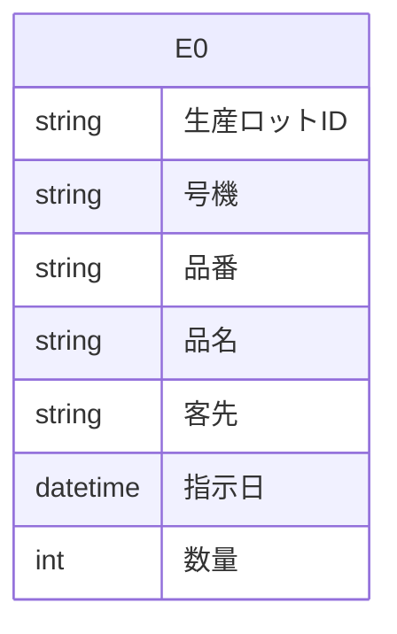

# Access データベース・スキーマ抽出レポート

このファイルは **Access の ODBC メタデータ**から自動生成しました。
LLM に渡す場合は **「スキーマ JSON」セクション**と **「PostgreSQL DDL 草案」**をあわせて指示に含めると、目的の RDB に近い定義を再現しやすくなります。

## LLM / AI 向け: このドキュメントの使い方

以下をプロンプトにコピーして、目的の SQL ダイアレクト（例: PostgreSQL）向け **CREATE TABLE・INDEX・FK** を生成させてください。

```text
あなたはデータベース設計者です。添付 Markdown の次を根拠に、一貫したリレーショナルスキーマを設計してください。
1) YAML フロントマターと「サマリー」の数値
2) 「スキーマ JSON（機械可読・全量）」の tables / relationships / warnings
3) 「PostgreSQL DDL 草案」は参考用。型・NULL・FK・インデックスを JSON・列定義と突き合わせて修正すること。
4) ODBC が SYNONYM としたテーブルはリンク元の実体が別にある場合がある。移行時はデータ取得元を明示すること。
5) relationships が空のときは、列名・サンプルデータから FK を推論してよいが、推論はコメントで区別すること。
出力: (a) 最終 DDL (b) 設計上の想定・未確定事項の箇条書き
```

> ⚠ FK 取得スキップ: t_現品票検索用 — ('IM001', '[IM001] [Microsoft][ODBC Driver Manager] ドライバーはこの関数をサポートしていません。 (0) (SQLForeignKeys)')
> ⚠ VBA 抽出失敗: (-2147352567, '例外が発生しました。', (0, None, '指定した式に、Visible プロパティに対する正しくない参照が含まれます。', 'dao360.chm', 2015567, -2146825833), None)

## サマリー

| 項目 | 値 |
|---|---|
| Access ファイル | `\\192.168.1.200\共有\QRシステム\Access\現品票検索DB.accdb` |
| ODBC ドライバ | `Microsoft Access Driver (*.mdb, *.accdb)` |
| テーブル数 | 1 |
| 行数合計（取得できたテーブルのみ） | 169,836 |
| リンクテーブル相当（ODBC: SYNONYM） | 0 |
| 外部キー（検出分） | 0 |
| ビュー / クエリ名 | 0 |
| 警告 | 2 |

## ER 図（Mermaid・参考）

Mermaid 内のエンティティは `E0`, `E1`, … です。実テーブル名は次の対応表を参照してください。

| 記号 | テーブル名 | ODBC 型 | 行数 |
|---|---|---:|---:|
| E0 | `t_現品票検索用` | TABLE | 169,836 |



## PostgreSQL DDL 草案（全文・自動生成）

```sql
-- PostgreSQL DDL 草案（Access メタデータから自動生成）
-- ※ 型・制約は必ず手動で確認・修正してください

CREATE TABLE "t_現品票検索用" (
    "生産ロットID" VARCHAR(7),
    "号機" VARCHAR(5),
    "品番" VARCHAR(30),
    "品名" VARCHAR(30),
    "客先" VARCHAR(30),
    "指示日" TIMESTAMP,
    "数量" INTEGER
);
```

## スキーマ JSON（機械可読・全量）

以下をパースすれば、テーブル・列・PK・インデックス・サンプル・統計・FK・ビュー名を一括で渡せます。

```json
{
  "export_spec": "access-inspector/schema-export/v1",
  "generated_at": "2026-06-12T02:50:18.531562+00:00",
  "source": {
    "database_path": "\\\\192.168.1.200\\共有\\QRシステム\\Access\\現品票検索DB.accdb",
    "driver_used": "Microsoft Access Driver (*.mdb, *.accdb)"
  },
  "summary": {
    "table_count": 1,
    "sum_row_count_where_known": 169836,
    "tables_with_row_count": 1,
    "linked_table_odbc_synonym_count": 0,
    "relationship_count": 0,
    "view_count": 0,
    "warning_count": 2
  },
  "notes_for_consumer": [
    "ODBC の table_type が SYNONYM のテーブルは Access のリンクテーブルであることが多い。",
    "PostgreSQL 型ヒントは参考。最終 DDL は業務要件とデータ実態で確認すること。",
    "relationships が空でも、命名規則やサンプル行から推定された FK があり得る。"
  ],
  "tables": [
    {
      "name": "t_現品票検索用",
      "table_type": "TABLE",
      "row_count": 169836,
      "row_count_error": null,
      "primary_key": [],
      "columns": [
        {
          "name": "生産ロットID",
          "access_type": "VARCHAR",
          "sql_data_type": -9,
          "column_size": 7,
          "decimal_digits": null,
          "nullable": true,
          "postgres_type_hint": "VARCHAR(7)"
        },
        {
          "name": "号機",
          "access_type": "VARCHAR",
          "sql_data_type": -9,
          "column_size": 5,
          "decimal_digits": null,
          "nullable": true,
          "postgres_type_hint": "VARCHAR(5)"
        },
        {
          "name": "品番",
          "access_type": "VARCHAR",
          "sql_data_type": -9,
          "column_size": 30,
          "decimal_digits": null,
          "nullable": true,
          "postgres_type_hint": "VARCHAR(30)"
        },
        {
          "name": "品名",
          "access_type": "VARCHAR",
          "sql_data_type": -9,
          "column_size": 30,
          "decimal_digits": null,
          "nullable": true,
          "postgres_type_hint": "VARCHAR(30)"
        },
        {
          "name": "客先",
          "access_type": "VARCHAR",
          "sql_data_type": -9,
          "column_size": 30,
          "decimal_digits": null,
          "nullable": true,
          "postgres_type_hint": "VARCHAR(30)"
        },
        {
          "name": "指示日",
          "access_type": "DATETIME",
          "sql_data_type": 9,
          "column_size": 19,
          "decimal_digits": 0,
          "nullable": true,
          "postgres_type_hint": "TIMESTAMP"
        },
        {
          "name": "数量",
          "access_type": "INTEGER",
          "sql_data_type": 4,
          "column_size": 10,
          "decimal_digits": 0,
          "nullable": true,
          "postgres_type_hint": "INTEGER"
        }
      ],
      "indexes": [],
      "sample_headers": [
        "生産ロットID",
        "号機",
        "品番",
        "品名",
        "客先",
        "指示日",
        "数量"
      ],
      "sample_rows": [
        [
          "E000001",
          "AN",
          "00575532-01",
          "カラー 8×8.16",
          "東京鋲兼",
          "2017-10-12T00:00:00",
          3730
        ],
        [
          "E000002",
          "AN",
          "00575532-01",
          "カラー 8×8.16",
          "東京鋲兼",
          "2017-10-14T00:00:00",
          1370
        ],
        [
          "E000003",
          "AN",
          "00575532-05",
          "カラー 8×8.14",
          "東京鋲兼",
          "2017-10-14T00:00:00",
          2700
        ],
        [
          "E000004",
          "AN-1",
          "FA用リベット",
          "FA用リベット",
          "イワタボルト",
          "2017-10-14T00:00:00",
          10000
        ],
        [
          "E000005",
          "AN-2",
          "FA用リベット",
          "FA用リベット",
          "イワタボルト",
          "2017-10-14T00:00:00",
          10000
        ]
      ],
      "column_stats": [
        {
          "column": "生産ロットID",
          "null_count": 0,
          "null_rate_pct": 0.0,
          "unique_count": null,
          "unique_rate_pct": null
        },
        {
          "column": "号機",
          "null_count": 0,
          "null_rate_pct": 0.0,
          "unique_count": null,
          "unique_rate_pct": null
        },
        {
          "column": "品番",
          "null_count": 0,
          "null_rate_pct": 0.0,
          "unique_count": null,
          "unique_rate_pct": null
        },
        {
          "column": "品名",
          "null_count": 0,
          "null_rate_pct": 0.0,
          "unique_count": null,
          "unique_rate_pct": null
        },
        {
          "column": "客先",
          "null_count": 0,
          "null_rate_pct": 0.0,
          "unique_count": null,
          "unique_rate_pct": null
        },
        {
          "column": "指示日",
          "null_count": 0,
          "null_rate_pct": 0.0,
          "unique_count": null,
          "unique_rate_pct": null
        },
        {
          "column": "数量",
          "null_count": 2,
          "null_rate_pct": 0.0,
          "unique_count": null,
          "unique_rate_pct": null
        }
      ]
    }
  ],
  "relationships": [],
  "views_and_queries": [],
  "vba_modules": [],
  "warnings": [
    "FK 取得スキップ: t_現品票検索用 — ('IM001', '[IM001] [Microsoft][ODBC Driver Manager] ドライバーはこの関数をサポートしていません。 (0) (SQLForeignKeys)')",
    "VBA 抽出失敗: (-2147352567, '例外が発生しました。', (0, None, '指定した式に、Visible プロパティに対する正しくない参照が含まれます。', 'dao360.chm', 2015567, -2146825833), None)"
  ]
}
```

## テーブル一覧

| テーブル | ODBC 型 | 行数 | PK | インデックス数 |
|---|---|---:|---|---:|
| `t_現品票検索用` | TABLE | 169,836 | — | 0 |

## カラム詳細

### `t_現品票検索用`

- **ODBC テーブル種別**: TABLE
- **行数**: 169,836

| 列 | Access 型 | PG 型ヒント | sql_data_type | サイズ | 小数 | NULL | PK |
|---|---|---|---:|---:|---:|:---:|:---:|
| 生産ロットID | VARCHAR | VARCHAR(7) | -9 | 7 |  | ○ |  |
| 号機 | VARCHAR | VARCHAR(5) | -9 | 5 |  | ○ |  |
| 品番 | VARCHAR | VARCHAR(30) | -9 | 30 |  | ○ |  |
| 品名 | VARCHAR | VARCHAR(30) | -9 | 30 |  | ○ |  |
| 客先 | VARCHAR | VARCHAR(30) | -9 | 30 |  | ○ |  |
| 指示日 | DATETIME | TIMESTAMP | 9 | 19 | 0 | ○ |  |
| 数量 | INTEGER | INTEGER | 4 | 10 | 0 | ○ |  |

**カラム統計**

| 列 | NULL件数 | NULL率% | ユニーク件数 | ユニーク率% |
|---|---:|---:|---:|---:|
| 生産ロットID | 0 | 0.0 | None | None |
| 号機 | 0 | 0.0 | None | None |
| 品番 | 0 | 0.0 | None | None |
| 品名 | 0 | 0.0 | None | None |
| 客先 | 0 | 0.0 | None | None |
| 指示日 | 0 | 0.0 | None | None |
| 数量 | 2 | 0.0 | None | None |

**サンプルデータ（先頭数行）**

| 生産ロットID | 号機 | 品番 | 品名 | 客先 | 指示日 | 数量 |
|---|---|---|---|---|---|---|
| E000001 | AN | 00575532-01 | カラー 8×8.16 | 東京鋲兼 | 2017-10-12T00:00:00 | 3730 |
| E000002 | AN | 00575532-01 | カラー 8×8.16 | 東京鋲兼 | 2017-10-14T00:00:00 | 1370 |
| E000003 | AN | 00575532-05 | カラー 8×8.14 | 東京鋲兼 | 2017-10-14T00:00:00 | 2700 |
| E000004 | AN-1 | FA用リベット | FA用リベット | イワタボルト | 2017-10-14T00:00:00 | 10000 |
| E000005 | AN-2 | FA用リベット | FA用リベット | イワタボルト | 2017-10-14T00:00:00 | 10000 |

## リレーション（外部キー）

（検出なし、またはドライバが FK メタデータを返しませんでした）

## ビュー / クエリ

（なし）

## VBA モジュール

（取得なし — オプションで「VBAコードを取得」を有効にして再取得してください）
