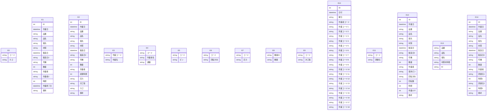

# Access データベース・スキーマ抽出レポート

このファイルは **Access の ODBC メタデータ**から自動生成しました。
LLM に渡す場合は **「スキーマ JSON」セクション**と **「PostgreSQL DDL 草案」**をあわせて指示に含めると、目的の RDB に近い定義を再現しやすくなります。

## LLM / AI 向け: このドキュメントの使い方

以下をプロンプトにコピーして、目的の SQL ダイアレクト（例: PostgreSQL）向け **CREATE TABLE・INDEX・FK** を生成させてください。

```text
あなたはデータベース設計者です。添付 Markdown の次を根拠に、一貫したリレーショナルスキーマを設計してください。
1) YAML フロントマターと「サマリー」の数値
2) 「スキーマ JSON（機械可読・全量）」の tables / relationships / warnings
3) 「PostgreSQL DDL 草案」は参考用。型・NULL・FK・インデックスを JSON・列定義と突き合わせて修正すること。
4) ODBC が SYNONYM としたテーブルはリンク元の実体が別にある場合がある。移行時はデータ取得元を明示すること。
5) relationships が空のときは、列名・サンプルデータから FK を推論してよいが、推論はコメントで区別すること。
出力: (a) 最終 DDL (b) 設計上の想定・未確定事項の箇条書き
```

> ⚠ FK 取得スキップ: t_カゴマスタ — ('IM001', '[IM001] [Microsoft][ODBC Driver Manager] ドライバーはこの関数をサポートしていません。 (0) (SQLForeignKeys)')
> ⚠ FK 取得スキップ: t_バフ記録 — ('IM001', '[IM001] [Microsoft][ODBC Driver Manager] ドライバーはこの関数をサポートしていません。 (0) (SQLForeignKeys)')
> ⚠ FK 取得スキップ: t_ブラスト記録 — ('IM001', '[IM001] [Microsoft][ODBC Driver Manager] ドライバーはこの関数をサポートしていません。 (0) (SQLForeignKeys)')
> ⚠ FK 取得スキップ: t_作業マスタ — ('IM001', '[IM001] [Microsoft][ODBC Driver Manager] ドライバーはこの関数をサポートしていません。 (0) (SQLForeignKeys)')
> ⚠ FK 取得スキップ: t_作業者マスタ — ('IM001', '[IM001] [Microsoft][ODBC Driver Manager] ドライバーはこの関数をサポートしていません。 (0) (SQLForeignKeys)')
> ⚠ FK 取得スキップ: t_使用ピンマスタ — ('IM001', '[IM001] [Microsoft][ODBC Driver Manager] ドライバーはこの関数をサポートしていません。 (0) (SQLForeignKeys)')
> ⚠ FK 取得スキップ: t_回転方向マスタ — ('IM001', '[IM001] [Microsoft][ODBC Driver Manager] ドライバーはこの関数をサポートしていません。 (0) (SQLForeignKeys)')
> ⚠ FK 取得スキップ: t_圧力マスタ — ('IM001', '[IM001] [Microsoft][ODBC Driver Manager] ドライバーはこの関数をサポートしていません。 (0) (SQLForeignKeys)')
> ⚠ FK 取得スキップ: t_機番マスタ — ('IM001', '[IM001] [Microsoft][ODBC Driver Manager] ドライバーはこの関数をサポートしていません。 (0) (SQLForeignKeys)')
> ⚠ FK 取得スキップ: t_次工程マスタ — ('IM001', '[IM001] [Microsoft][ODBC Driver Manager] ドライバーはこの関数をサポートしていません。 (0) (SQLForeignKeys)')
> ⚠ FK 取得スキップ: t_洗浄工程日報 — ('IM001', '[IM001] [Microsoft][ODBC Driver Manager] ドライバーはこの関数をサポートしていません。 (0) (SQLForeignKeys)')
> ⚠ FK 取得スキップ: t_研磨石マスタ — ('IM001', '[IM001] [Microsoft][ODBC Driver Manager] ドライバーはこの関数をサポートしていません。 (0) (SQLForeignKeys)')
> ⚠ FK 取得スキップ: t_磁気バレル記録 — ('IM001', '[IM001] [Microsoft][ODBC Driver Manager] ドライバーはこの関数をサポートしていません。 (0) (SQLForeignKeys)')
> ⚠ FK 取得スキップ: t_製品マスタ — ('IM001', '[IM001] [Microsoft][ODBC Driver Manager] ドライバーはこの関数をサポートしていません。 (0) (SQLForeignKeys)')
> ⚠ FK 取得スキップ: t_遠心バレル記録 — ('IM001', '[IM001] [Microsoft][ODBC Driver Manager] ドライバーはこの関数をサポートしていません。 (0) (SQLForeignKeys)')
> ⚠ VBA 抽出失敗: (-2147352567, '例外が発生しました。', (0, None, '指定した式に、Visible プロパティに対する正しくない参照が含まれます。', 'dao360.chm', 2015567, -2146825833), None)

## サマリー

| 項目 | 値 |
|---|---|
| Access ファイル | `\\192.168.1.200\共有\生産管理課\AccessDB\社内二次工程記録DB.accdb` |
| ODBC ドライバ | `Microsoft Access Driver (*.mdb, *.accdb)` |
| テーブル数 | 15 |
| 行数合計（取得できたテーブルのみ） | 35,772 |
| リンクテーブル相当（ODBC: SYNONYM） | 0 |
| 外部キー（検出分） | 0 |
| ビュー / クエリ名 | 0 |
| 警告 | 16 |

## ER 図（Mermaid・参考）

Mermaid 内のエンティティは `E0`, `E1`, … です。実テーブル名は次の対応表を参照してください。

| 記号 | テーブル名 | ODBC 型 | 行数 |
|---|---|---:|---:|
| E0 | `t_カゴマスタ` | TABLE | 4 |
| E1 | `t_バフ記録` | TABLE | 530 |
| E2 | `t_ブラスト記録` | TABLE | 4,664 |
| E3 | `t_作業マスタ` | TABLE | 15 |
| E4 | `t_作業者マスタ` | TABLE | 24 |
| E5 | `t_使用ピンマスタ` | TABLE | 3 |
| E6 | `t_回転方向マスタ` | TABLE | 10 |
| E7 | `t_圧力マスタ` | TABLE | 2 |
| E8 | `t_機番マスタ` | TABLE | 94 |
| E9 | `t_次工程マスタ` | TABLE | 4 |
| E10 | `t_洗浄工程日報` | TABLE | 5,297 |
| E11 | `t_研磨石マスタ` | TABLE | 17 |
| E12 | `t_磁気バレル記録` | TABLE | 16,111 |
| E13 | `t_製品マスタ` | TABLE | 4,543 |
| E14 | `t_遠心バレル記録` | TABLE | 4,454 |



## PostgreSQL DDL 草案（全文・自動生成）

```sql
-- PostgreSQL DDL 草案（Access メタデータから自動生成）
-- ※ 型・制約は必ず手動で確認・修正してください

CREATE TABLE "t_カゴマスタ" (
    "コード" VARCHAR(2),
    "カゴ" VARCHAR(4)
);


CREATE TABLE "t_バフ記録" (
    "ID" BIGSERIAL,
    "作業日" TIMESTAMP,
    "品番" VARCHAR(30),
    "品名" VARCHAR(30),
    "客先" VARCHAR(30),
    "材質" VARCHAR(35),
    "製造日" TIMESTAMP,
    "製造日2" VARCHAR(30),
    "号機" VARCHAR(5),
    "数量" INTEGER,
    "作業者" VARCHAR(6),
    "作業者2" VARCHAR(6),
    "時間" INTEGER,
    "作業終了日" TIMESTAMP,
    "備考" VARCHAR(20)
);


CREATE TABLE "t_ブラスト記録" (
    "ID" BIGSERIAL,
    "作業日" TIMESTAMP,
    "品番" VARCHAR(30),
    "品名" VARCHAR(30),
    "客先" VARCHAR(30),
    "材質" VARCHAR(35),
    "製造日" TIMESTAMP,
    "製造日2" VARCHAR(30),
    "号機" VARCHAR(5),
    "数量" INTEGER,
    "作業者" VARCHAR(6),
    "処理時間" INTEGER,
    "圧力" VARCHAR(8),
    "次工程" VARCHAR(8),
    "カゴ" VARCHAR(4),
    "備考" VARCHAR(20)
);


CREATE TABLE "t_作業マスタ" (
    "作業コード" VARCHAR(2),
    "作業名" VARCHAR(15)
);


CREATE TABLE "t_作業者マスタ" (
    "コード" VARCHAR(2),
    "作業者名" VARCHAR(6),
    "退職" VARCHAR(1)
);


CREATE TABLE "t_使用ピンマスタ" (
    "コード" VARCHAR(2),
    "ピン" VARCHAR(5)
);


CREATE TABLE "t_回転方向マスタ" (
    "コード" VARCHAR(2),
    "回転方向" VARCHAR(8)
);


CREATE TABLE "t_圧力マスタ" (
    "コード" VARCHAR(2),
    "圧力" VARCHAR(8)
);


CREATE TABLE "t_機番マスタ" (
    "機械ID" VARCHAR(3),
    "機番" VARCHAR(5)
);


CREATE TABLE "t_次工程マスタ" (
    "コード" VARCHAR(2),
    "次工程" VARCHAR(10)
);


CREATE TABLE "t_洗浄工程日報" (
    "ID" BIGSERIAL,
    "日付" TIMESTAMP,
    "曜日" VARCHAR(1),
    "作業者コード" VARCHAR(2),
    "作業コード1" VARCHAR(2),
    "作業コード2" VARCHAR(2),
    "作業コード3" VARCHAR(2),
    "作業コード4" VARCHAR(2),
    "作業コード5" VARCHAR(2),
    "作業コード6" VARCHAR(2),
    "作業コード7" VARCHAR(2),
    "作業コード8" VARCHAR(2),
    "作業コード9" VARCHAR(2),
    "作業コード10" VARCHAR(2),
    "作業コード11" VARCHAR(2),
    "作業コード12" VARCHAR(2),
    "作業コード13" VARCHAR(2),
    "作業コード14" VARCHAR(2),
    "作業コード15" VARCHAR(2),
    "作業コード16" VARCHAR(2),
    "作業コード17" VARCHAR(2),
    "作業コード18" VARCHAR(2)
);


CREATE TABLE "t_研磨石マスタ" (
    "コード" VARCHAR(2),
    "研磨石" VARCHAR(10)
);


CREATE TABLE "t_磁気バレル記録" (
    "ID" BIGSERIAL,
    "作業日" TIMESTAMP,
    "品番" VARCHAR(30),
    "品名" VARCHAR(30),
    "客先" VARCHAR(30),
    "材質" VARCHAR(35),
    "製造日" TIMESTAMP,
    "製造日2" VARCHAR(30),
    "号機" VARCHAR(5),
    "数量" INTEGER,
    "作業者" VARCHAR(6),
    "使用ピン" VARCHAR(5),
    "回転方向" VARCHAR(8),
    "回転数" INTEGER,
    "時間" INTEGER,
    "作業LOT" INTEGER,
    "備考" VARCHAR(20)
);


CREATE TABLE "t_製品マスタ" (
    "品番" VARCHAR(30),
    "品名" VARCHAR(30),
    "客先" VARCHAR(30),
    "材質材料径" VARCHAR(30),
    "ID" VARCHAR(6)
);


CREATE TABLE "t_遠心バレル記録" (
    "ID" BIGSERIAL,
    "作業日" TIMESTAMP,
    "品番" VARCHAR(30),
    "品名" VARCHAR(30),
    "客先" VARCHAR(30),
    "材質" VARCHAR(35),
    "製造日" TIMESTAMP,
    "製造日2" VARCHAR(30),
    "号機" VARCHAR(5),
    "数量" INTEGER,
    "作業者" VARCHAR(6),
    "研磨石1" VARCHAR(10),
    "時間1" INTEGER,
    "研磨石2" VARCHAR(10),
    "時間2" INTEGER,
    "備考" VARCHAR(20)
);
```

## スキーマ JSON（機械可読・全量）

以下をパースすれば、テーブル・列・PK・インデックス・サンプル・統計・FK・ビュー名を一括で渡せます。

```json
{
  "export_spec": "access-inspector/schema-export/v1",
  "generated_at": "2026-06-12T05:42:08.422688+00:00",
  "source": {
    "database_path": "\\\\192.168.1.200\\共有\\生産管理課\\AccessDB\\社内二次工程記録DB.accdb",
    "driver_used": "Microsoft Access Driver (*.mdb, *.accdb)"
  },
  "summary": {
    "table_count": 15,
    "sum_row_count_where_known": 35772,
    "tables_with_row_count": 15,
    "linked_table_odbc_synonym_count": 0,
    "relationship_count": 0,
    "view_count": 0,
    "warning_count": 16
  },
  "notes_for_consumer": [
    "ODBC の table_type が SYNONYM のテーブルは Access のリンクテーブルであることが多い。",
    "PostgreSQL 型ヒントは参考。最終 DDL は業務要件とデータ実態で確認すること。",
    "relationships が空でも、命名規則やサンプル行から推定された FK があり得る。"
  ],
  "tables": [
    {
      "name": "t_カゴマスタ",
      "table_type": "TABLE",
      "row_count": 4,
      "row_count_error": null,
      "primary_key": [],
      "columns": [
        {
          "name": "コード",
          "access_type": "VARCHAR",
          "sql_data_type": -9,
          "column_size": 2,
          "decimal_digits": null,
          "nullable": true,
          "postgres_type_hint": "VARCHAR(2)"
        },
        {
          "name": "カゴ",
          "access_type": "VARCHAR",
          "sql_data_type": -9,
          "column_size": 4,
          "decimal_digits": null,
          "nullable": true,
          "postgres_type_hint": "VARCHAR(4)"
        }
      ],
      "indexes": [],
      "sample_headers": [
        "コード",
        "カゴ"
      ],
      "sample_rows": [
        [
          "01",
          "カゴ大"
        ],
        [
          "02",
          "カゴ中"
        ],
        [
          "03",
          "カゴ小"
        ],
        [
          "04",
          "カゴ極小"
        ]
      ],
      "column_stats": [
        {
          "column": "コード",
          "null_count": 0,
          "null_rate_pct": 0.0,
          "unique_count": null,
          "unique_rate_pct": null
        },
        {
          "column": "カゴ",
          "null_count": 0,
          "null_rate_pct": 0.0,
          "unique_count": null,
          "unique_rate_pct": null
        }
      ]
    },
    {
      "name": "t_バフ記録",
      "table_type": "TABLE",
      "row_count": 530,
      "row_count_error": null,
      "primary_key": [],
      "columns": [
        {
          "name": "ID",
          "access_type": "COUNTER",
          "sql_data_type": 4,
          "column_size": 10,
          "decimal_digits": 0,
          "nullable": false,
          "postgres_type_hint": "BIGSERIAL"
        },
        {
          "name": "作業日",
          "access_type": "DATETIME",
          "sql_data_type": 9,
          "column_size": 19,
          "decimal_digits": 0,
          "nullable": true,
          "postgres_type_hint": "TIMESTAMP"
        },
        {
          "name": "品番",
          "access_type": "VARCHAR",
          "sql_data_type": -9,
          "column_size": 30,
          "decimal_digits": null,
          "nullable": true,
          "postgres_type_hint": "VARCHAR(30)"
        },
        {
          "name": "品名",
          "access_type": "VARCHAR",
          "sql_data_type": -9,
          "column_size": 30,
          "decimal_digits": null,
          "nullable": true,
          "postgres_type_hint": "VARCHAR(30)"
        },
        {
          "name": "客先",
          "access_type": "VARCHAR",
          "sql_data_type": -9,
          "column_size": 30,
          "decimal_digits": null,
          "nullable": true,
          "postgres_type_hint": "VARCHAR(30)"
        },
        {
          "name": "材質",
          "access_type": "VARCHAR",
          "sql_data_type": -9,
          "column_size": 35,
          "decimal_digits": null,
          "nullable": true,
          "postgres_type_hint": "VARCHAR(35)"
        },
        {
          "name": "製造日",
          "access_type": "DATETIME",
          "sql_data_type": 9,
          "column_size": 19,
          "decimal_digits": 0,
          "nullable": true,
          "postgres_type_hint": "TIMESTAMP"
        },
        {
          "name": "製造日2",
          "access_type": "VARCHAR",
          "sql_data_type": -9,
          "column_size": 30,
          "decimal_digits": null,
          "nullable": true,
          "postgres_type_hint": "VARCHAR(30)"
        },
        {
          "name": "号機",
          "access_type": "VARCHAR",
          "sql_data_type": -9,
          "column_size": 5,
          "decimal_digits": null,
          "nullable": true,
          "postgres_type_hint": "VARCHAR(5)"
        },
        {
          "name": "数量",
          "access_type": "INTEGER",
          "sql_data_type": 4,
          "column_size": 10,
          "decimal_digits": 0,
          "nullable": true,
          "postgres_type_hint": "INTEGER"
        },
        {
          "name": "作業者",
          "access_type": "VARCHAR",
          "sql_data_type": -9,
          "column_size": 6,
          "decimal_digits": null,
          "nullable": true,
          "postgres_type_hint": "VARCHAR(6)"
        },
        {
          "name": "作業者2",
          "access_type": "VARCHAR",
          "sql_data_type": -9,
          "column_size": 6,
          "decimal_digits": null,
          "nullable": true,
          "postgres_type_hint": "VARCHAR(6)"
        },
        {
          "name": "時間",
          "access_type": "INTEGER",
          "sql_data_type": 4,
          "column_size": 10,
          "decimal_digits": 0,
          "nullable": true,
          "postgres_type_hint": "INTEGER"
        },
        {
          "name": "作業終了日",
          "access_type": "DATETIME",
          "sql_data_type": 9,
          "column_size": 19,
          "decimal_digits": 0,
          "nullable": true,
          "postgres_type_hint": "TIMESTAMP"
        },
        {
          "name": "備考",
          "access_type": "VARCHAR",
          "sql_data_type": -9,
          "column_size": 20,
          "decimal_digits": null,
          "nullable": true,
          "postgres_type_hint": "VARCHAR(20)"
        }
      ],
      "indexes": [],
      "sample_headers": [
        "ID",
        "作業日",
        "品番",
        "品名",
        "客先",
        "材質",
        "製造日",
        "製造日2",
        "号機",
        "数量",
        "作業者",
        "作業者2",
        "時間",
        "作業終了日",
        "備考"
      ],
      "sample_rows": [
        [
          1,
          "2016-03-10T00:00:00",
          "M5X43",
          "シャフトネジM5",
          "タカシマ",
          "SUS303 φ12.0CM",
          "2016-03-10T00:00:00",
          null,
          "C-4",
          193,
          "新井",
          "深田",
          180,
          "2016-03-10T00:00:00",
          null
        ],
        [
          2,
          "2016-04-19T00:00:00",
          "008929-001-01",
          "シャフト",
          "トラストパーツ",
          "C5191 φ4.0",
          "2016-04-19T00:00:00",
          null,
          "E-5",
          1600,
          "新井",
          null,
          360,
          "2016-04-20T00:00:00",
          null
        ],
        [
          3,
          "2016-04-13T00:00:00",
          "125278",
          "ジクB",
          "タカシマ",
          "SUS304 φ3.0G  2m",
          "2016-04-11T00:00:00",
          null,
          "F-14",
          1640,
          "新井",
          "深田",
          360,
          "2016-04-25T00:00:00",
          null
        ],
        [
          4,
          "2016-04-21T00:00:00",
          "008929-001-01",
          "シャフト",
          "トラストパーツ",
          "C5191 φ4.0",
          "2016-04-21T00:00:00",
          null,
          "E-5",
          3320,
          "新井",
          null,
          720,
          "2016-04-26T00:00:00",
          null
        ],
        [
          5,
          "2016-04-26T00:00:00",
          "008929-001-01",
          "シャフト",
          "トラストパーツ",
          "C5191 φ4.0",
          "2016-04-21T00:00:00",
          null,
          "E-5",
          980,
          "新井",
          null,
          240,
          "2016-04-27T00:00:00",
          null
        ]
      ],
      "column_stats": [
        {
          "column": "ID",
          "null_count": 0,
          "null_rate_pct": 0.0,
          "unique_count": null,
          "unique_rate_pct": null
        },
        {
          "column": "作業日",
          "null_count": 0,
          "null_rate_pct": 0.0,
          "unique_count": null,
          "unique_rate_pct": null
        },
        {
          "column": "品番",
          "null_count": 0,
          "null_rate_pct": 0.0,
          "unique_count": null,
          "unique_rate_pct": null
        },
        {
          "column": "品名",
          "null_count": 0,
          "null_rate_pct": 0.0,
          "unique_count": null,
          "unique_rate_pct": null
        },
        {
          "column": "客先",
          "null_count": 0,
          "null_rate_pct": 0.0,
          "unique_count": null,
          "unique_rate_pct": null
        },
        {
          "column": "材質",
          "null_count": 0,
          "null_rate_pct": 0.0,
          "unique_count": null,
          "unique_rate_pct": null
        },
        {
          "column": "製造日",
          "null_count": 163,
          "null_rate_pct": 30.8,
          "unique_count": null,
          "unique_rate_pct": null
        },
        {
          "column": "製造日2",
          "null_count": 417,
          "null_rate_pct": 78.7,
          "unique_count": null,
          "unique_rate_pct": null
        },
        {
          "column": "号機",
          "null_count": 0,
          "null_rate_pct": 0.0,
          "unique_count": null,
          "unique_rate_pct": null
        },
        {
          "column": "数量",
          "null_count": 14,
          "null_rate_pct": 2.6,
          "unique_count": null,
          "unique_rate_pct": null
        },
        {
          "column": "作業者",
          "null_count": 0,
          "null_rate_pct": 0.0,
          "unique_count": null,
          "unique_rate_pct": null
        },
        {
          "column": "作業者2",
          "null_count": 93,
          "null_rate_pct": 17.5,
          "unique_count": null,
          "unique_rate_pct": null
        },
        {
          "column": "時間",
          "null_count": 96,
          "null_rate_pct": 18.1,
          "unique_count": null,
          "unique_rate_pct": null
        },
        {
          "column": "作業終了日",
          "null_count": 1,
          "null_rate_pct": 0.2,
          "unique_count": null,
          "unique_rate_pct": null
        },
        {
          "column": "備考",
          "null_count": 387,
          "null_rate_pct": 73.0,
          "unique_count": null,
          "unique_rate_pct": null
        }
      ]
    },
    {
      "name": "t_ブラスト記録",
      "table_type": "TABLE",
      "row_count": 4664,
      "row_count_error": null,
      "primary_key": [],
      "columns": [
        {
          "name": "ID",
          "access_type": "COUNTER",
          "sql_data_type": 4,
          "column_size": 10,
          "decimal_digits": 0,
          "nullable": false,
          "postgres_type_hint": "BIGSERIAL"
        },
        {
          "name": "作業日",
          "access_type": "DATETIME",
          "sql_data_type": 9,
          "column_size": 19,
          "decimal_digits": 0,
          "nullable": true,
          "postgres_type_hint": "TIMESTAMP"
        },
        {
          "name": "品番",
          "access_type": "VARCHAR",
          "sql_data_type": -9,
          "column_size": 30,
          "decimal_digits": null,
          "nullable": true,
          "postgres_type_hint": "VARCHAR(30)"
        },
        {
          "name": "品名",
          "access_type": "VARCHAR",
          "sql_data_type": -9,
          "column_size": 30,
          "decimal_digits": null,
          "nullable": true,
          "postgres_type_hint": "VARCHAR(30)"
        },
        {
          "name": "客先",
          "access_type": "VARCHAR",
          "sql_data_type": -9,
          "column_size": 30,
          "decimal_digits": null,
          "nullable": true,
          "postgres_type_hint": "VARCHAR(30)"
        },
        {
          "name": "材質",
          "access_type": "VARCHAR",
          "sql_data_type": -9,
          "column_size": 35,
          "decimal_digits": null,
          "nullable": true,
          "postgres_type_hint": "VARCHAR(35)"
        },
        {
          "name": "製造日",
          "access_type": "DATETIME",
          "sql_data_type": 9,
          "column_size": 19,
          "decimal_digits": 0,
          "nullable": true,
          "postgres_type_hint": "TIMESTAMP"
        },
        {
          "name": "製造日2",
          "access_type": "VARCHAR",
          "sql_data_type": -9,
          "column_size": 30,
          "decimal_digits": null,
          "nullable": true,
          "postgres_type_hint": "VARCHAR(30)"
        },
        {
          "name": "号機",
          "access_type": "VARCHAR",
          "sql_data_type": -9,
          "column_size": 5,
          "decimal_digits": null,
          "nullable": true,
          "postgres_type_hint": "VARCHAR(5)"
        },
        {
          "name": "数量",
          "access_type": "INTEGER",
          "sql_data_type": 4,
          "column_size": 10,
          "decimal_digits": 0,
          "nullable": true,
          "postgres_type_hint": "INTEGER"
        },
        {
          "name": "作業者",
          "access_type": "VARCHAR",
          "sql_data_type": -9,
          "column_size": 6,
          "decimal_digits": null,
          "nullable": true,
          "postgres_type_hint": "VARCHAR(6)"
        },
        {
          "name": "処理時間",
          "access_type": "INTEGER",
          "sql_data_type": 4,
          "column_size": 10,
          "decimal_digits": 0,
          "nullable": true,
          "postgres_type_hint": "INTEGER"
        },
        {
          "name": "圧力",
          "access_type": "VARCHAR",
          "sql_data_type": -9,
          "column_size": 8,
          "decimal_digits": null,
          "nullable": true,
          "postgres_type_hint": "VARCHAR(8)"
        },
        {
          "name": "次工程",
          "access_type": "VARCHAR",
          "sql_data_type": -9,
          "column_size": 8,
          "decimal_digits": null,
          "nullable": true,
          "postgres_type_hint": "VARCHAR(8)"
        },
        {
          "name": "カゴ",
          "access_type": "VARCHAR",
          "sql_data_type": -9,
          "column_size": 4,
          "decimal_digits": null,
          "nullable": true,
          "postgres_type_hint": "VARCHAR(4)"
        },
        {
          "name": "備考",
          "access_type": "VARCHAR",
          "sql_data_type": -9,
          "column_size": 20,
          "decimal_digits": null,
          "nullable": true,
          "postgres_type_hint": "VARCHAR(20)"
        }
      ],
      "indexes": [],
      "sample_headers": [
        "ID",
        "作業日",
        "品番",
        "品名",
        "客先",
        "材質",
        "製造日",
        "製造日2",
        "号機",
        "数量",
        "作業者",
        "処理時間",
        "圧力",
        "次工程",
        "カゴ",
        "備考"
      ],
      "sample_rows": [
        [
          1,
          "2016-02-22T00:00:00",
          "2-663-108-01",
          "キャップコンホルダー",
          "ムサシ電子",
          "SUS303 φ13.0CM",
          "2016-02-22T00:00:00",
          null,
          "C-4",
          1320,
          "中川",
          10,
          "0.25",
          "洗浄",
          null,
          null
        ],
        [
          2,
          "2016-02-23T00:00:00",
          "WS-00026",
          "WS-1 チョウセイネジB",
          "鷺宮製作所",
          "ASK2600S φ14.0CM",
          "2016-02-22T00:00:00",
          null,
          "D-5",
          1260,
          "中川",
          20,
          "0.25",
          "洗浄",
          null,
          "粉+1"
        ],
        [
          3,
          "2016-02-23T00:00:00",
          "03-28296Z01-A",
          "SCR,HDMI",
          "トラストパーツ",
          "ASK2600S φ7.5 ﾀﾃﾒR m=0.3",
          "2016-02-19T00:00:00",
          "2016/2/22",
          "B-2",
          3080,
          "中川",
          20,
          "0.25",
          "洗浄",
          null,
          "3080/2"
        ],
        [
          4,
          "2016-02-24T00:00:00",
          "633950065",
          "シャフト",
          "秩父富士",
          "C3604Lcd φ6.0",
          "2016-01-06T00:00:00",
          null,
          "INI",
          3000,
          "中川",
          20,
          "0.25",
          "遠心バレル",
          "カゴ大",
          null
        ],
        [
          5,
          "2016-02-25T00:00:00",
          "KBS-3",
          "エンドキャップ",
          "ハギテック",
          "C3604Lcd φ7.0",
          "2015-05-23T00:00:00",
          null,
          "B-1",
          590,
          "中川",
          10,
          "0.25",
          "洗浄",
          "カゴ中",
          null
        ]
      ],
      "column_stats": [
        {
          "column": "ID",
          "null_count": 0,
          "null_rate_pct": 0.0,
          "unique_count": null,
          "unique_rate_pct": null
        },
        {
          "column": "作業日",
          "null_count": 0,
          "null_rate_pct": 0.0,
          "unique_count": null,
          "unique_rate_pct": null
        },
        {
          "column": "品番",
          "null_count": 0,
          "null_rate_pct": 0.0,
          "unique_count": null,
          "unique_rate_pct": null
        },
        {
          "column": "品名",
          "null_count": 0,
          "null_rate_pct": 0.0,
          "unique_count": null,
          "unique_rate_pct": null
        },
        {
          "column": "客先",
          "null_count": 0,
          "null_rate_pct": 0.0,
          "unique_count": null,
          "unique_rate_pct": null
        },
        {
          "column": "材質",
          "null_count": 0,
          "null_rate_pct": 0.0,
          "unique_count": null,
          "unique_rate_pct": null
        },
        {
          "column": "製造日",
          "null_count": 35,
          "null_rate_pct": 0.8,
          "unique_count": null,
          "unique_rate_pct": null
        },
        {
          "column": "製造日2",
          "null_count": 1417,
          "null_rate_pct": 30.4,
          "unique_count": null,
          "unique_rate_pct": null
        },
        {
          "column": "号機",
          "null_count": 31,
          "null_rate_pct": 0.7,
          "unique_count": null,
          "unique_rate_pct": null
        },
        {
          "column": "数量",
          "null_count": 11,
          "null_rate_pct": 0.2,
          "unique_count": null,
          "unique_rate_pct": null
        },
        {
          "column": "作業者",
          "null_count": 0,
          "null_rate_pct": 0.0,
          "unique_count": null,
          "unique_rate_pct": null
        },
        {
          "column": "処理時間",
          "null_count": 1,
          "null_rate_pct": 0.0,
          "unique_count": null,
          "unique_rate_pct": null
        },
        {
          "column": "圧力",
          "null_count": 4,
          "null_rate_pct": 0.1,
          "unique_count": null,
          "unique_rate_pct": null
        },
        {
          "column": "次工程",
          "null_count": 4,
          "null_rate_pct": 0.1,
          "unique_count": null,
          "unique_rate_pct": null
        },
        {
          "column": "カゴ",
          "null_count": 25,
          "null_rate_pct": 0.5,
          "unique_count": null,
          "unique_rate_pct": null
        },
        {
          "column": "備考",
          "null_count": 1281,
          "null_rate_pct": 27.5,
          "unique_count": null,
          "unique_rate_pct": null
        }
      ]
    },
    {
      "name": "t_作業マスタ",
      "table_type": "TABLE",
      "row_count": 15,
      "row_count_error": null,
      "primary_key": [],
      "columns": [
        {
          "name": "作業コード",
          "access_type": "VARCHAR",
          "sql_data_type": -9,
          "column_size": 2,
          "decimal_digits": null,
          "nullable": true,
          "postgres_type_hint": "VARCHAR(2)"
        },
        {
          "name": "作業名",
          "access_type": "VARCHAR",
          "sql_data_type": -9,
          "column_size": 15,
          "decimal_digits": null,
          "nullable": true,
          "postgres_type_hint": "VARCHAR(15)"
        }
      ],
      "indexes": [],
      "sample_headers": [
        "作業コード",
        "作業名"
      ],
      "sample_rows": [
        [
          "01",
          "荒洗浄"
        ],
        [
          "02",
          "洗浄"
        ],
        [
          "03",
          "除熱＋計量"
        ],
        [
          "04",
          "アブソール液交換"
        ],
        [
          "05",
          "ASK(自動)液交換"
        ]
      ],
      "column_stats": [
        {
          "column": "作業コード",
          "null_count": 0,
          "null_rate_pct": 0.0,
          "unique_count": null,
          "unique_rate_pct": null
        },
        {
          "column": "作業名",
          "null_count": 0,
          "null_rate_pct": 0.0,
          "unique_count": null,
          "unique_rate_pct": null
        }
      ]
    },
    {
      "name": "t_作業者マスタ",
      "table_type": "TABLE",
      "row_count": 24,
      "row_count_error": null,
      "primary_key": [],
      "columns": [
        {
          "name": "コード",
          "access_type": "VARCHAR",
          "sql_data_type": -9,
          "column_size": 2,
          "decimal_digits": null,
          "nullable": true,
          "postgres_type_hint": "VARCHAR(2)"
        },
        {
          "name": "作業者名",
          "access_type": "VARCHAR",
          "sql_data_type": -9,
          "column_size": 6,
          "decimal_digits": null,
          "nullable": true,
          "postgres_type_hint": "VARCHAR(6)"
        },
        {
          "name": "退職",
          "access_type": "VARCHAR",
          "sql_data_type": -9,
          "column_size": 1,
          "decimal_digits": null,
          "nullable": true,
          "postgres_type_hint": "VARCHAR(1)"
        }
      ],
      "indexes": [],
      "sample_headers": [
        "コード",
        "作業者名",
        "退職"
      ],
      "sample_rows": [
        [
          "23",
          "嶋田",
          "1"
        ],
        [
          "24",
          "宮本",
          "1"
        ],
        [
          "25",
          "矢野",
          "1"
        ],
        [
          "26",
          "小久保",
          null
        ],
        [
          "27",
          "荒船",
          null
        ]
      ],
      "column_stats": [
        {
          "column": "コード",
          "null_count": 0,
          "null_rate_pct": 0.0,
          "unique_count": null,
          "unique_rate_pct": null
        },
        {
          "column": "作業者名",
          "null_count": 0,
          "null_rate_pct": 0.0,
          "unique_count": null,
          "unique_rate_pct": null
        },
        {
          "column": "退職",
          "null_count": 10,
          "null_rate_pct": 41.7,
          "unique_count": null,
          "unique_rate_pct": null
        }
      ]
    },
    {
      "name": "t_使用ピンマスタ",
      "table_type": "TABLE",
      "row_count": 3,
      "row_count_error": null,
      "primary_key": [],
      "columns": [
        {
          "name": "コード",
          "access_type": "VARCHAR",
          "sql_data_type": -9,
          "column_size": 2,
          "decimal_digits": null,
          "nullable": true,
          "postgres_type_hint": "VARCHAR(2)"
        },
        {
          "name": "ピン",
          "access_type": "VARCHAR",
          "sql_data_type": -9,
          "column_size": 5,
          "decimal_digits": null,
          "nullable": true,
          "postgres_type_hint": "VARCHAR(5)"
        }
      ],
      "indexes": [],
      "sample_headers": [
        "コード",
        "ピン"
      ],
      "sample_rows": [
        [
          "02",
          "0.2"
        ],
        [
          "03",
          "0.3"
        ],
        [
          "04",
          "0.5"
        ]
      ],
      "column_stats": [
        {
          "column": "コード",
          "null_count": 0,
          "null_rate_pct": 0.0,
          "unique_count": null,
          "unique_rate_pct": null
        },
        {
          "column": "ピン",
          "null_count": 0,
          "null_rate_pct": 0.0,
          "unique_count": null,
          "unique_rate_pct": null
        }
      ]
    },
    {
      "name": "t_回転方向マスタ",
      "table_type": "TABLE",
      "row_count": 10,
      "row_count_error": null,
      "primary_key": [],
      "columns": [
        {
          "name": "コード",
          "access_type": "VARCHAR",
          "sql_data_type": -9,
          "column_size": 2,
          "decimal_digits": null,
          "nullable": true,
          "postgres_type_hint": "VARCHAR(2)"
        },
        {
          "name": "回転方向",
          "access_type": "VARCHAR",
          "sql_data_type": -9,
          "column_size": 8,
          "decimal_digits": null,
          "nullable": true,
          "postgres_type_hint": "VARCHAR(8)"
        }
      ],
      "indexes": [],
      "sample_headers": [
        "コード",
        "回転方向"
      ],
      "sample_rows": [
        [
          "01",
          "R1,L1"
        ],
        [
          "02",
          "R1,L2"
        ],
        [
          "03",
          "R2,L1"
        ],
        [
          "04",
          "R2,L2"
        ],
        [
          "05",
          "R2,L3"
        ]
      ],
      "column_stats": [
        {
          "column": "コード",
          "null_count": 0,
          "null_rate_pct": 0.0,
          "unique_count": null,
          "unique_rate_pct": null
        },
        {
          "column": "回転方向",
          "null_count": 0,
          "null_rate_pct": 0.0,
          "unique_count": null,
          "unique_rate_pct": null
        }
      ]
    },
    {
      "name": "t_圧力マスタ",
      "table_type": "TABLE",
      "row_count": 2,
      "row_count_error": null,
      "primary_key": [],
      "columns": [
        {
          "name": "コード",
          "access_type": "VARCHAR",
          "sql_data_type": -9,
          "column_size": 2,
          "decimal_digits": null,
          "nullable": true,
          "postgres_type_hint": "VARCHAR(2)"
        },
        {
          "name": "圧力",
          "access_type": "VARCHAR",
          "sql_data_type": -9,
          "column_size": 8,
          "decimal_digits": null,
          "nullable": true,
          "postgres_type_hint": "VARCHAR(8)"
        }
      ],
      "indexes": [],
      "sample_headers": [
        "コード",
        "圧力"
      ],
      "sample_rows": [
        [
          "01",
          "0.25"
        ],
        [
          "02",
          "0.15"
        ]
      ],
      "column_stats": [
        {
          "column": "コード",
          "null_count": 0,
          "null_rate_pct": 0.0,
          "unique_count": null,
          "unique_rate_pct": null
        },
        {
          "column": "圧力",
          "null_count": 0,
          "null_rate_pct": 0.0,
          "unique_count": null,
          "unique_rate_pct": null
        }
      ]
    },
    {
      "name": "t_機番マスタ",
      "table_type": "TABLE",
      "row_count": 94,
      "row_count_error": null,
      "primary_key": [],
      "columns": [
        {
          "name": "機械ID",
          "access_type": "VARCHAR",
          "sql_data_type": -9,
          "column_size": 3,
          "decimal_digits": null,
          "nullable": true,
          "postgres_type_hint": "VARCHAR(3)"
        },
        {
          "name": "機番",
          "access_type": "VARCHAR",
          "sql_data_type": -9,
          "column_size": 5,
          "decimal_digits": null,
          "nullable": true,
          "postgres_type_hint": "VARCHAR(5)"
        }
      ],
      "indexes": [],
      "sample_headers": [
        "機械ID",
        "機番"
      ],
      "sample_rows": [
        [
          "001",
          "A-1"
        ],
        [
          "002",
          "A-2"
        ],
        [
          "003",
          "A-3"
        ],
        [
          "004",
          "A-4"
        ],
        [
          "005",
          "A-5"
        ]
      ],
      "column_stats": [
        {
          "column": "機械ID",
          "null_count": 0,
          "null_rate_pct": 0.0,
          "unique_count": null,
          "unique_rate_pct": null
        },
        {
          "column": "機番",
          "null_count": 0,
          "null_rate_pct": 0.0,
          "unique_count": null,
          "unique_rate_pct": null
        }
      ]
    },
    {
      "name": "t_次工程マスタ",
      "table_type": "TABLE",
      "row_count": 4,
      "row_count_error": null,
      "primary_key": [],
      "columns": [
        {
          "name": "コード",
          "access_type": "VARCHAR",
          "sql_data_type": -9,
          "column_size": 2,
          "decimal_digits": null,
          "nullable": true,
          "postgres_type_hint": "VARCHAR(2)"
        },
        {
          "name": "次工程",
          "access_type": "VARCHAR",
          "sql_data_type": -9,
          "column_size": 10,
          "decimal_digits": null,
          "nullable": true,
          "postgres_type_hint": "VARCHAR(10)"
        }
      ],
      "indexes": [],
      "sample_headers": [
        "コード",
        "次工程"
      ],
      "sample_rows": [
        [
          "01",
          "洗浄"
        ],
        [
          "02",
          "遠心バレル"
        ],
        [
          "03",
          "磁気バレル"
        ],
        [
          "04",
          "エアブロー"
        ]
      ],
      "column_stats": [
        {
          "column": "コード",
          "null_count": 0,
          "null_rate_pct": 0.0,
          "unique_count": null,
          "unique_rate_pct": null
        },
        {
          "column": "次工程",
          "null_count": 0,
          "null_rate_pct": 0.0,
          "unique_count": null,
          "unique_rate_pct": null
        }
      ]
    },
    {
      "name": "t_洗浄工程日報",
      "table_type": "TABLE",
      "row_count": 5297,
      "row_count_error": null,
      "primary_key": [],
      "columns": [
        {
          "name": "ID",
          "access_type": "COUNTER",
          "sql_data_type": 4,
          "column_size": 10,
          "decimal_digits": 0,
          "nullable": false,
          "postgres_type_hint": "BIGSERIAL"
        },
        {
          "name": "日付",
          "access_type": "DATETIME",
          "sql_data_type": 9,
          "column_size": 19,
          "decimal_digits": 0,
          "nullable": true,
          "postgres_type_hint": "TIMESTAMP"
        },
        {
          "name": "曜日",
          "access_type": "VARCHAR",
          "sql_data_type": -9,
          "column_size": 1,
          "decimal_digits": null,
          "nullable": true,
          "postgres_type_hint": "VARCHAR(1)"
        },
        {
          "name": "作業者コード",
          "access_type": "VARCHAR",
          "sql_data_type": -9,
          "column_size": 2,
          "decimal_digits": null,
          "nullable": true,
          "postgres_type_hint": "VARCHAR(2)"
        },
        {
          "name": "作業コード1",
          "access_type": "VARCHAR",
          "sql_data_type": -9,
          "column_size": 2,
          "decimal_digits": null,
          "nullable": true,
          "postgres_type_hint": "VARCHAR(2)"
        },
        {
          "name": "作業コード2",
          "access_type": "VARCHAR",
          "sql_data_type": -9,
          "column_size": 2,
          "decimal_digits": null,
          "nullable": true,
          "postgres_type_hint": "VARCHAR(2)"
        },
        {
          "name": "作業コード3",
          "access_type": "VARCHAR",
          "sql_data_type": -9,
          "column_size": 2,
          "decimal_digits": null,
          "nullable": true,
          "postgres_type_hint": "VARCHAR(2)"
        },
        {
          "name": "作業コード4",
          "access_type": "VARCHAR",
          "sql_data_type": -9,
          "column_size": 2,
          "decimal_digits": null,
          "nullable": true,
          "postgres_type_hint": "VARCHAR(2)"
        },
        {
          "name": "作業コード5",
          "access_type": "VARCHAR",
          "sql_data_type": -9,
          "column_size": 2,
          "decimal_digits": null,
          "nullable": true,
          "postgres_type_hint": "VARCHAR(2)"
        },
        {
          "name": "作業コード6",
          "access_type": "VARCHAR",
          "sql_data_type": -9,
          "column_size": 2,
          "decimal_digits": null,
          "nullable": true,
          "postgres_type_hint": "VARCHAR(2)"
        },
        {
          "name": "作業コード7",
          "access_type": "VARCHAR",
          "sql_data_type": -9,
          "column_size": 2,
          "decimal_digits": null,
          "nullable": true,
          "postgres_type_hint": "VARCHAR(2)"
        },
        {
          "name": "作業コード8",
          "access_type": "VARCHAR",
          "sql_data_type": -9,
          "column_size": 2,
          "decimal_digits": null,
          "nullable": true,
          "postgres_type_hint": "VARCHAR(2)"
        },
        {
          "name": "作業コード9",
          "access_type": "VARCHAR",
          "sql_data_type": -9,
          "column_size": 2,
          "decimal_digits": null,
          "nullable": true,
          "postgres_type_hint": "VARCHAR(2)"
        },
        {
          "name": "作業コード10",
          "access_type": "VARCHAR",
          "sql_data_type": -9,
          "column_size": 2,
          "decimal_digits": null,
          "nullable": true,
          "postgres_type_hint": "VARCHAR(2)"
        },
        {
          "name": "作業コード11",
          "access_type": "VARCHAR",
          "sql_data_type": -9,
          "column_size": 2,
          "decimal_digits": null,
          "nullable": true,
          "postgres_type_hint": "VARCHAR(2)"
        },
        {
          "name": "作業コード12",
          "access_type": "VARCHAR",
          "sql_data_type": -9,
          "column_size": 2,
          "decimal_digits": null,
          "nullable": true,
          "postgres_type_hint": "VARCHAR(2)"
        },
        {
          "name": "作業コード13",
          "access_type": "VARCHAR",
          "sql_data_type": -9,
          "column_size": 2,
          "decimal_digits": null,
          "nullable": true,
          "postgres_type_hint": "VARCHAR(2)"
        },
        {
          "name": "作業コード14",
          "access_type": "VARCHAR",
          "sql_data_type": -9,
          "column_size": 2,
          "decimal_digits": null,
          "nullable": true,
          "postgres_type_hint": "VARCHAR(2)"
        },
        {
          "name": "作業コード15",
          "access_type": "VARCHAR",
          "sql_data_type": -9,
          "column_size": 2,
          "decimal_digits": null,
          "nullable": true,
          "postgres_type_hint": "VARCHAR(2)"
        },
        {
          "name": "作業コード16",
          "access_type": "VARCHAR",
          "sql_data_type": -9,
          "column_size": 2,
          "decimal_digits": null,
          "nullable": true,
          "postgres_type_hint": "VARCHAR(2)"
        },
        {
          "name": "作業コード17",
          "access_type": "VARCHAR",
          "sql_data_type": -9,
          "column_size": 2,
          "decimal_digits": null,
          "nullable": true,
          "postgres_type_hint": "VARCHAR(2)"
        },
        {
          "name": "作業コード18",
          "access_type": "VARCHAR",
          "sql_data_type": -9,
          "column_size": 2,
          "decimal_digits": null,
          "nullable": true,
          "postgres_type_hint": "VARCHAR(2)"
        }
      ],
      "indexes": [],
      "sample_headers": [
        "ID",
        "日付",
        "曜日",
        "作業者コード",
        "作業コード1",
        "作業コード2",
        "作業コード3",
        "作業コード4",
        "作業コード5",
        "作業コード6",
        "作業コード7",
        "作業コード8",
        "作業コード9",
        "作業コード10",
        "作業コード11",
        "作業コード12",
        "作業コード13",
        "作業コード14",
        "作業コード15",
        "作業コード16",
        "作業コード17",
        "作業コード18"
      ],
      "sample_rows": [
        [
          27,
          "2017-03-27T00:00:00",
          "月",
          "01",
          "02",
          "02",
          "02",
          "02",
          "02",
          "02",
          "02",
          "02",
          "02",
          "02",
          "02",
          "02",
          "02",
          "02",
          "02",
          "02",
          "09",
          "09"
        ],
        [
          28,
          "2017-03-28T00:00:00",
          "火",
          "01",
          "02",
          "02",
          "02",
          "02",
          "02",
          "02",
          "02",
          "12",
          "12",
          "02",
          "12",
          "12",
          "06",
          "06",
          "06",
          "06",
          "06",
          "06"
        ],
        [
          29,
          "2017-03-29T00:00:00",
          "水",
          "01",
          "02",
          "02",
          "02",
          "02",
          "02",
          "02",
          "02",
          "02",
          "02",
          "02",
          "02",
          "09",
          "09",
          "09",
          "09",
          "09",
          "09",
          "09"
        ],
        [
          30,
          "2017-03-30T00:00:00",
          "木",
          "01",
          "90",
          "90",
          "90",
          "90",
          "90",
          "90",
          "90",
          "02",
          "12",
          "02",
          "02",
          "04",
          "04",
          "04",
          "04",
          "04",
          "11",
          "11"
        ],
        [
          31,
          "2017-03-31T00:00:00",
          "金",
          "01",
          "02",
          "02",
          "02",
          "02",
          "02",
          "02",
          "02",
          "02",
          "02",
          "02",
          "11",
          "11",
          "11",
          "11",
          "11",
          "11",
          "11",
          "11"
        ]
      ],
      "column_stats": [
        {
          "column": "ID",
          "null_count": 0,
          "null_rate_pct": 0.0,
          "unique_count": null,
          "unique_rate_pct": null
        },
        {
          "column": "日付",
          "null_count": 0,
          "null_rate_pct": 0.0,
          "unique_count": null,
          "unique_rate_pct": null
        },
        {
          "column": "曜日",
          "null_count": 0,
          "null_rate_pct": 0.0,
          "unique_count": null,
          "unique_rate_pct": null
        },
        {
          "column": "作業者コード",
          "null_count": 0,
          "null_rate_pct": 0.0,
          "unique_count": null,
          "unique_rate_pct": null
        },
        {
          "column": "作業コード1",
          "null_count": 0,
          "null_rate_pct": 0.0,
          "unique_count": null,
          "unique_rate_pct": null
        },
        {
          "column": "作業コード2",
          "null_count": 0,
          "null_rate_pct": 0.0,
          "unique_count": null,
          "unique_rate_pct": null
        },
        {
          "column": "作業コード3",
          "null_count": 0,
          "null_rate_pct": 0.0,
          "unique_count": null,
          "unique_rate_pct": null
        },
        {
          "column": "作業コード4",
          "null_count": 0,
          "null_rate_pct": 0.0,
          "unique_count": null,
          "unique_rate_pct": null
        },
        {
          "column": "作業コード5",
          "null_count": 0,
          "null_rate_pct": 0.0,
          "unique_count": null,
          "unique_rate_pct": null
        },
        {
          "column": "作業コード6",
          "null_count": 0,
          "null_rate_pct": 0.0,
          "unique_count": null,
          "unique_rate_pct": null
        },
        {
          "column": "作業コード7",
          "null_count": 0,
          "null_rate_pct": 0.0,
          "unique_count": null,
          "unique_rate_pct": null
        },
        {
          "column": "作業コード8",
          "null_count": 0,
          "null_rate_pct": 0.0,
          "unique_count": null,
          "unique_rate_pct": null
        },
        {
          "column": "作業コード9",
          "null_count": 0,
          "null_rate_pct": 0.0,
          "unique_count": null,
          "unique_rate_pct": null
        },
        {
          "column": "作業コード10",
          "null_count": 0,
          "null_rate_pct": 0.0,
          "unique_count": null,
          "unique_rate_pct": null
        },
        {
          "column": "作業コード11",
          "null_count": 0,
          "null_rate_pct": 0.0,
          "unique_count": null,
          "unique_rate_pct": null
        },
        {
          "column": "作業コード12",
          "null_count": 0,
          "null_rate_pct": 0.0,
          "unique_count": null,
          "unique_rate_pct": null
        },
        {
          "column": "作業コード13",
          "null_count": 0,
          "null_rate_pct": 0.0,
          "unique_count": null,
          "unique_rate_pct": null
        },
        {
          "column": "作業コード14",
          "null_count": 0,
          "null_rate_pct": 0.0,
          "unique_count": null,
          "unique_rate_pct": null
        },
        {
          "column": "作業コード15",
          "null_count": 0,
          "null_rate_pct": 0.0,
          "unique_count": null,
          "unique_rate_pct": null
        },
        {
          "column": "作業コード16",
          "null_count": 0,
          "null_rate_pct": 0.0,
          "unique_count": null,
          "unique_rate_pct": null
        },
        {
          "column": "作業コード17",
          "null_count": 0,
          "null_rate_pct": 0.0,
          "unique_count": null,
          "unique_rate_pct": null
        },
        {
          "column": "作業コード18",
          "null_count": 0,
          "null_rate_pct": 0.0,
          "unique_count": null,
          "unique_rate_pct": null
        }
      ]
    },
    {
      "name": "t_研磨石マスタ",
      "table_type": "TABLE",
      "row_count": 17,
      "row_count_error": null,
      "primary_key": [],
      "columns": [
        {
          "name": "コード",
          "access_type": "VARCHAR",
          "sql_data_type": -9,
          "column_size": 2,
          "decimal_digits": null,
          "nullable": true,
          "postgres_type_hint": "VARCHAR(2)"
        },
        {
          "name": "研磨石",
          "access_type": "VARCHAR",
          "sql_data_type": -9,
          "column_size": 10,
          "decimal_digits": null,
          "nullable": true,
          "postgres_type_hint": "VARCHAR(10)"
        }
      ],
      "indexes": [],
      "sample_headers": [
        "コード",
        "研磨石"
      ],
      "sample_rows": [
        [
          "05",
          "粗△極小"
        ],
        [
          "10",
          "粗△小"
        ],
        [
          "15",
          "粗△中小"
        ],
        [
          "20",
          "粗△中"
        ],
        [
          "25",
          "粗△大"
        ]
      ],
      "column_stats": [
        {
          "column": "コード",
          "null_count": 0,
          "null_rate_pct": 0.0,
          "unique_count": null,
          "unique_rate_pct": null
        },
        {
          "column": "研磨石",
          "null_count": 0,
          "null_rate_pct": 0.0,
          "unique_count": null,
          "unique_rate_pct": null
        }
      ]
    },
    {
      "name": "t_磁気バレル記録",
      "table_type": "TABLE",
      "row_count": 16111,
      "row_count_error": null,
      "primary_key": [],
      "columns": [
        {
          "name": "ID",
          "access_type": "COUNTER",
          "sql_data_type": 4,
          "column_size": 10,
          "decimal_digits": 0,
          "nullable": false,
          "postgres_type_hint": "BIGSERIAL"
        },
        {
          "name": "作業日",
          "access_type": "DATETIME",
          "sql_data_type": 9,
          "column_size": 19,
          "decimal_digits": 0,
          "nullable": true,
          "postgres_type_hint": "TIMESTAMP"
        },
        {
          "name": "品番",
          "access_type": "VARCHAR",
          "sql_data_type": -9,
          "column_size": 30,
          "decimal_digits": null,
          "nullable": true,
          "postgres_type_hint": "VARCHAR(30)"
        },
        {
          "name": "品名",
          "access_type": "VARCHAR",
          "sql_data_type": -9,
          "column_size": 30,
          "decimal_digits": null,
          "nullable": true,
          "postgres_type_hint": "VARCHAR(30)"
        },
        {
          "name": "客先",
          "access_type": "VARCHAR",
          "sql_data_type": -9,
          "column_size": 30,
          "decimal_digits": null,
          "nullable": true,
          "postgres_type_hint": "VARCHAR(30)"
        },
        {
          "name": "材質",
          "access_type": "VARCHAR",
          "sql_data_type": -9,
          "column_size": 35,
          "decimal_digits": null,
          "nullable": true,
          "postgres_type_hint": "VARCHAR(35)"
        },
        {
          "name": "製造日",
          "access_type": "DATETIME",
          "sql_data_type": 9,
          "column_size": 19,
          "decimal_digits": 0,
          "nullable": true,
          "postgres_type_hint": "TIMESTAMP"
        },
        {
          "name": "製造日2",
          "access_type": "VARCHAR",
          "sql_data_type": -9,
          "column_size": 30,
          "decimal_digits": null,
          "nullable": true,
          "postgres_type_hint": "VARCHAR(30)"
        },
        {
          "name": "号機",
          "access_type": "VARCHAR",
          "sql_data_type": -9,
          "column_size": 5,
          "decimal_digits": null,
          "nullable": true,
          "postgres_type_hint": "VARCHAR(5)"
        },
        {
          "name": "数量",
          "access_type": "INTEGER",
          "sql_data_type": 4,
          "column_size": 10,
          "decimal_digits": 0,
          "nullable": true,
          "postgres_type_hint": "INTEGER"
        },
        {
          "name": "作業者",
          "access_type": "VARCHAR",
          "sql_data_type": -9,
          "column_size": 6,
          "decimal_digits": null,
          "nullable": true,
          "postgres_type_hint": "VARCHAR(6)"
        },
        {
          "name": "使用ピン",
          "access_type": "VARCHAR",
          "sql_data_type": -9,
          "column_size": 5,
          "decimal_digits": null,
          "nullable": true,
          "postgres_type_hint": "VARCHAR(5)"
        },
        {
          "name": "回転方向",
          "access_type": "VARCHAR",
          "sql_data_type": -9,
          "column_size": 8,
          "decimal_digits": null,
          "nullable": true,
          "postgres_type_hint": "VARCHAR(8)"
        },
        {
          "name": "回転数",
          "access_type": "INTEGER",
          "sql_data_type": 4,
          "column_size": 10,
          "decimal_digits": 0,
          "nullable": true,
          "postgres_type_hint": "INTEGER"
        },
        {
          "name": "時間",
          "access_type": "INTEGER",
          "sql_data_type": 4,
          "column_size": 10,
          "decimal_digits": 0,
          "nullable": true,
          "postgres_type_hint": "INTEGER"
        },
        {
          "name": "作業LOT",
          "access_type": "INTEGER",
          "sql_data_type": 4,
          "column_size": 10,
          "decimal_digits": 0,
          "nullable": true,
          "postgres_type_hint": "INTEGER"
        },
        {
          "name": "備考",
          "access_type": "VARCHAR",
          "sql_data_type": -9,
          "column_size": 20,
          "decimal_digits": null,
          "nullable": true,
          "postgres_type_hint": "VARCHAR(20)"
        }
      ],
      "indexes": [],
      "sample_headers": [
        "ID",
        "作業日",
        "品番",
        "品名",
        "客先",
        "材質",
        "製造日",
        "製造日2",
        "号機",
        "数量",
        "作業者",
        "使用ピン",
        "回転方向",
        "回転数",
        "時間",
        "作業LOT",
        "備考"
      ],
      "sample_rows": [
        [
          2,
          "2016-02-22T00:00:00",
          "WV5021900",
          "FVA50ﾁｮｳｾｲｼﾞｸ1.6*32.5",
          "サノハツ",
          "SUS303 φ2.0G 2.1m",
          "2016-02-22T00:00:00",
          null,
          "E-9",
          2780,
          "新井",
          "0.5",
          "R2.L3",
          70,
          15,
          1000,
          null
        ],
        [
          3,
          "2016-02-23T00:00:00",
          "VHN0382",
          "M6ナット",
          "山一精工",
          "SUS303 φ8.0D",
          "2016-02-23T00:00:00",
          null,
          "A-4",
          6700,
          "新井",
          "0.3",
          "R3.L3",
          80,
          8,
          1000,
          "1000～1300"
        ],
        [
          4,
          "2016-02-24T00:00:00",
          "VHN0382",
          "M6ナット",
          "山一精工",
          "SUS303 φ8.0D",
          "2016-02-24T00:00:00",
          null,
          "A-4",
          1000,
          "新井",
          "0.3",
          "R3.L3",
          80,
          8,
          1000,
          "1000～1300"
        ],
        [
          5,
          "2016-03-02T00:00:00",
          "008841-001-01",
          "センターギヤシャフト",
          "トラストパーツ",
          "SUS303 φ5.0CM",
          "2016-03-02T00:00:00",
          null,
          "E-8",
          3280,
          "深田",
          "0.3",
          "R2.L2",
          65,
          6,
          500,
          null
        ],
        [
          6,
          "2016-03-04T00:00:00",
          "008841-001-01",
          "センターギヤシャフト",
          "トラストパーツ",
          "SUS303 φ5.0CM",
          "2016-03-03T00:00:00",
          null,
          "E-8",
          1718,
          "新井",
          "0.3",
          "R2.L2",
          65,
          6,
          500,
          null
        ]
      ],
      "column_stats": [
        {
          "column": "ID",
          "null_count": 0,
          "null_rate_pct": 0.0,
          "unique_count": null,
          "unique_rate_pct": null
        },
        {
          "column": "作業日",
          "null_count": 0,
          "null_rate_pct": 0.0,
          "unique_count": null,
          "unique_rate_pct": null
        },
        {
          "column": "品番",
          "null_count": 0,
          "null_rate_pct": 0.0,
          "unique_count": null,
          "unique_rate_pct": null
        },
        {
          "column": "品名",
          "null_count": 0,
          "null_rate_pct": 0.0,
          "unique_count": null,
          "unique_rate_pct": null
        },
        {
          "column": "客先",
          "null_count": 0,
          "null_rate_pct": 0.0,
          "unique_count": null,
          "unique_rate_pct": null
        },
        {
          "column": "材質",
          "null_count": 0,
          "null_rate_pct": 0.0,
          "unique_count": null,
          "unique_rate_pct": null
        },
        {
          "column": "製造日",
          "null_count": 2,
          "null_rate_pct": 0.0,
          "unique_count": null,
          "unique_rate_pct": null
        },
        {
          "column": "製造日2",
          "null_count": 922,
          "null_rate_pct": 5.7,
          "unique_count": null,
          "unique_rate_pct": null
        },
        {
          "column": "号機",
          "null_count": 4,
          "null_rate_pct": 0.0,
          "unique_count": null,
          "unique_rate_pct": null
        },
        {
          "column": "数量",
          "null_count": 2,
          "null_rate_pct": 0.0,
          "unique_count": null,
          "unique_rate_pct": null
        },
        {
          "column": "作業者",
          "null_count": 0,
          "null_rate_pct": 0.0,
          "unique_count": null,
          "unique_rate_pct": null
        },
        {
          "column": "使用ピン",
          "null_count": 0,
          "null_rate_pct": 0.0,
          "unique_count": null,
          "unique_rate_pct": null
        },
        {
          "column": "回転方向",
          "null_count": 0,
          "null_rate_pct": 0.0,
          "unique_count": null,
          "unique_rate_pct": null
        },
        {
          "column": "回転数",
          "null_count": 0,
          "null_rate_pct": 0.0,
          "unique_count": null,
          "unique_rate_pct": null
        },
        {
          "column": "時間",
          "null_count": 0,
          "null_rate_pct": 0.0,
          "unique_count": null,
          "unique_rate_pct": null
        },
        {
          "column": "作業LOT",
          "null_count": 3,
          "null_rate_pct": 0.0,
          "unique_count": null,
          "unique_rate_pct": null
        },
        {
          "column": "備考",
          "null_count": 880,
          "null_rate_pct": 5.5,
          "unique_count": null,
          "unique_rate_pct": null
        }
      ]
    },
    {
      "name": "t_製品マスタ",
      "table_type": "TABLE",
      "row_count": 4543,
      "row_count_error": null,
      "primary_key": [],
      "columns": [
        {
          "name": "品番",
          "access_type": "VARCHAR",
          "sql_data_type": -9,
          "column_size": 30,
          "decimal_digits": null,
          "nullable": true,
          "postgres_type_hint": "VARCHAR(30)"
        },
        {
          "name": "品名",
          "access_type": "VARCHAR",
          "sql_data_type": -9,
          "column_size": 30,
          "decimal_digits": null,
          "nullable": true,
          "postgres_type_hint": "VARCHAR(30)"
        },
        {
          "name": "客先",
          "access_type": "VARCHAR",
          "sql_data_type": -9,
          "column_size": 30,
          "decimal_digits": null,
          "nullable": true,
          "postgres_type_hint": "VARCHAR(30)"
        },
        {
          "name": "材質材料径",
          "access_type": "VARCHAR",
          "sql_data_type": -9,
          "column_size": 30,
          "decimal_digits": null,
          "nullable": true,
          "postgres_type_hint": "VARCHAR(30)"
        },
        {
          "name": "ID",
          "access_type": "VARCHAR",
          "sql_data_type": -9,
          "column_size": 6,
          "decimal_digits": null,
          "nullable": true,
          "postgres_type_hint": "VARCHAR(6)"
        }
      ],
      "indexes": [],
      "sample_headers": [
        "品番",
        "品名",
        "客先",
        "材質材料径",
        "ID"
      ],
      "sample_rows": [
        [
          "0061M-02",
          "FP-5C-P1ナット",
          "木村電気工業",
          "C3604（一般） Hex13.0",
          "A00050"
        ],
        [
          "0061M-04",
          "FP-5C-P1シェル",
          "木村電気工業",
          "C3604（一般） Hex13.0",
          "A00051"
        ],
        [
          "0061M-06",
          "FP-5C-P1締付金具",
          "木村電気工業",
          "C3604Lcd Hex14.0",
          "A00052"
        ],
        [
          "0061M-07",
          "FP-5C-P1フェルール",
          "木村電気工業",
          "C3604（一般） φ12.0",
          "A00053"
        ],
        [
          "0061M-09",
          "FP-5C-P1クランプ",
          "木村電気工業",
          "C3604（一般） φ10.0",
          "A00054"
        ]
      ],
      "column_stats": [
        {
          "column": "品番",
          "null_count": 0,
          "null_rate_pct": 0.0,
          "unique_count": null,
          "unique_rate_pct": null
        },
        {
          "column": "品名",
          "null_count": 12,
          "null_rate_pct": 0.3,
          "unique_count": null,
          "unique_rate_pct": null
        },
        {
          "column": "客先",
          "null_count": 0,
          "null_rate_pct": 0.0,
          "unique_count": null,
          "unique_rate_pct": null
        },
        {
          "column": "材質材料径",
          "null_count": 67,
          "null_rate_pct": 1.5,
          "unique_count": null,
          "unique_rate_pct": null
        },
        {
          "column": "ID",
          "null_count": 0,
          "null_rate_pct": 0.0,
          "unique_count": null,
          "unique_rate_pct": null
        }
      ]
    },
    {
      "name": "t_遠心バレル記録",
      "table_type": "TABLE",
      "row_count": 4454,
      "row_count_error": null,
      "primary_key": [],
      "columns": [
        {
          "name": "ID",
          "access_type": "COUNTER",
          "sql_data_type": 4,
          "column_size": 10,
          "decimal_digits": 0,
          "nullable": false,
          "postgres_type_hint": "BIGSERIAL"
        },
        {
          "name": "作業日",
          "access_type": "DATETIME",
          "sql_data_type": 9,
          "column_size": 19,
          "decimal_digits": 0,
          "nullable": true,
          "postgres_type_hint": "TIMESTAMP"
        },
        {
          "name": "品番",
          "access_type": "VARCHAR",
          "sql_data_type": -9,
          "column_size": 30,
          "decimal_digits": null,
          "nullable": true,
          "postgres_type_hint": "VARCHAR(30)"
        },
        {
          "name": "品名",
          "access_type": "VARCHAR",
          "sql_data_type": -9,
          "column_size": 30,
          "decimal_digits": null,
          "nullable": true,
          "postgres_type_hint": "VARCHAR(30)"
        },
        {
          "name": "客先",
          "access_type": "VARCHAR",
          "sql_data_type": -9,
          "column_size": 30,
          "decimal_digits": null,
          "nullable": true,
          "postgres_type_hint": "VARCHAR(30)"
        },
        {
          "name": "材質",
          "access_type": "VARCHAR",
          "sql_data_type": -9,
          "column_size": 35,
          "decimal_digits": null,
          "nullable": true,
          "postgres_type_hint": "VARCHAR(35)"
        },
        {
          "name": "製造日",
          "access_type": "DATETIME",
          "sql_data_type": 9,
          "column_size": 19,
          "decimal_digits": 0,
          "nullable": true,
          "postgres_type_hint": "TIMESTAMP"
        },
        {
          "name": "製造日2",
          "access_type": "VARCHAR",
          "sql_data_type": -9,
          "column_size": 30,
          "decimal_digits": null,
          "nullable": true,
          "postgres_type_hint": "VARCHAR(30)"
        },
        {
          "name": "号機",
          "access_type": "VARCHAR",
          "sql_data_type": -9,
          "column_size": 5,
          "decimal_digits": null,
          "nullable": true,
          "postgres_type_hint": "VARCHAR(5)"
        },
        {
          "name": "数量",
          "access_type": "INTEGER",
          "sql_data_type": 4,
          "column_size": 10,
          "decimal_digits": 0,
          "nullable": true,
          "postgres_type_hint": "INTEGER"
        },
        {
          "name": "作業者",
          "access_type": "VARCHAR",
          "sql_data_type": -9,
          "column_size": 6,
          "decimal_digits": null,
          "nullable": true,
          "postgres_type_hint": "VARCHAR(6)"
        },
        {
          "name": "研磨石1",
          "access_type": "VARCHAR",
          "sql_data_type": -9,
          "column_size": 10,
          "decimal_digits": null,
          "nullable": true,
          "postgres_type_hint": "VARCHAR(10)"
        },
        {
          "name": "時間1",
          "access_type": "INTEGER",
          "sql_data_type": 4,
          "column_size": 10,
          "decimal_digits": 0,
          "nullable": true,
          "postgres_type_hint": "INTEGER"
        },
        {
          "name": "研磨石2",
          "access_type": "VARCHAR",
          "sql_data_type": -9,
          "column_size": 10,
          "decimal_digits": null,
          "nullable": true,
          "postgres_type_hint": "VARCHAR(10)"
        },
        {
          "name": "時間2",
          "access_type": "INTEGER",
          "sql_data_type": 4,
          "column_size": 10,
          "decimal_digits": 0,
          "nullable": true,
          "postgres_type_hint": "INTEGER"
        },
        {
          "name": "備考",
          "access_type": "VARCHAR",
          "sql_data_type": -9,
          "column_size": 20,
          "decimal_digits": null,
          "nullable": true,
          "postgres_type_hint": "VARCHAR(20)"
        }
      ],
      "indexes": [],
      "sample_headers": [
        "ID",
        "作業日",
        "品番",
        "品名",
        "客先",
        "材質",
        "製造日",
        "製造日2",
        "号機",
        "数量",
        "作業者",
        "研磨石1",
        "時間1",
        "研磨石2",
        "時間2",
        "備考"
      ],
      "sample_rows": [
        [
          1,
          "2016-02-22T00:00:00",
          "JA000420",
          "PIN",
          "イワタボルト",
          "S20C φ10.0D  1.5m",
          "2016-02-17T00:00:00",
          null,
          "C-5",
          3530,
          "中川",
          "粗△中小",
          7,
          null,
          null,
          "3530/8"
        ],
        [
          2,
          "2016-02-23T00:00:00",
          "JA000420",
          "PIN",
          "イワタボルト",
          "S20C φ10.0D  1.5m",
          "2016-02-19T00:00:00",
          null,
          "C-5",
          4030,
          "中川",
          "粗△中小",
          7,
          null,
          null,
          "4030/9"
        ],
        [
          3,
          "2016-02-24T00:00:00",
          "WV5021900",
          "FVA50ﾁｮｳｾｲｼﾞｸ1.6*32.5",
          "サノハツ",
          "SUS303 φ2.0G 2.1m",
          "2016-02-22T00:00:00",
          null,
          "E-9",
          370,
          "柴岡",
          "粗△中小",
          5,
          "みがき",
          8,
          "△中　5分　ボッチ"
        ],
        [
          4,
          "2016-02-24T00:00:00",
          "8982720170012",
          "DISTANCE PIECE",
          "イワタボルト",
          "C3604Lcd φ10.0",
          "2016-02-24T00:00:00",
          null,
          "D-10",
          2050,
          "柴岡",
          "粗○極小",
          8,
          null,
          null,
          "ヒゲバリ取り"
        ],
        [
          5,
          "2016-02-24T00:00:00",
          "000003-0234-1-00",
          "オートポンチL",
          "東泉産業",
          "S45CL2 φ14.0D",
          "2016-02-19T00:00:00",
          null,
          "Ｃ-4",
          915,
          "中川",
          "みがき△中",
          5,
          null,
          null,
          "915/10"
        ]
      ],
      "column_stats": [
        {
          "column": "ID",
          "null_count": 0,
          "null_rate_pct": 0.0,
          "unique_count": null,
          "unique_rate_pct": null
        },
        {
          "column": "作業日",
          "null_count": 0,
          "null_rate_pct": 0.0,
          "unique_count": null,
          "unique_rate_pct": null
        },
        {
          "column": "品番",
          "null_count": 2,
          "null_rate_pct": 0.0,
          "unique_count": null,
          "unique_rate_pct": null
        },
        {
          "column": "品名",
          "null_count": 1,
          "null_rate_pct": 0.0,
          "unique_count": null,
          "unique_rate_pct": null
        },
        {
          "column": "客先",
          "null_count": 2,
          "null_rate_pct": 0.0,
          "unique_count": null,
          "unique_rate_pct": null
        },
        {
          "column": "材質",
          "null_count": 1,
          "null_rate_pct": 0.0,
          "unique_count": null,
          "unique_rate_pct": null
        },
        {
          "column": "製造日",
          "null_count": 58,
          "null_rate_pct": 1.3,
          "unique_count": null,
          "unique_rate_pct": null
        },
        {
          "column": "製造日2",
          "null_count": 1540,
          "null_rate_pct": 34.6,
          "unique_count": null,
          "unique_rate_pct": null
        },
        {
          "column": "号機",
          "null_count": 45,
          "null_rate_pct": 1.0,
          "unique_count": null,
          "unique_rate_pct": null
        },
        {
          "column": "数量",
          "null_count": 18,
          "null_rate_pct": 0.4,
          "unique_count": null,
          "unique_rate_pct": null
        },
        {
          "column": "作業者",
          "null_count": 0,
          "null_rate_pct": 0.0,
          "unique_count": null,
          "unique_rate_pct": null
        },
        {
          "column": "研磨石1",
          "null_count": 0,
          "null_rate_pct": 0.0,
          "unique_count": null,
          "unique_rate_pct": null
        },
        {
          "column": "時間1",
          "null_count": 1,
          "null_rate_pct": 0.0,
          "unique_count": null,
          "unique_rate_pct": null
        },
        {
          "column": "研磨石2",
          "null_count": 1395,
          "null_rate_pct": 31.3,
          "unique_count": null,
          "unique_rate_pct": null
        },
        {
          "column": "時間2",
          "null_count": 3975,
          "null_rate_pct": 89.2,
          "unique_count": null,
          "unique_rate_pct": null
        },
        {
          "column": "備考",
          "null_count": 488,
          "null_rate_pct": 11.0,
          "unique_count": null,
          "unique_rate_pct": null
        }
      ]
    }
  ],
  "relationships": [],
  "views_and_queries": [],
  "vba_modules": [],
  "warnings": [
    "FK 取得スキップ: t_カゴマスタ — ('IM001', '[IM001] [Microsoft][ODBC Driver Manager] ドライバーはこの関数をサポートしていません。 (0) (SQLForeignKeys)')",
    "FK 取得スキップ: t_バフ記録 — ('IM001', '[IM001] [Microsoft][ODBC Driver Manager] ドライバーはこの関数をサポートしていません。 (0) (SQLForeignKeys)')",
    "FK 取得スキップ: t_ブラスト記録 — ('IM001', '[IM001] [Microsoft][ODBC Driver Manager] ドライバーはこの関数をサポートしていません。 (0) (SQLForeignKeys)')",
    "FK 取得スキップ: t_作業マスタ — ('IM001', '[IM001] [Microsoft][ODBC Driver Manager] ドライバーはこの関数をサポートしていません。 (0) (SQLForeignKeys)')",
    "FK 取得スキップ: t_作業者マスタ — ('IM001', '[IM001] [Microsoft][ODBC Driver Manager] ドライバーはこの関数をサポートしていません。 (0) (SQLForeignKeys)')",
    "FK 取得スキップ: t_使用ピンマスタ — ('IM001', '[IM001] [Microsoft][ODBC Driver Manager] ドライバーはこの関数をサポートしていません。 (0) (SQLForeignKeys)')",
    "FK 取得スキップ: t_回転方向マスタ — ('IM001', '[IM001] [Microsoft][ODBC Driver Manager] ドライバーはこの関数をサポートしていません。 (0) (SQLForeignKeys)')",
    "FK 取得スキップ: t_圧力マスタ — ('IM001', '[IM001] [Microsoft][ODBC Driver Manager] ドライバーはこの関数をサポートしていません。 (0) (SQLForeignKeys)')",
    "FK 取得スキップ: t_機番マスタ — ('IM001', '[IM001] [Microsoft][ODBC Driver Manager] ドライバーはこの関数をサポートしていません。 (0) (SQLForeignKeys)')",
    "FK 取得スキップ: t_次工程マスタ — ('IM001', '[IM001] [Microsoft][ODBC Driver Manager] ドライバーはこの関数をサポートしていません。 (0) (SQLForeignKeys)')",
    "FK 取得スキップ: t_洗浄工程日報 — ('IM001', '[IM001] [Microsoft][ODBC Driver Manager] ドライバーはこの関数をサポートしていません。 (0) (SQLForeignKeys)')",
    "FK 取得スキップ: t_研磨石マスタ — ('IM001', '[IM001] [Microsoft][ODBC Driver Manager] ドライバーはこの関数をサポートしていません。 (0) (SQLForeignKeys)')",
    "FK 取得スキップ: t_磁気バレル記録 — ('IM001', '[IM001] [Microsoft][ODBC Driver Manager] ドライバーはこの関数をサポートしていません。 (0) (SQLForeignKeys)')",
    "FK 取得スキップ: t_製品マスタ — ('IM001', '[IM001] [Microsoft][ODBC Driver Manager] ドライバーはこの関数をサポートしていません。 (0) (SQLForeignKeys)')",
    "FK 取得スキップ: t_遠心バレル記録 — ('IM001', '[IM001] [Microsoft][ODBC Driver Manager] ドライバーはこの関数をサポートしていません。 (0) (SQLForeignKeys)')",
    "VBA 抽出失敗: (-2147352567, '例外が発生しました。', (0, None, '指定した式に、Visible プロパティに対する正しくない参照が含まれます。', 'dao360.chm', 2015567, -2146825833), None)"
  ]
}
```

## テーブル一覧

| テーブル | ODBC 型 | 行数 | PK | インデックス数 |
|---|---|---:|---|---:|
| `t_カゴマスタ` | TABLE | 4 | — | 0 |
| `t_バフ記録` | TABLE | 530 | — | 0 |
| `t_ブラスト記録` | TABLE | 4,664 | — | 0 |
| `t_作業マスタ` | TABLE | 15 | — | 0 |
| `t_作業者マスタ` | TABLE | 24 | — | 0 |
| `t_使用ピンマスタ` | TABLE | 3 | — | 0 |
| `t_回転方向マスタ` | TABLE | 10 | — | 0 |
| `t_圧力マスタ` | TABLE | 2 | — | 0 |
| `t_機番マスタ` | TABLE | 94 | — | 0 |
| `t_次工程マスタ` | TABLE | 4 | — | 0 |
| `t_洗浄工程日報` | TABLE | 5,297 | — | 0 |
| `t_研磨石マスタ` | TABLE | 17 | — | 0 |
| `t_磁気バレル記録` | TABLE | 16,111 | — | 0 |
| `t_製品マスタ` | TABLE | 4,543 | — | 0 |
| `t_遠心バレル記録` | TABLE | 4,454 | — | 0 |

## カラム詳細

### `t_カゴマスタ`

- **ODBC テーブル種別**: TABLE
- **行数**: 4

| 列 | Access 型 | PG 型ヒント | sql_data_type | サイズ | 小数 | NULL | PK |
|---|---|---|---:|---:|---:|:---:|:---:|
| コード | VARCHAR | VARCHAR(2) | -9 | 2 |  | ○ |  |
| カゴ | VARCHAR | VARCHAR(4) | -9 | 4 |  | ○ |  |

**カラム統計**

| 列 | NULL件数 | NULL率% | ユニーク件数 | ユニーク率% |
|---|---:|---:|---:|---:|
| コード | 0 | 0.0 | None | None |
| カゴ | 0 | 0.0 | None | None |

**サンプルデータ（先頭数行）**

| コード | カゴ |
|---|---|
| 01 | カゴ大 |
| 02 | カゴ中 |
| 03 | カゴ小 |
| 04 | カゴ極小 |

### `t_バフ記録`

- **ODBC テーブル種別**: TABLE
- **行数**: 530

| 列 | Access 型 | PG 型ヒント | sql_data_type | サイズ | 小数 | NULL | PK |
|---|---|---|---:|---:|---:|:---:|:---:|
| ID | COUNTER | BIGSERIAL | 4 | 10 | 0 | × |  |
| 作業日 | DATETIME | TIMESTAMP | 9 | 19 | 0 | ○ |  |
| 品番 | VARCHAR | VARCHAR(30) | -9 | 30 |  | ○ |  |
| 品名 | VARCHAR | VARCHAR(30) | -9 | 30 |  | ○ |  |
| 客先 | VARCHAR | VARCHAR(30) | -9 | 30 |  | ○ |  |
| 材質 | VARCHAR | VARCHAR(35) | -9 | 35 |  | ○ |  |
| 製造日 | DATETIME | TIMESTAMP | 9 | 19 | 0 | ○ |  |
| 製造日2 | VARCHAR | VARCHAR(30) | -9 | 30 |  | ○ |  |
| 号機 | VARCHAR | VARCHAR(5) | -9 | 5 |  | ○ |  |
| 数量 | INTEGER | INTEGER | 4 | 10 | 0 | ○ |  |
| 作業者 | VARCHAR | VARCHAR(6) | -9 | 6 |  | ○ |  |
| 作業者2 | VARCHAR | VARCHAR(6) | -9 | 6 |  | ○ |  |
| 時間 | INTEGER | INTEGER | 4 | 10 | 0 | ○ |  |
| 作業終了日 | DATETIME | TIMESTAMP | 9 | 19 | 0 | ○ |  |
| 備考 | VARCHAR | VARCHAR(20) | -9 | 20 |  | ○ |  |

**カラム統計**

| 列 | NULL件数 | NULL率% | ユニーク件数 | ユニーク率% |
|---|---:|---:|---:|---:|
| ID | 0 | 0.0 | None | None |
| 作業日 | 0 | 0.0 | None | None |
| 品番 | 0 | 0.0 | None | None |
| 品名 | 0 | 0.0 | None | None |
| 客先 | 0 | 0.0 | None | None |
| 材質 | 0 | 0.0 | None | None |
| 製造日 | 163 | 30.8 | None | None |
| 製造日2 | 417 | 78.7 | None | None |
| 号機 | 0 | 0.0 | None | None |
| 数量 | 14 | 2.6 | None | None |
| 作業者 | 0 | 0.0 | None | None |
| 作業者2 | 93 | 17.5 | None | None |
| 時間 | 96 | 18.1 | None | None |
| 作業終了日 | 1 | 0.2 | None | None |
| 備考 | 387 | 73.0 | None | None |

**サンプルデータ（先頭数行）**

| ID | 作業日 | 品番 | 品名 | 客先 | 材質 | 製造日 | 製造日2 | 号機 | 数量 | 作業者 | 作業者2 | 時間 | 作業終了日 | 備考 |
|---|---|---|---|---|---|---|---|---|---|---|---|---|---|---|
| 1 | 2016-03-10T00:00:00 | M5X43 | シャフトネジM5 | タカシマ | SUS303 φ12.0CM | 2016-03-10T00:00:00 | NULL | C-4 | 193 | 新井 | 深田 | 180 | 2016-03-10T00:00:00 | NULL |
| 2 | 2016-04-19T00:00:00 | 008929-001-01 | シャフト | トラストパーツ | C5191 φ4.0 | 2016-04-19T00:00:00 | NULL | E-5 | 1600 | 新井 | NULL | 360 | 2016-04-20T00:00:00 | NULL |
| 3 | 2016-04-13T00:00:00 | 125278 | ジクB | タカシマ | SUS304 φ3.0G  2m | 2016-04-11T00:00:00 | NULL | F-14 | 1640 | 新井 | 深田 | 360 | 2016-04-25T00:00:00 | NULL |
| 4 | 2016-04-21T00:00:00 | 008929-001-01 | シャフト | トラストパーツ | C5191 φ4.0 | 2016-04-21T00:00:00 | NULL | E-5 | 3320 | 新井 | NULL | 720 | 2016-04-26T00:00:00 | NULL |
| 5 | 2016-04-26T00:00:00 | 008929-001-01 | シャフト | トラストパーツ | C5191 φ4.0 | 2016-04-21T00:00:00 | NULL | E-5 | 980 | 新井 | NULL | 240 | 2016-04-27T00:00:00 | NULL |

### `t_ブラスト記録`

- **ODBC テーブル種別**: TABLE
- **行数**: 4,664

| 列 | Access 型 | PG 型ヒント | sql_data_type | サイズ | 小数 | NULL | PK |
|---|---|---|---:|---:|---:|:---:|:---:|
| ID | COUNTER | BIGSERIAL | 4 | 10 | 0 | × |  |
| 作業日 | DATETIME | TIMESTAMP | 9 | 19 | 0 | ○ |  |
| 品番 | VARCHAR | VARCHAR(30) | -9 | 30 |  | ○ |  |
| 品名 | VARCHAR | VARCHAR(30) | -9 | 30 |  | ○ |  |
| 客先 | VARCHAR | VARCHAR(30) | -9 | 30 |  | ○ |  |
| 材質 | VARCHAR | VARCHAR(35) | -9 | 35 |  | ○ |  |
| 製造日 | DATETIME | TIMESTAMP | 9 | 19 | 0 | ○ |  |
| 製造日2 | VARCHAR | VARCHAR(30) | -9 | 30 |  | ○ |  |
| 号機 | VARCHAR | VARCHAR(5) | -9 | 5 |  | ○ |  |
| 数量 | INTEGER | INTEGER | 4 | 10 | 0 | ○ |  |
| 作業者 | VARCHAR | VARCHAR(6) | -9 | 6 |  | ○ |  |
| 処理時間 | INTEGER | INTEGER | 4 | 10 | 0 | ○ |  |
| 圧力 | VARCHAR | VARCHAR(8) | -9 | 8 |  | ○ |  |
| 次工程 | VARCHAR | VARCHAR(8) | -9 | 8 |  | ○ |  |
| カゴ | VARCHAR | VARCHAR(4) | -9 | 4 |  | ○ |  |
| 備考 | VARCHAR | VARCHAR(20) | -9 | 20 |  | ○ |  |

**カラム統計**

| 列 | NULL件数 | NULL率% | ユニーク件数 | ユニーク率% |
|---|---:|---:|---:|---:|
| ID | 0 | 0.0 | None | None |
| 作業日 | 0 | 0.0 | None | None |
| 品番 | 0 | 0.0 | None | None |
| 品名 | 0 | 0.0 | None | None |
| 客先 | 0 | 0.0 | None | None |
| 材質 | 0 | 0.0 | None | None |
| 製造日 | 35 | 0.8 | None | None |
| 製造日2 | 1417 | 30.4 | None | None |
| 号機 | 31 | 0.7 | None | None |
| 数量 | 11 | 0.2 | None | None |
| 作業者 | 0 | 0.0 | None | None |
| 処理時間 | 1 | 0.0 | None | None |
| 圧力 | 4 | 0.1 | None | None |
| 次工程 | 4 | 0.1 | None | None |
| カゴ | 25 | 0.5 | None | None |
| 備考 | 1281 | 27.5 | None | None |

**サンプルデータ（先頭数行）**

| ID | 作業日 | 品番 | 品名 | 客先 | 材質 | 製造日 | 製造日2 | 号機 | 数量 | 作業者 | 処理時間 | 圧力 | 次工程 | カゴ | 備考 |
|---|---|---|---|---|---|---|---|---|---|---|---|---|---|---|---|
| 1 | 2016-02-22T00:00:00 | 2-663-108-01 | キャップコンホルダー | ムサシ電子 | SUS303 φ13.0CM | 2016-02-22T00:00:00 | NULL | C-4 | 1320 | 中川 | 10 | 0.25 | 洗浄 | NULL | NULL |
| 2 | 2016-02-23T00:00:00 | WS-00026 | WS-1 チョウセイネジB | 鷺宮製作所 | ASK2600S φ14.0CM | 2016-02-22T00:00:00 | NULL | D-5 | 1260 | 中川 | 20 | 0.25 | 洗浄 | NULL | 粉+1 |
| 3 | 2016-02-23T00:00:00 | 03-28296Z01-A | SCR,HDMI | トラストパーツ | ASK2600S φ7.5 ﾀﾃﾒR m=0.3 | 2016-02-19T00:00:00 | 2016/2/22 | B-2 | 3080 | 中川 | 20 | 0.25 | 洗浄 | NULL | 3080/2 |
| 4 | 2016-02-24T00:00:00 | 633950065 | シャフト | 秩父富士 | C3604Lcd φ6.0 | 2016-01-06T00:00:00 | NULL | INI | 3000 | 中川 | 20 | 0.25 | 遠心バレル | カゴ大 | NULL |
| 5 | 2016-02-25T00:00:00 | KBS-3 | エンドキャップ | ハギテック | C3604Lcd φ7.0 | 2015-05-23T00:00:00 | NULL | B-1 | 590 | 中川 | 10 | 0.25 | 洗浄 | カゴ中 | NULL |

### `t_作業マスタ`

- **ODBC テーブル種別**: TABLE
- **行数**: 15

| 列 | Access 型 | PG 型ヒント | sql_data_type | サイズ | 小数 | NULL | PK |
|---|---|---|---:|---:|---:|:---:|:---:|
| 作業コード | VARCHAR | VARCHAR(2) | -9 | 2 |  | ○ |  |
| 作業名 | VARCHAR | VARCHAR(15) | -9 | 15 |  | ○ |  |

**カラム統計**

| 列 | NULL件数 | NULL率% | ユニーク件数 | ユニーク率% |
|---|---:|---:|---:|---:|
| 作業コード | 0 | 0.0 | None | None |
| 作業名 | 0 | 0.0 | None | None |

**サンプルデータ（先頭数行）**

| 作業コード | 作業名 |
|---|---|
| 01 | 荒洗浄 |
| 02 | 洗浄 |
| 03 | 除熱＋計量 |
| 04 | アブソール液交換 |
| 05 | ASK(自動)液交換 |

### `t_作業者マスタ`

- **ODBC テーブル種別**: TABLE
- **行数**: 24

| 列 | Access 型 | PG 型ヒント | sql_data_type | サイズ | 小数 | NULL | PK |
|---|---|---|---:|---:|---:|:---:|:---:|
| コード | VARCHAR | VARCHAR(2) | -9 | 2 |  | ○ |  |
| 作業者名 | VARCHAR | VARCHAR(6) | -9 | 6 |  | ○ |  |
| 退職 | VARCHAR | VARCHAR(1) | -9 | 1 |  | ○ |  |

**カラム統計**

| 列 | NULL件数 | NULL率% | ユニーク件数 | ユニーク率% |
|---|---:|---:|---:|---:|
| コード | 0 | 0.0 | None | None |
| 作業者名 | 0 | 0.0 | None | None |
| 退職 | 10 | 41.7 | None | None |

**サンプルデータ（先頭数行）**

| コード | 作業者名 | 退職 |
|---|---|---|
| 23 | 嶋田 | 1 |
| 24 | 宮本 | 1 |
| 25 | 矢野 | 1 |
| 26 | 小久保 | NULL |
| 27 | 荒船 | NULL |

### `t_使用ピンマスタ`

- **ODBC テーブル種別**: TABLE
- **行数**: 3

| 列 | Access 型 | PG 型ヒント | sql_data_type | サイズ | 小数 | NULL | PK |
|---|---|---|---:|---:|---:|:---:|:---:|
| コード | VARCHAR | VARCHAR(2) | -9 | 2 |  | ○ |  |
| ピン | VARCHAR | VARCHAR(5) | -9 | 5 |  | ○ |  |

**カラム統計**

| 列 | NULL件数 | NULL率% | ユニーク件数 | ユニーク率% |
|---|---:|---:|---:|---:|
| コード | 0 | 0.0 | None | None |
| ピン | 0 | 0.0 | None | None |

**サンプルデータ（先頭数行）**

| コード | ピン |
|---|---|
| 02 | 0.2 |
| 03 | 0.3 |
| 04 | 0.5 |

### `t_回転方向マスタ`

- **ODBC テーブル種別**: TABLE
- **行数**: 10

| 列 | Access 型 | PG 型ヒント | sql_data_type | サイズ | 小数 | NULL | PK |
|---|---|---|---:|---:|---:|:---:|:---:|
| コード | VARCHAR | VARCHAR(2) | -9 | 2 |  | ○ |  |
| 回転方向 | VARCHAR | VARCHAR(8) | -9 | 8 |  | ○ |  |

**カラム統計**

| 列 | NULL件数 | NULL率% | ユニーク件数 | ユニーク率% |
|---|---:|---:|---:|---:|
| コード | 0 | 0.0 | None | None |
| 回転方向 | 0 | 0.0 | None | None |

**サンプルデータ（先頭数行）**

| コード | 回転方向 |
|---|---|
| 01 | R1,L1 |
| 02 | R1,L2 |
| 03 | R2,L1 |
| 04 | R2,L2 |
| 05 | R2,L3 |

### `t_圧力マスタ`

- **ODBC テーブル種別**: TABLE
- **行数**: 2

| 列 | Access 型 | PG 型ヒント | sql_data_type | サイズ | 小数 | NULL | PK |
|---|---|---|---:|---:|---:|:---:|:---:|
| コード | VARCHAR | VARCHAR(2) | -9 | 2 |  | ○ |  |
| 圧力 | VARCHAR | VARCHAR(8) | -9 | 8 |  | ○ |  |

**カラム統計**

| 列 | NULL件数 | NULL率% | ユニーク件数 | ユニーク率% |
|---|---:|---:|---:|---:|
| コード | 0 | 0.0 | None | None |
| 圧力 | 0 | 0.0 | None | None |

**サンプルデータ（先頭数行）**

| コード | 圧力 |
|---|---|
| 01 | 0.25 |
| 02 | 0.15 |

### `t_機番マスタ`

- **ODBC テーブル種別**: TABLE
- **行数**: 94

| 列 | Access 型 | PG 型ヒント | sql_data_type | サイズ | 小数 | NULL | PK |
|---|---|---|---:|---:|---:|:---:|:---:|
| 機械ID | VARCHAR | VARCHAR(3) | -9 | 3 |  | ○ |  |
| 機番 | VARCHAR | VARCHAR(5) | -9 | 5 |  | ○ |  |

**カラム統計**

| 列 | NULL件数 | NULL率% | ユニーク件数 | ユニーク率% |
|---|---:|---:|---:|---:|
| 機械ID | 0 | 0.0 | None | None |
| 機番 | 0 | 0.0 | None | None |

**サンプルデータ（先頭数行）**

| 機械ID | 機番 |
|---|---|
| 001 | A-1 |
| 002 | A-2 |
| 003 | A-3 |
| 004 | A-4 |
| 005 | A-5 |

### `t_次工程マスタ`

- **ODBC テーブル種別**: TABLE
- **行数**: 4

| 列 | Access 型 | PG 型ヒント | sql_data_type | サイズ | 小数 | NULL | PK |
|---|---|---|---:|---:|---:|:---:|:---:|
| コード | VARCHAR | VARCHAR(2) | -9 | 2 |  | ○ |  |
| 次工程 | VARCHAR | VARCHAR(10) | -9 | 10 |  | ○ |  |

**カラム統計**

| 列 | NULL件数 | NULL率% | ユニーク件数 | ユニーク率% |
|---|---:|---:|---:|---:|
| コード | 0 | 0.0 | None | None |
| 次工程 | 0 | 0.0 | None | None |

**サンプルデータ（先頭数行）**

| コード | 次工程 |
|---|---|
| 01 | 洗浄 |
| 02 | 遠心バレル |
| 03 | 磁気バレル |
| 04 | エアブロー |

### `t_洗浄工程日報`

- **ODBC テーブル種別**: TABLE
- **行数**: 5,297

| 列 | Access 型 | PG 型ヒント | sql_data_type | サイズ | 小数 | NULL | PK |
|---|---|---|---:|---:|---:|:---:|:---:|
| ID | COUNTER | BIGSERIAL | 4 | 10 | 0 | × |  |
| 日付 | DATETIME | TIMESTAMP | 9 | 19 | 0 | ○ |  |
| 曜日 | VARCHAR | VARCHAR(1) | -9 | 1 |  | ○ |  |
| 作業者コード | VARCHAR | VARCHAR(2) | -9 | 2 |  | ○ |  |
| 作業コード1 | VARCHAR | VARCHAR(2) | -9 | 2 |  | ○ |  |
| 作業コード2 | VARCHAR | VARCHAR(2) | -9 | 2 |  | ○ |  |
| 作業コード3 | VARCHAR | VARCHAR(2) | -9 | 2 |  | ○ |  |
| 作業コード4 | VARCHAR | VARCHAR(2) | -9 | 2 |  | ○ |  |
| 作業コード5 | VARCHAR | VARCHAR(2) | -9 | 2 |  | ○ |  |
| 作業コード6 | VARCHAR | VARCHAR(2) | -9 | 2 |  | ○ |  |
| 作業コード7 | VARCHAR | VARCHAR(2) | -9 | 2 |  | ○ |  |
| 作業コード8 | VARCHAR | VARCHAR(2) | -9 | 2 |  | ○ |  |
| 作業コード9 | VARCHAR | VARCHAR(2) | -9 | 2 |  | ○ |  |
| 作業コード10 | VARCHAR | VARCHAR(2) | -9 | 2 |  | ○ |  |
| 作業コード11 | VARCHAR | VARCHAR(2) | -9 | 2 |  | ○ |  |
| 作業コード12 | VARCHAR | VARCHAR(2) | -9 | 2 |  | ○ |  |
| 作業コード13 | VARCHAR | VARCHAR(2) | -9 | 2 |  | ○ |  |
| 作業コード14 | VARCHAR | VARCHAR(2) | -9 | 2 |  | ○ |  |
| 作業コード15 | VARCHAR | VARCHAR(2) | -9 | 2 |  | ○ |  |
| 作業コード16 | VARCHAR | VARCHAR(2) | -9 | 2 |  | ○ |  |
| 作業コード17 | VARCHAR | VARCHAR(2) | -9 | 2 |  | ○ |  |
| 作業コード18 | VARCHAR | VARCHAR(2) | -9 | 2 |  | ○ |  |

**カラム統計**

| 列 | NULL件数 | NULL率% | ユニーク件数 | ユニーク率% |
|---|---:|---:|---:|---:|
| ID | 0 | 0.0 | None | None |
| 日付 | 0 | 0.0 | None | None |
| 曜日 | 0 | 0.0 | None | None |
| 作業者コード | 0 | 0.0 | None | None |
| 作業コード1 | 0 | 0.0 | None | None |
| 作業コード2 | 0 | 0.0 | None | None |
| 作業コード3 | 0 | 0.0 | None | None |
| 作業コード4 | 0 | 0.0 | None | None |
| 作業コード5 | 0 | 0.0 | None | None |
| 作業コード6 | 0 | 0.0 | None | None |
| 作業コード7 | 0 | 0.0 | None | None |
| 作業コード8 | 0 | 0.0 | None | None |
| 作業コード9 | 0 | 0.0 | None | None |
| 作業コード10 | 0 | 0.0 | None | None |
| 作業コード11 | 0 | 0.0 | None | None |
| 作業コード12 | 0 | 0.0 | None | None |
| 作業コード13 | 0 | 0.0 | None | None |
| 作業コード14 | 0 | 0.0 | None | None |
| 作業コード15 | 0 | 0.0 | None | None |
| 作業コード16 | 0 | 0.0 | None | None |
| 作業コード17 | 0 | 0.0 | None | None |
| 作業コード18 | 0 | 0.0 | None | None |

**サンプルデータ（先頭数行）**

| ID | 日付 | 曜日 | 作業者コード | 作業コード1 | 作業コード2 | 作業コード3 | 作業コード4 | 作業コード5 | 作業コード6 | 作業コード7 | 作業コード8 | 作業コード9 | 作業コード10 | 作業コード11 | 作業コード12 | 作業コード13 | 作業コード14 | 作業コード15 | 作業コード16 | 作業コード17 | 作業コード18 |
|---|---|---|---|---|---|---|---|---|---|---|---|---|---|---|---|---|---|---|---|---|---|
| 27 | 2017-03-27T00:00:00 | 月 | 01 | 02 | 02 | 02 | 02 | 02 | 02 | 02 | 02 | 02 | 02 | 02 | 02 | 02 | 02 | 02 | 02 | 09 | 09 |
| 28 | 2017-03-28T00:00:00 | 火 | 01 | 02 | 02 | 02 | 02 | 02 | 02 | 02 | 12 | 12 | 02 | 12 | 12 | 06 | 06 | 06 | 06 | 06 | 06 |
| 29 | 2017-03-29T00:00:00 | 水 | 01 | 02 | 02 | 02 | 02 | 02 | 02 | 02 | 02 | 02 | 02 | 02 | 09 | 09 | 09 | 09 | 09 | 09 | 09 |
| 30 | 2017-03-30T00:00:00 | 木 | 01 | 90 | 90 | 90 | 90 | 90 | 90 | 90 | 02 | 12 | 02 | 02 | 04 | 04 | 04 | 04 | 04 | 11 | 11 |
| 31 | 2017-03-31T00:00:00 | 金 | 01 | 02 | 02 | 02 | 02 | 02 | 02 | 02 | 02 | 02 | 02 | 11 | 11 | 11 | 11 | 11 | 11 | 11 | 11 |

### `t_研磨石マスタ`

- **ODBC テーブル種別**: TABLE
- **行数**: 17

| 列 | Access 型 | PG 型ヒント | sql_data_type | サイズ | 小数 | NULL | PK |
|---|---|---|---:|---:|---:|:---:|:---:|
| コード | VARCHAR | VARCHAR(2) | -9 | 2 |  | ○ |  |
| 研磨石 | VARCHAR | VARCHAR(10) | -9 | 10 |  | ○ |  |

**カラム統計**

| 列 | NULL件数 | NULL率% | ユニーク件数 | ユニーク率% |
|---|---:|---:|---:|---:|
| コード | 0 | 0.0 | None | None |
| 研磨石 | 0 | 0.0 | None | None |

**サンプルデータ（先頭数行）**

| コード | 研磨石 |
|---|---|
| 05 | 粗△極小 |
| 10 | 粗△小 |
| 15 | 粗△中小 |
| 20 | 粗△中 |
| 25 | 粗△大 |

### `t_磁気バレル記録`

- **ODBC テーブル種別**: TABLE
- **行数**: 16,111

| 列 | Access 型 | PG 型ヒント | sql_data_type | サイズ | 小数 | NULL | PK |
|---|---|---|---:|---:|---:|:---:|:---:|
| ID | COUNTER | BIGSERIAL | 4 | 10 | 0 | × |  |
| 作業日 | DATETIME | TIMESTAMP | 9 | 19 | 0 | ○ |  |
| 品番 | VARCHAR | VARCHAR(30) | -9 | 30 |  | ○ |  |
| 品名 | VARCHAR | VARCHAR(30) | -9 | 30 |  | ○ |  |
| 客先 | VARCHAR | VARCHAR(30) | -9 | 30 |  | ○ |  |
| 材質 | VARCHAR | VARCHAR(35) | -9 | 35 |  | ○ |  |
| 製造日 | DATETIME | TIMESTAMP | 9 | 19 | 0 | ○ |  |
| 製造日2 | VARCHAR | VARCHAR(30) | -9 | 30 |  | ○ |  |
| 号機 | VARCHAR | VARCHAR(5) | -9 | 5 |  | ○ |  |
| 数量 | INTEGER | INTEGER | 4 | 10 | 0 | ○ |  |
| 作業者 | VARCHAR | VARCHAR(6) | -9 | 6 |  | ○ |  |
| 使用ピン | VARCHAR | VARCHAR(5) | -9 | 5 |  | ○ |  |
| 回転方向 | VARCHAR | VARCHAR(8) | -9 | 8 |  | ○ |  |
| 回転数 | INTEGER | INTEGER | 4 | 10 | 0 | ○ |  |
| 時間 | INTEGER | INTEGER | 4 | 10 | 0 | ○ |  |
| 作業LOT | INTEGER | INTEGER | 4 | 10 | 0 | ○ |  |
| 備考 | VARCHAR | VARCHAR(20) | -9 | 20 |  | ○ |  |

**カラム統計**

| 列 | NULL件数 | NULL率% | ユニーク件数 | ユニーク率% |
|---|---:|---:|---:|---:|
| ID | 0 | 0.0 | None | None |
| 作業日 | 0 | 0.0 | None | None |
| 品番 | 0 | 0.0 | None | None |
| 品名 | 0 | 0.0 | None | None |
| 客先 | 0 | 0.0 | None | None |
| 材質 | 0 | 0.0 | None | None |
| 製造日 | 2 | 0.0 | None | None |
| 製造日2 | 922 | 5.7 | None | None |
| 号機 | 4 | 0.0 | None | None |
| 数量 | 2 | 0.0 | None | None |
| 作業者 | 0 | 0.0 | None | None |
| 使用ピン | 0 | 0.0 | None | None |
| 回転方向 | 0 | 0.0 | None | None |
| 回転数 | 0 | 0.0 | None | None |
| 時間 | 0 | 0.0 | None | None |
| 作業LOT | 3 | 0.0 | None | None |
| 備考 | 880 | 5.5 | None | None |

**サンプルデータ（先頭数行）**

| ID | 作業日 | 品番 | 品名 | 客先 | 材質 | 製造日 | 製造日2 | 号機 | 数量 | 作業者 | 使用ピン | 回転方向 | 回転数 | 時間 | 作業LOT | 備考 |
|---|---|---|---|---|---|---|---|---|---|---|---|---|---|---|---|---|
| 2 | 2016-02-22T00:00:00 | WV5021900 | FVA50ﾁｮｳｾｲｼﾞｸ1.6*32.5 | サノハツ | SUS303 φ2.0G 2.1m | 2016-02-22T00:00:00 | NULL | E-9 | 2780 | 新井 | 0.5 | R2.L3 | 70 | 15 | 1000 | NULL |
| 3 | 2016-02-23T00:00:00 | VHN0382 | M6ナット | 山一精工 | SUS303 φ8.0D | 2016-02-23T00:00:00 | NULL | A-4 | 6700 | 新井 | 0.3 | R3.L3 | 80 | 8 | 1000 | 1000～1300 |
| 4 | 2016-02-24T00:00:00 | VHN0382 | M6ナット | 山一精工 | SUS303 φ8.0D | 2016-02-24T00:00:00 | NULL | A-4 | 1000 | 新井 | 0.3 | R3.L3 | 80 | 8 | 1000 | 1000～1300 |
| 5 | 2016-03-02T00:00:00 | 008841-001-01 | センターギヤシャフト | トラストパーツ | SUS303 φ5.0CM | 2016-03-02T00:00:00 | NULL | E-8 | 3280 | 深田 | 0.3 | R2.L2 | 65 | 6 | 500 | NULL |
| 6 | 2016-03-04T00:00:00 | 008841-001-01 | センターギヤシャフト | トラストパーツ | SUS303 φ5.0CM | 2016-03-03T00:00:00 | NULL | E-8 | 1718 | 新井 | 0.3 | R2.L2 | 65 | 6 | 500 | NULL |

### `t_製品マスタ`

- **ODBC テーブル種別**: TABLE
- **行数**: 4,543

| 列 | Access 型 | PG 型ヒント | sql_data_type | サイズ | 小数 | NULL | PK |
|---|---|---|---:|---:|---:|:---:|:---:|
| 品番 | VARCHAR | VARCHAR(30) | -9 | 30 |  | ○ |  |
| 品名 | VARCHAR | VARCHAR(30) | -9 | 30 |  | ○ |  |
| 客先 | VARCHAR | VARCHAR(30) | -9 | 30 |  | ○ |  |
| 材質材料径 | VARCHAR | VARCHAR(30) | -9 | 30 |  | ○ |  |
| ID | VARCHAR | VARCHAR(6) | -9 | 6 |  | ○ |  |

**カラム統計**

| 列 | NULL件数 | NULL率% | ユニーク件数 | ユニーク率% |
|---|---:|---:|---:|---:|
| 品番 | 0 | 0.0 | None | None |
| 品名 | 12 | 0.3 | None | None |
| 客先 | 0 | 0.0 | None | None |
| 材質材料径 | 67 | 1.5 | None | None |
| ID | 0 | 0.0 | None | None |

**サンプルデータ（先頭数行）**

| 品番 | 品名 | 客先 | 材質材料径 | ID |
|---|---|---|---|---|
| 0061M-02 | FP-5C-P1ナット | 木村電気工業 | C3604（一般） Hex13.0 | A00050 |
| 0061M-04 | FP-5C-P1シェル | 木村電気工業 | C3604（一般） Hex13.0 | A00051 |
| 0061M-06 | FP-5C-P1締付金具 | 木村電気工業 | C3604Lcd Hex14.0 | A00052 |
| 0061M-07 | FP-5C-P1フェルール | 木村電気工業 | C3604（一般） φ12.0 | A00053 |
| 0061M-09 | FP-5C-P1クランプ | 木村電気工業 | C3604（一般） φ10.0 | A00054 |

### `t_遠心バレル記録`

- **ODBC テーブル種別**: TABLE
- **行数**: 4,454

| 列 | Access 型 | PG 型ヒント | sql_data_type | サイズ | 小数 | NULL | PK |
|---|---|---|---:|---:|---:|:---:|:---:|
| ID | COUNTER | BIGSERIAL | 4 | 10 | 0 | × |  |
| 作業日 | DATETIME | TIMESTAMP | 9 | 19 | 0 | ○ |  |
| 品番 | VARCHAR | VARCHAR(30) | -9 | 30 |  | ○ |  |
| 品名 | VARCHAR | VARCHAR(30) | -9 | 30 |  | ○ |  |
| 客先 | VARCHAR | VARCHAR(30) | -9 | 30 |  | ○ |  |
| 材質 | VARCHAR | VARCHAR(35) | -9 | 35 |  | ○ |  |
| 製造日 | DATETIME | TIMESTAMP | 9 | 19 | 0 | ○ |  |
| 製造日2 | VARCHAR | VARCHAR(30) | -9 | 30 |  | ○ |  |
| 号機 | VARCHAR | VARCHAR(5) | -9 | 5 |  | ○ |  |
| 数量 | INTEGER | INTEGER | 4 | 10 | 0 | ○ |  |
| 作業者 | VARCHAR | VARCHAR(6) | -9 | 6 |  | ○ |  |
| 研磨石1 | VARCHAR | VARCHAR(10) | -9 | 10 |  | ○ |  |
| 時間1 | INTEGER | INTEGER | 4 | 10 | 0 | ○ |  |
| 研磨石2 | VARCHAR | VARCHAR(10) | -9 | 10 |  | ○ |  |
| 時間2 | INTEGER | INTEGER | 4 | 10 | 0 | ○ |  |
| 備考 | VARCHAR | VARCHAR(20) | -9 | 20 |  | ○ |  |

**カラム統計**

| 列 | NULL件数 | NULL率% | ユニーク件数 | ユニーク率% |
|---|---:|---:|---:|---:|
| ID | 0 | 0.0 | None | None |
| 作業日 | 0 | 0.0 | None | None |
| 品番 | 2 | 0.0 | None | None |
| 品名 | 1 | 0.0 | None | None |
| 客先 | 2 | 0.0 | None | None |
| 材質 | 1 | 0.0 | None | None |
| 製造日 | 58 | 1.3 | None | None |
| 製造日2 | 1540 | 34.6 | None | None |
| 号機 | 45 | 1.0 | None | None |
| 数量 | 18 | 0.4 | None | None |
| 作業者 | 0 | 0.0 | None | None |
| 研磨石1 | 0 | 0.0 | None | None |
| 時間1 | 1 | 0.0 | None | None |
| 研磨石2 | 1395 | 31.3 | None | None |
| 時間2 | 3975 | 89.2 | None | None |
| 備考 | 488 | 11.0 | None | None |

**サンプルデータ（先頭数行）**

| ID | 作業日 | 品番 | 品名 | 客先 | 材質 | 製造日 | 製造日2 | 号機 | 数量 | 作業者 | 研磨石1 | 時間1 | 研磨石2 | 時間2 | 備考 |
|---|---|---|---|---|---|---|---|---|---|---|---|---|---|---|---|
| 1 | 2016-02-22T00:00:00 | JA000420 | PIN | イワタボルト | S20C φ10.0D  1.5m | 2016-02-17T00:00:00 | NULL | C-5 | 3530 | 中川 | 粗△中小 | 7 | NULL | NULL | 3530/8 |
| 2 | 2016-02-23T00:00:00 | JA000420 | PIN | イワタボルト | S20C φ10.0D  1.5m | 2016-02-19T00:00:00 | NULL | C-5 | 4030 | 中川 | 粗△中小 | 7 | NULL | NULL | 4030/9 |
| 3 | 2016-02-24T00:00:00 | WV5021900 | FVA50ﾁｮｳｾｲｼﾞｸ1.6*32.5 | サノハツ | SUS303 φ2.0G 2.1m | 2016-02-22T00:00:00 | NULL | E-9 | 370 | 柴岡 | 粗△中小 | 5 | みがき | 8 | △中　5分　ボッチ |
| 4 | 2016-02-24T00:00:00 | 8982720170012 | DISTANCE PIECE | イワタボルト | C3604Lcd φ10.0 | 2016-02-24T00:00:00 | NULL | D-10 | 2050 | 柴岡 | 粗○極小 | 8 | NULL | NULL | ヒゲバリ取り |
| 5 | 2016-02-24T00:00:00 | 000003-0234-1-00 | オートポンチL | 東泉産業 | S45CL2 φ14.0D | 2016-02-19T00:00:00 | NULL | Ｃ-4 | 915 | 中川 | みがき△中 | 5 | NULL | NULL | 915/10 |

## リレーション（外部キー）

（検出なし、またはドライバが FK メタデータを返しませんでした）

## ビュー / クエリ

（なし）

## VBA モジュール

（取得なし — オプションで「VBAコードを取得」を有効にして再取得してください）
